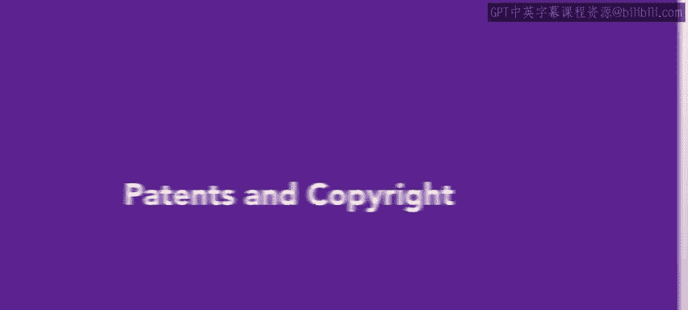
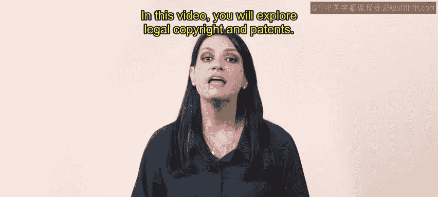
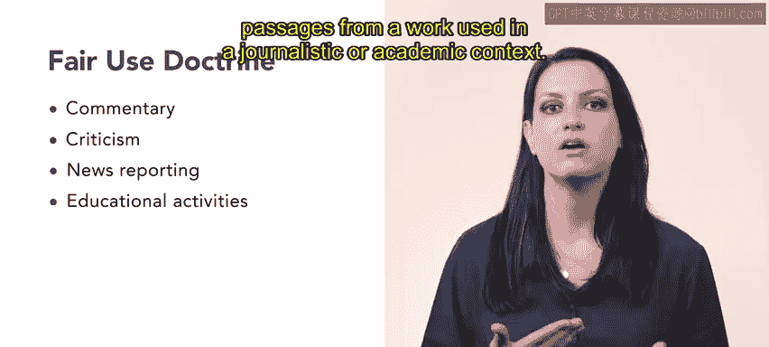
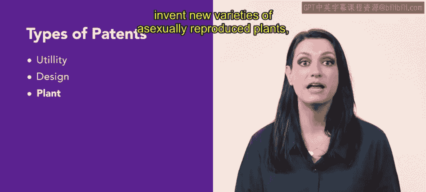
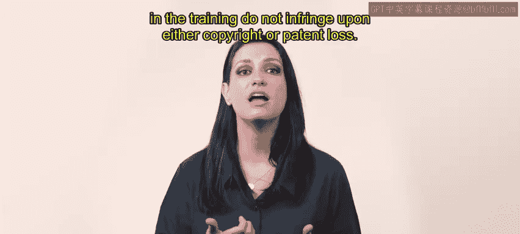

# HRCI《人力资源助理（员工关系、合规）》：第4-5课：专利与版权 📚⚖️  


在本节课中，我们将学习**版权与专利的基本法律概念**，包括《版权法》《专利法》的核心内容、版权的归属与期限、合理使用原则，以及三种主要专利类型。最后，我们将理解在人力资源培训中如何避免侵犯版权与专利权。  




---

## 一、培训材料与联邦法律要求 🏛️  


在开展培训项目时，培训人员必须确保遵守**联邦版权法与专利法**。  

其中最重要的两部联邦法律包括：  


- 《1976年版权法》  
- 《美国专利法》  


本节课将系统讲解**版权与专利的法律规定**，为HR在培训材料使用方面提供法律基础。  


---



## 二、版权的基本概念与保护期限 ✍️📖  


上一节我们了解了相关法律背景，本节我们具体分析什么是版权。  


### 1️⃣ 版权的定义  


**版权（Copyright）**是对文学、艺术或音乐作品享有的合法权利，包括：  


```text
发表（Publish）
复制（Reproduce）
演出或表演（Perform）
```  


其核心权利可以表示为：  


```text
版权 = 发表权 + 复制权 + 表演权
```  


### 2️⃣ 版权归属原则  


以下是版权通常的归属方式：  


- 在大多数情况下，版权归作者或其继承人所有  
- 版权保护期限为：  


```text
版权期限 = 作者终身 + 70年
```  


- 版权持有人是唯一有权授权他人使用作品的人  
- 版权持有人可以收取授权费用  


当版权期限届满后，作品进入：  


```text
Public Domain（公共领域）
```  


进入公共领域后，任何人都可以无需许可自由使用。  


---

## 三、职务作品例外（Work for Hire） 👩‍💼📄  


在一般规则之外，还存在“受雇创作例外”。本节我们具体说明这种特殊情况。  


### 1️⃣ 全职员工创作  


如果员工在受雇期间创作原创作品：  


```text
版权归属 = 雇主
```  


因为雇主支付报酬，因此成为版权拥有者。  


### 2️⃣ 自由职业者受托创作  


如果自由职业者受委托创作作品：  


```text
版权归属 = 委托并支付报酬的人
```  


### 3️⃣ 职务作品保护期限  


```text
职务作品保护期 = min(发表后95年, 创作后120年)
```  


即两者中较短者。  


### 4️⃣ 其他公共领域情况  


以下情况也属于公共领域：  


- 联邦政府员工在工作中创作的作品  
- 1978年1月1日前未标注版权声明的作品  
- 1978年1月1日至1989年3月1日之间某些未标注版权声明的作品  


---

## 四、合理使用原则（Fair Use Doctrine） ⚖️  


在了解版权保护后，本节介绍一个重要例外：合理使用原则。  


合理使用原则在特定条件下，限制版权人的专有权利，允许在**未经许可**的情况下使用部分作品。  


通常适用于以下情况：  


- 评论  
- 批评  
- 新闻报道  
- 教育活动  


其典型使用方式为：  


```text
使用形式 = 简短引用 / 片段摘录
使用场景 = 新闻或学术语境
```  


合理使用强调“有限使用”，而非全部复制。  


---



## 五、专利的基本概念与类型 🔬📜  


前面我们介绍了版权制度，接下来我们转向专利制度。  


### 1️⃣ 专利的定义  


专利与版权类似，都是授予权利，但专利专门针对**发明创造**，并由政府授予。  


```text
专利 = 政府授予的发明专有权
```  


发明人在规定期限内享有：  


```text
专有权 = 使用权 + 销售权
```  


未经许可使用或销售该发明，将可能被起诉。  


---

### 2️⃣ 专利的三种类型  


以下是美国专利制度中的三种主要类型：  


#### （1）实用专利（Utility Patent）  


适用于：  


- 新且有用的工艺（Process）  
- 机器（Machine）  
- 制造物（Manufacture）  
- 物质组合（Composition of matter）  
- 以上内容的改进  


实用专利约占近20年授予专利总数的90%。  


---

#### （2）外观设计专利（Design Patent）  


适用于：  


- 制造品中体现的新颖、原创、装饰性设计  


保护期限为：  


```text
2015年5月13日前授权 = 14年
2015年5月13日后授权 = 15年
```  


---

#### （3）植物专利（Plant Patent）  


适用于：  


- 通过无性繁殖培育的新植物品种  




保护期限：  


```text
植物专利期限 = 20年
```  


---

## 六、HR在培训中的合规责任 🧑‍💼📋  


在理解版权与专利制度后，我们回到HR的实际工作场景。  


当HR实施培训项目时，必须确保：  


```text
培训材料 不侵犯 版权
培训工具 不侵犯 专利
```  


未经授权使用受保护内容，可能引发法律风险。  


---

## 课程总结 📝  


本节课中，我们学习了：  




- 版权的定义、归属与保护期限  
- 职务作品与公共领域规则  
- 合理使用原则的适用范围  
- 专利的概念与三种类型  
- HR在培训实施中的法律合规要求  


通过本节内容，我们掌握了在培训材料使用过程中避免侵犯版权与专利权的基本法律框架。