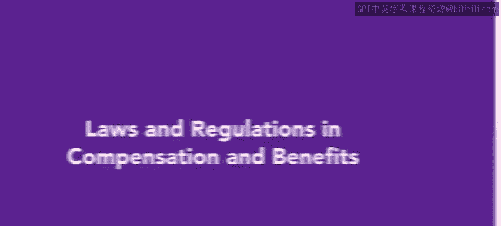
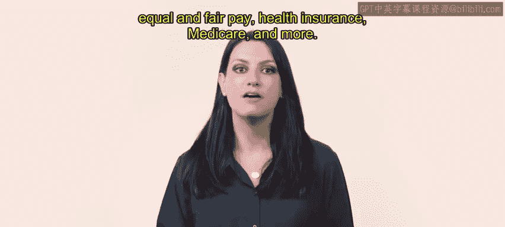
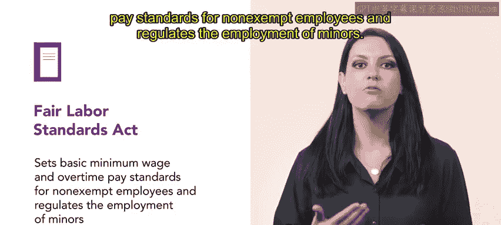
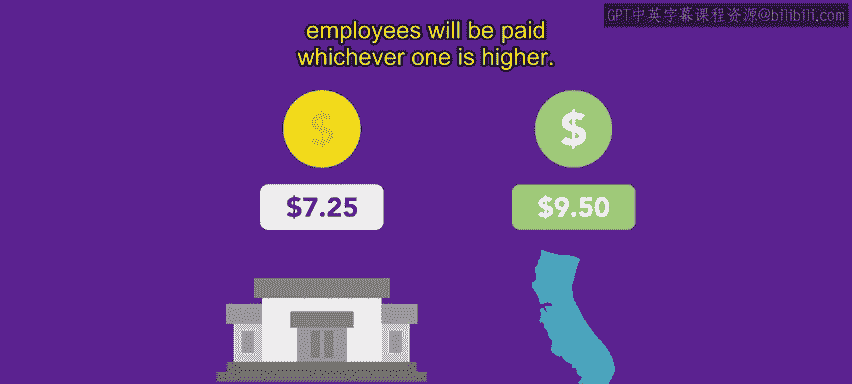
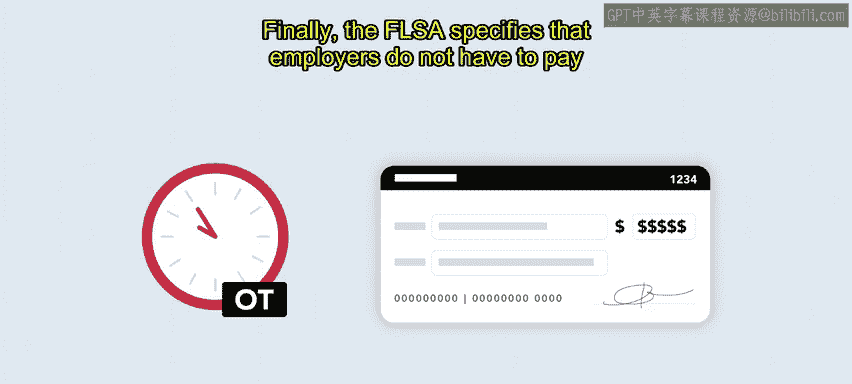
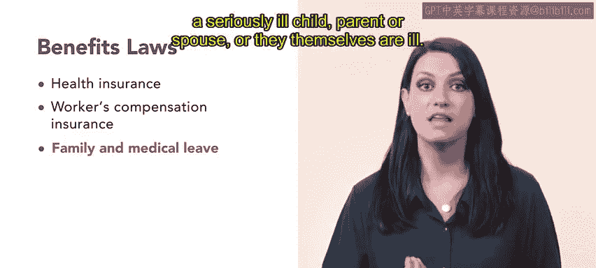

# HRCI《人力资源助理（员工关系、合规，4-5课／共5课）》：第33章：薪酬和福利法律法规 ⚖️

在本节课中，我们将复习与薪酬和福利相关的法律法规。具体来说，我们会介绍《公平劳动标准法》（FLSA）、平等薪酬法案、以及与健康保险、医疗保险等相关的法律内容。

## 《公平劳动标准法》（FLSA）

《公平劳动标准法》（FLSA）规定了非豁免员工的最低工资标准和加班工资标准，并监管未成年人的雇佣。

- 截至2023年，联邦最低工资为每小时7.25美元。
- 如果某个州有自己的最低工资要求，则会支付较高者。

### 加班工资

FLSA要求雇主支付大部分小时工的加班费，即“加班时薪”（time and a half）。如果员工一周工作超过40小时，加班费为基础时薪的1.5倍。

### 豁免员工

FLSA还规定，豁免员工不需要支付加班费。

## 平等薪酬法案与公平薪酬法案

《平等薪酬法案》和《公平薪酬法案》是联邦法律，旨在防止基于性别的薪酬歧视，特别是对于平等工作的薪酬。

- 工作内容可以不同，但必须实质上相等。
- 薪酬包括基本工资、奖金、加班费、绩效奖励、病假工资、养老金待遇和遣散费。

### 薪酬差异

如果发现男女在平等工作的情况下薪酬不同，雇主不能通过降低任何一方的工资来平衡薪酬。

## 福利相关法律

除了薪酬外，关于福利的法律也非常重要。各级政府（地方、州和联邦）都有相关规定。

### 健康保险和社会保障

- 雇主必须为员工及其家庭提供健康保险。
- 雇主还需为医疗保险和社会保障做出贡献。

### 工伤保险

雇主必须提供工伤赔偿保险，以减少因残疾、工伤或失业而带来的经济困难。

### 家庭和医疗假期

雇主还需要提供家庭和医疗假期，允许员工在以下情况中享受最多12周的无薪假期：
- 生育、领养子女；
- 照顾重病的孩子、父母或配偶；
- 员工自身生病。

## 总结

本节课中，我们学习了与薪酬和福利相关的联邦法律，主要包括《公平劳动标准法》、《平等薪酬法案》和《公平薪酬法案》。这些法律涉及最低工资、加班费和性别平等薪酬的问题，同时也规定了雇主在福利方面的责任，如健康保险、工伤保险和家庭医疗假期等。作为人力资源专业人员，理解这些法律非常重要，因为它们是我们日常工作的一部分。