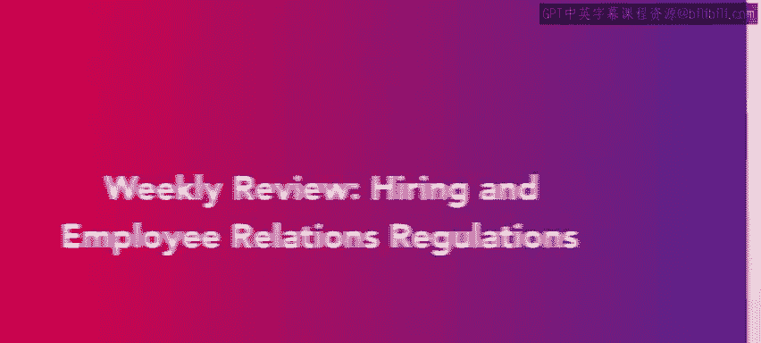
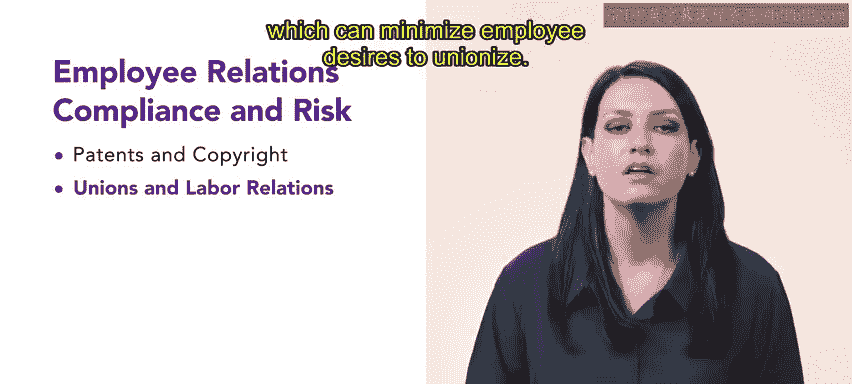

# HRCI人力资源助理课程：第4课：每周回顾：招聘与员工关系 📚

在本节课中，我们将回顾本周学习的核心内容，主要聚焦于员工关系、合规与风险管理。我们将系统梳理知识产权、工会关系以及薪酬福利法规等关键知识点。

## 知识产权：版权与专利 📜

上一节我们介绍了员工关系的基础，本节中我们来看看知识产权保护。理解版权和专利法律对于人力资源工作至关重要，尤其是在创建培训材料时。

*   **版权法**：指对原创作品的所有权，涵盖**写作、艺术**等作品形式。
*   **专利法**：与版权类似，但专门针对**发明创造**。

## 工会与劳资关系 👥

在理解了知识产权后，我们转向另一个重要领域——工会与劳资关系。根据《国家劳资关系法》和《塔夫脱-哈特莱法案》，员工拥有组织工会的权利。

以下是处理工会关系时的关键原则：
*   无论员工是否加入工会，都应获得公平对待。
*   建立相互尊重和开放沟通的工作文化，有助于营造更好的工作环境，从而减少员工组建工会的意愿。

为了深化对工会的理解，我们还学习了四种主要的工会类型。

以下是四种工会类型：
1.  **地方工会**
2.  **全国性工会**
3.  **工会联合会**
4.  **国际工会**

## 薪酬与福利法规 💰

最后，我们回顾了薪酬与福利方面的法律法规。这确保了组织的薪酬实践既合法又公平。

本周重点关注的法规包括：
*   **《公平劳动标准法》**：规定了最低工资、加班工资等。
*   **《同工同酬法》**与公平薪酬原则：确保从事同等工作的员工获得同等报酬。

此外，雇主必须提供某些法定福利。

以下是雇主通常被要求提供的福利示例：
*   健康保险
*   工伤保险
*   失业保险

---

本节课中我们一起学习了员工关系与合规的核心模块。我们回顾了知识产权保护的基本概念，探讨了工会关系的处理原则与类型，并梳理了关键的薪酬福利法规。掌握这些知识，是成为一名专业人力资源从业者的重要一步。接下来，课程将进入人力资源与职场健康安全的学习，请继续保持努力。