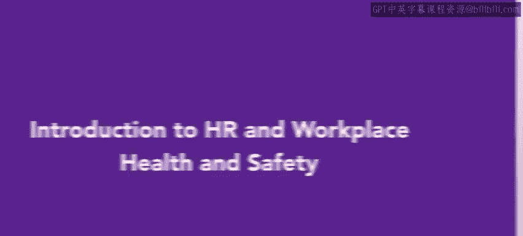
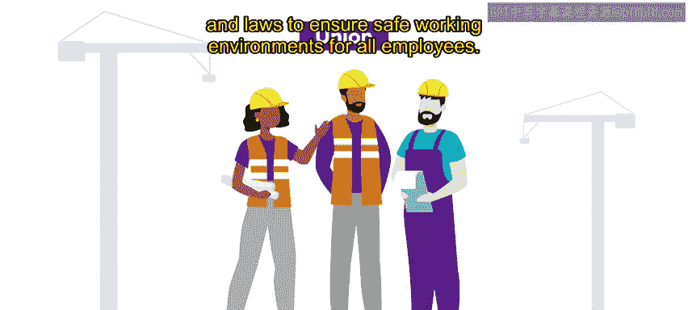
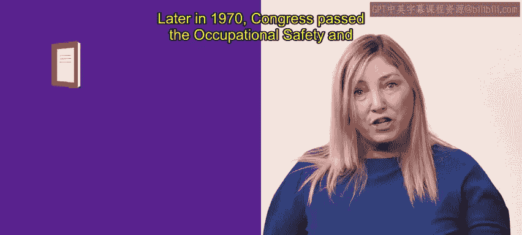
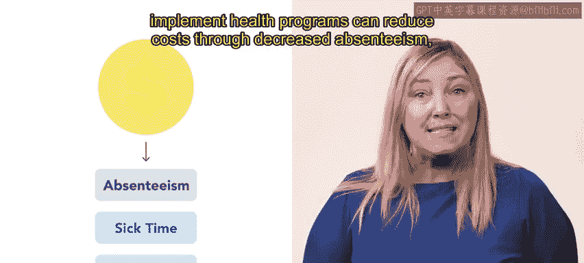
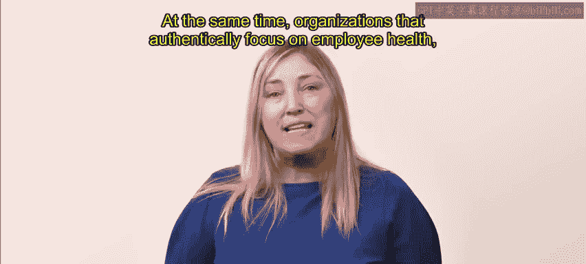
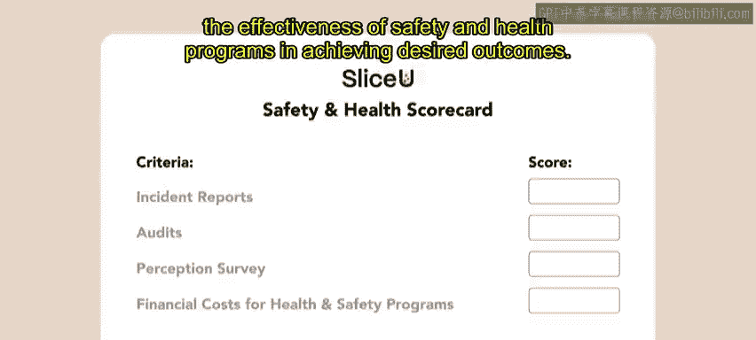

# HRCI《人力资源助理（员工关系、合规，4-5课／共5课）｜HRCI Human Resource Associate》 - P119：36_人力资源与工作场所健康安全简介.zh_en - GPT中英字幕课程资源 - BV1qE4m19788

Organizations in the US have both a legal and moral obligation to provide workplaces that ensure the safety and health of their employees。

In this video， we will briefly discuss OSHA and the role that HR plays in an organization's health and safety processes。

Over 100 years ago， workers were largely motivated to unionize for safer working conditions。

 primarily in industrial settings。Since then， the US government has created regulations， standards。

 and laws to ensure safe working environments for all employees。

These safeguards do not apply to US based organizations with overseas manufacturing， however。

 with a rise awareness of global working conditions。

 these organizations are progressing toward improving the working conditions of foreign employees。

Later in 1970， Congress passed the Occupational Safety and Health Act known today as OSHA to protect American worker safety。

This act requires employers to provide their employees with working conditions free of known dangers。

The Act created the Occupational Safety and Health Administration， OSHA。

 which sets and enforces protective workplace safety and health standards。

You'll learn more about OSHA later on。Human resources has become the central place for guiding and managing the relationship between an organization and its employees。

 including hiring， benefits， and training。Benefits often include wellness programs such as fitness classes that address common workplace health issues。

HR is also often tasked with ensuring that the organization complies with OSHA and other health and safety rules。

 minimizing losses that might arise from safety and health issues risk。

HR departments that enforce OSHA regulations and implement health programs can reduce costs through decreased absenteeism。

 sick time， and time off the job。

Compliance helps reduce workers compensation claims and lawsuits for injuries or accidents。

 giving organizations a competitive edge by minimizing costs。😊，At the same time。

 organizations that authentically focus on employee health。

 safety and wellness are viewed as model employers。

For example， Google is often praised for the range of benefits and perks it offers its employees to encourage a healthy and satisfied workforce These benefits include free cafes focusing on healthy。

 locally sourced foods， fitness centers， ample vacation time。

 and encouraging time outside the office for volunteer work through Google Serve their community outreach unit As a result。

 Google has reported a lower turnover rate， which has reduced staffing costs for the organization as it has not had to recruit as many replacements。

 an organizational scorecard provides a comprehensive assessment of an organization's overall safety and health program performance。

😊，It considers various measures， including incident reports， audit scores。

 perception survey results from management and workers。

 and financial costs associated with safety programs。😊，By considering multiple actions。

 the scorecard helps HR evaluate the effectiveness of safety and health programs in achieving desired outcomes。

😊。

Now that you've learned about the role of HR in an organization's health and safety。

 next we will explore OSHA。

