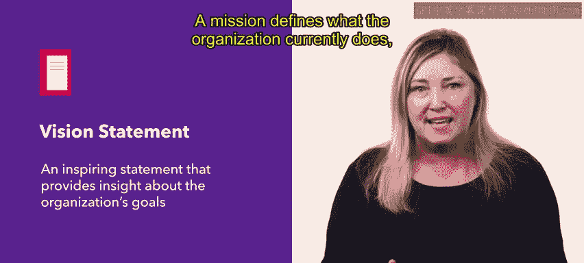
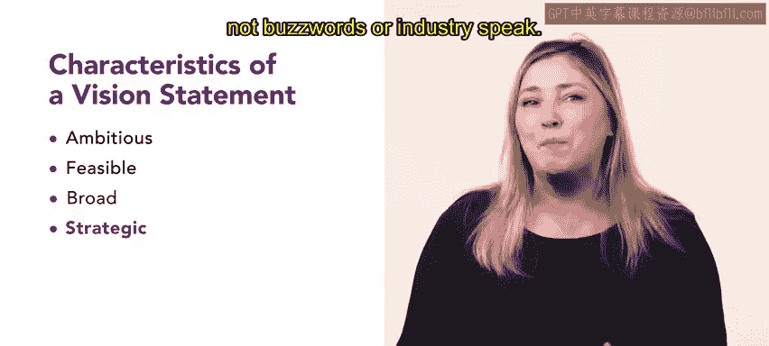
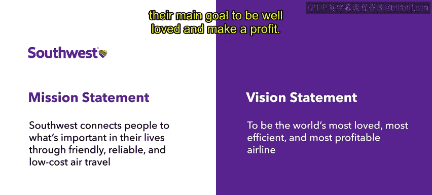

# HRCI《人力资源助理（员工关系、合规，4-5课／共5课）｜HRCI Human Resource Associate》 - P11：6_制定愿景声明.zh_en - GPT中英字幕课程资源 - BV1qE4m19788

Hello， now that you better understand what a mission statement is。

 we are going to review vision statements and discover how they are different from mission statements。

 we'll also explore examples from various well known companies， let's get started。

As you'll recall， a mission statement is a one sentence statement that explains the three components of an organization。

 what your company does， why it does it， and how it gets done。

 it describes what an organization does in the present vision statements are similar because they also define an organization's character and personality。

 but there are clear differences between mission and vision statements。😊。

A vision statement is an inspiring statement that provides insight about the organization's goals and ideals for the future。

A mission defines what the organization currently does and the vision speaks to their future。

Asana is a program that helps companies manage and create projects。

 Asana has defined the four key components of a vision statement。😊，First。

 a vision statement needs to be ambitious。 It should inspire employees。

 investors and customers to value an organization's mission。

 The statement should be passionate about the organization's ideals for the future and its direction。

😊，A vision statement should also be feasible while your vision statement should be ambitious。

 it must still be achievable it needs to be an attainable goal that the organization can strive towards next。

 the vision statement should be broad， it should not be extremely specific。

 but it does need to connect the organization's mission to its goals。Finally。

 a vision statement should be strategic。 It should identify the most relevant and important ideas。

 It should speak to the aspirations of an organization's mission and purpose。

 A mission statement should be clearly written and use everyday language。

 not buzzwords or industry Spak。 Let's compare the mission and vision statements for Ikea Hab and Southwest Airlines。

 Ikea， a globally known Swedish furniture company， Pri itself on its mission statement。

 Ikea offers a wide range of well designed functional home furnishing products at low and accessible prices。

😊。

Their vision statement is to create a better everyday life for the many people。

Their mission statement explains who they are as an organization。

 a furniture company with low prices。 While their vision statement expresses their goal to create a better life for people。

 Hasbro is a reliable and wellknown toy manufacturer。

 Their mission statement is Hasbro creates the world's best play and entertainment experiences。

 from this， it is easy to understand that Habro creates popular toys。

 which they call play and entertainment experiences， to compel people to purchase their products。

 Their vision statement， which explains to make the world a better place for all children。

 fans and families， elaborates on their ambitious， feasible。

 broad and strategic goal to make the world a better place for everyone through play。😊，Next。

 let's examine Southwest airlines， one of the most well known airlines in the US。

 Their mission statement is clear Southwest connects people to what's important in their lives through friendly。

 reliable and low cost airline travel。 Their vision is to be the world's most loved。

 most efficient and most profitable airline。😊，Their mission statement expresses their dedication to customers。

 while their vision statement mentions their main goal to be well loved and make a profit。

To review， a mission statement explains what an organization is doing in the present。

 while a vision statement clearly expresses an organization's goals and provides insight into the long term direction of the company。

