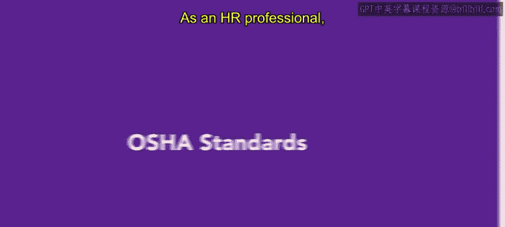
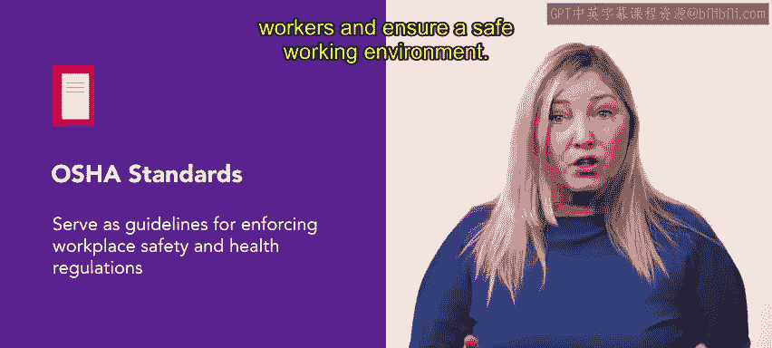
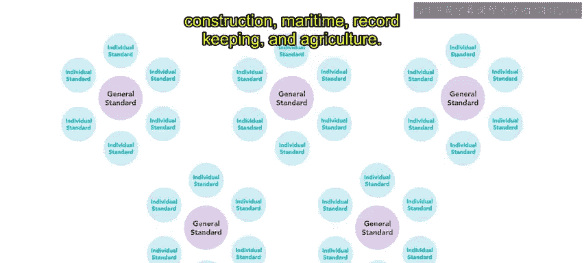
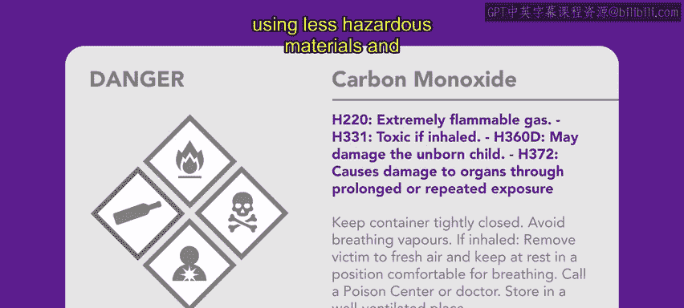
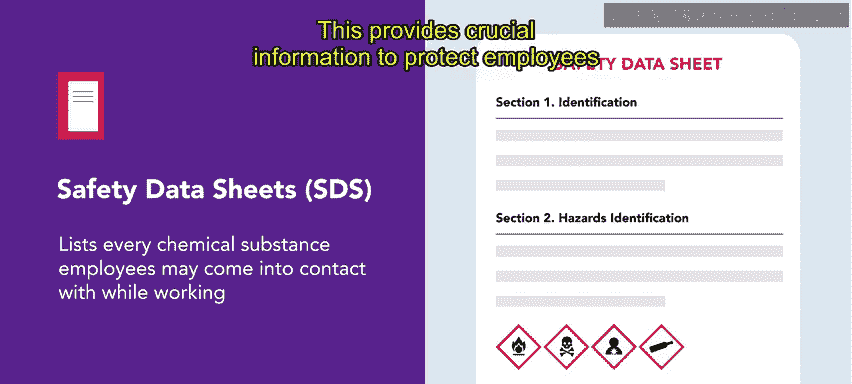
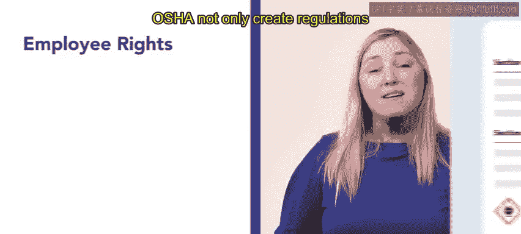

# HRCI《人力资源助理（员工关系、合规）》：第4-5课：OSHA标准 🏗️




## 📘 课程概述  

在本节课中，我们将学习与工作场所安全与健康相关的OSHA标准。  

我们将重点了解危险沟通标准（HCS）、安全数据表（SDS），以及员工与雇主在OSHA框架下所享有的权利。  


## 🏛️ OSHA标准概述  


作为一名人力资源专业人士，理解OSHA对于保持法规合规性以及营造安全的工作环境至关重要。  


接下来，我们将深入了解OSHA标准的关键信息。  


上一节我们介绍了OSHA的整体背景，本节我们具体看看OSHA标准的基本作用。  

OSHA发布的标准是用于执行工作场所安全与健康法规的指导方针。  



这些标准旨在保护员工并确保安全的工作环境。  


目前，OSHA已发布超过50项通用标准，其中包含数十甚至数百项具体标准。  

这些标准覆盖多个行业领域。  

以下是OSHA标准所涵盖的主要行业：  



- 一般行业（General Industry）  
- 建筑业（Construction）  
- 海事行业（Maritime）  
- 记录保存（Record Keeping）  
- 农业（Agriculture）  


通过覆盖多个行业，OSHA构建了系统性的安全监管体系。  


## ⚠️ 危险沟通标准（Hazard Communication Standard, HCS）  


在了解了OSHA整体标准后，本节我们重点介绍其中一项关键标准——危险沟通标准。  

危险沟通标准（HCS）也被称为“知情权法”（Right to Know Law）。  

该标准要求雇主向员工告知他们在工作场所可能接触到的有害化学品。  

其核心目标是确保危险化学品被正确标识，并且定期维护危险化学品清单。  

此外，员工必须接受如何安全处理这些化学品的培训。  


根据OSHA的规定，当员工了解所接触的化学品信息时，他们可以采取措施减少与工作相关的化学疾病和伤害。  

这种减少可以通过以下方式实现：  

- 减少暴露（Reduce Exposure）  
- 使用危害较小的材料（Use Less Hazardous Materials）  
- 遵循正确的操作规范（Follow Proper Work Practices）  


HCS还要求组织指定专门人员负责合规实施与维护。  

这些责任包括：  




- 识别所有危险材料  
- 进行正确标识  
- 提供相关培训  
- 制定并实施危险沟通计划  


可以将危险沟通计划理解为：  

```text
Hazard Communication Program =
化学品识别 + 标签管理 + 员工培训 + 合规维护
```  


## 📄 安全数据表（Safety Data Sheets, SDS）  


在了解危险沟通标准之后，我们继续学习与之密切相关的安全数据表。  

OSHA标准要求雇主为员工可能接触的每一种化学物质提供安全数据表（SDS）。  



SDS文件描述了某种化学物质的潜在风险。  



同时，它还包含化学品的成分信息以及正确的处理程序。  

这些信息对于保护员工免受危害至关重要。  

SDS有助于创建更安全的工作环境。  


可以将SDS的核心结构理解为：  

```text
SDS =
风险说明 + 成分信息 + 安全操作程序
```  


## 👥 员工与雇主的权利  


在掌握了具体标准后，我们接下来了解OSHA所保障的权利体系。  

OSHA不仅制定组织必须遵守的法规，还通过建立指导方针保护员工权利。  


以下是员工在OSHA框架下享有的主要权利：  

- 请求安全检查（Request Inspections）  
- 在不受报复的情况下行使权利（No Retaliation）  
- 接受有关危害和OSHA标准的全面培训（Training Rights）  
- 获取检测结果与相关记录（Access to Records）  
- 在无处罚的情况下提出投诉（File Complaints Without Penalty）  


如果组织违反OSHA法规并危及员工安全，员工可以向OSHA提出投诉并请求检查。  


虽然OSHA法规主要关注保护员工权益，但法律也赋予雇主一定权利。  

以下是雇主享有的主要权利：  

- 通过向OSHA标准咨询委员会提交意见或参加听证会来影响健康与安全标准  
- 联系国家职业安全与健康研究所（National Institute of Occupational Safety and Health, NIOSH）以获取关于特定物质毒性的相关信息  
- 在特定情况下，如无法满足OSHA标准时，可申请永久或临时豁免  


可以概括为：  

```text
Employee Rights = 检查权 + 培训权 + 信息获取权 + 投诉权
Employer Rights = 参与制定标准 + 获取专业信息 + 申请豁免
```  


## 🏁 课程总结  


在本节课中，我们学习了保障工作场所安全与健康的相关法规。  

我们重点掌握了危险沟通标准（HCS）和安全数据表（SDS）的核心内容。  

我们还了解了员工享有的权利，例如请求检查、接受培训和获取相关信息的权利。  

同时，我们也认识到雇主可以参与安全标准制定，并在必要时寻求指导或申请豁免。  


通过员工与雇主的共同努力，可以建立更加安全与健康的工作环境。