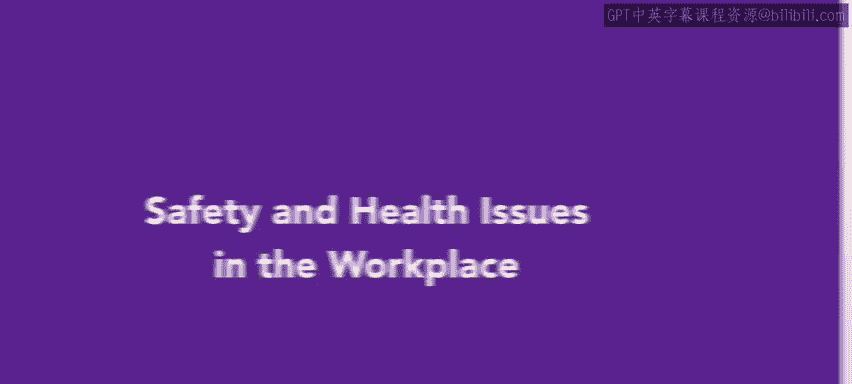
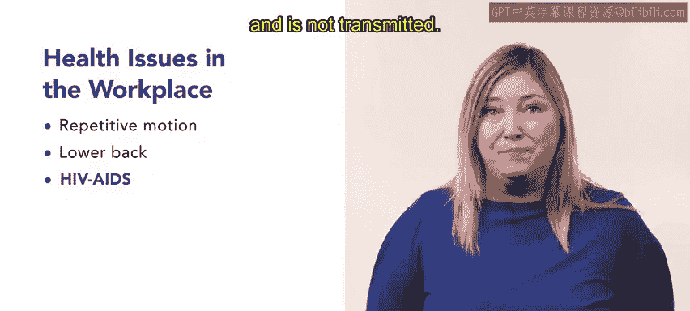
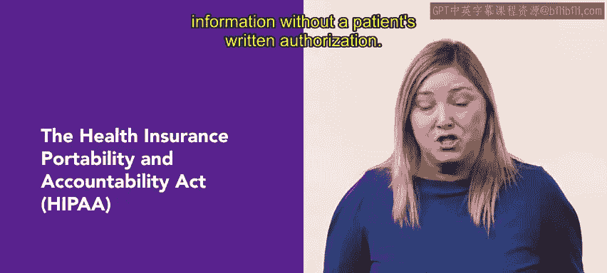

# HRCI《人力资源助理（员工关系、合规，4-5课／共5课）》: P123：40_工作场所安全与健康问题 🏥

在本节课中，我们将讨论一些组织在工作场所中需要关注的健康与安全问题。确保员工的健康和安全在任何工作场所都至关重要，下面我们将详细了解组织应该如何应对这些问题。

## 1. 保护员工免受危险

首先，员工应当受到可能危险的设备和物质的保护。为此，组织应采取以下措施：

- 提供充足的安全防护设备，如防护服、手套等。
- 对员工进行正确操作危险物质的培训。
- 制定并实施安全协议，减少风险。

## 2. 提供全面的工作安全培训

接下来，员工应接受全面的培训，以减少与工作相关的风险。这些培训包括：

- 正确操作重型机械。
- 遵守安全协议。
- 确保员工在使用键盘时采取符合人体工学的姿势。

此外，建筑物也必须符合安全标准，确保工作人员的安全。这些标准包括：

- 合理的通风。
- 防火措施，如火灾报警系统和自动喷水灭火系统。
- 定期检查建筑物结构，确保没有潜在的危险。

## 3. 紧急应急处理程序

组织有责任设计、测试并教育所有员工关于紧急应急处理程序。根据美国职业安全健康管理局（OSHA）的规定，紧急应急计划应明确雇主和员工在火灾或其他紧急情况下需要采取的具体措施。该计划可能包括：

- 紧急情况报告方法。
- 疏散政策和程序。

## 4. 关注员工的药物、酒精和心理健康问题

员工在工作中若遇到药物、酒精或心理健康问题，不应对自己或他人构成风险。为此，组织应建立相应的政策，识别和支持有这些问题的员工，确保他们的健康，并预防潜在的安全隐患。

## 5. 健康问题对生产力的影响

员工的健康直接影响组织的生产力，进而影响组织的财务表现。美国疾病控制和预防中心（CDC）估计，健康不良的间接成本，包括缺勤、残疾和工作效率下降，可能比直接的医疗费用高几倍。

CDC还计算出，因个人和家庭健康问题造成的生产力损失，每名美国员工每年约为1,685美元，总损失达2,258亿美元。此外，慢性疾病和其他与工作相关的健康问题也需要引起关注。例如，使用笔记本电脑或台式电脑的员工容易患上腕管综合症，重复的运动会影响员工的肌腱，导致炎症。

组织可以通过提供符合人体工学的桌椅和计算机设备，培训员工预防重复性运动问题，并提供健身计划来帮助解决这些问题。

## 6. 下背部疾病

下背部疾病或拉伤在工厂和仓库员工中非常常见，尤其是那些不正确地举、推或拉重物的员工。然而，长时间坐着也可能导致下背部问题。

## 7. 与HIV/AIDS相关的政策

组织必须雇佣并留住符合资格的HIV/AIDS感染者，除非其疾病妨碍了工作表现。同时，组织应教育所有员工了解HIV/AIDS的传播途径。

## 8. 物质滥用问题

物质滥用每年让公司损失大约10亿美元，这包括生产力损失、事故、工人赔偿、健康保险索赔以及财产盗窃。1988年的《无毒工作场所法案》规定，组织应告知员工工作场所药物滥用的危害，并提供药物咨询、康复和员工援助计划。

为预防工作场所中的物质滥用问题，组织应：

- 对求职者进行筛查。
- 解雇那些被确认滥用物质的员工。
- 培训主管和经理观察并识别物质滥用的迹象。
- 提供员工援助计划，如咨询。
- 制定书面的物质滥用政策。

## 9. 工作压力与健康问题

美国员工通常比其他国家的员工工作更长时间，因此，他们常常面临更高的压力，导致不良的饮食习惯、体重问题、高血压和高胆固醇等问题。

在工作表现方面，经理可能会注意到员工出现疲劳、易怒和悲观的情绪，这可能是抑郁的迹象。为帮助员工缓解工作压力，组织可以提供健康计划，如营养、健身、放松或瑜伽课程，以及员工援助计划。组织还可以提供各种培训课程，如时间管理、assertiveness训练，甚至社交技巧培训，以减少员工的压力。

## 10. 工作场所暴力的风险因素

工作场所暴力的风险因素包括与公众互动、处理财务交易以及提供商品或服务等。其中，非致命的袭击最为常见，导致员工失去工作日和工资。由于没有通用的预防策略适用于所有工作场所，因此实施暴力预防计划需要关注以下几个关键点：

- 记录事件。
- 制定标准程序。
- 管理层和员工之间保持开放的沟通。

## 11. 尊重员工隐私

虽然雇主在法律、经济和道德方面都对员工的健康和福祉有明确的利益，但仍需要尊重员工的隐私权。根据《健康保险流通与问责法案》（HIPAA），对于受保护的健康信息的访问有严格的规定。保护健康信息指的是任何由医疗实体收集或创建的信息，该信息能够与特定患者或个人相关联。

在大多数情况下，HIPAA禁止在没有患者书面授权的情况下获取受保护的健康信息。

## 小结

通过了解工作场所中的安全和健康问题，您将能够更好地管理风险，确保合规，促进员工的福祉，并减少潜在的法律责任。在本节课中，我们一起学习了如何应对工作场所中的安全和健康挑战，以及如何通过适当的措施确保员工的安全和健康。