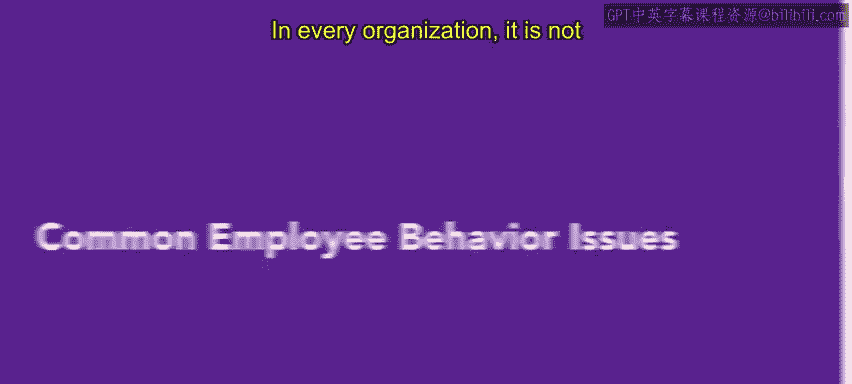
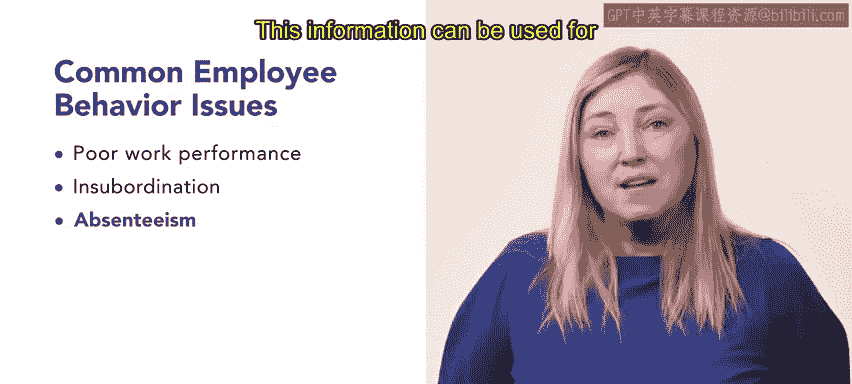

# HRCI《人力资源助理（员工关系、合规，4-5课／共5课）》 - P124：41_常见员工行为问题

## 📋 概述

在本节课中，我们将要学习组织中常见的员工行为问题。这些问题会对工作环境和员工生产力产生显著影响。作为人力资源专业人士，理解并有效处理这些问题，对于维护安全健康的工作环境至关重要。我们将探讨几种最常见的行为问题，并讨论人力资源部门在处理过程中的关键作用。

## 🧩 常见员工行为问题类型

上一节我们介绍了课程概述，本节中我们来看看具体有哪些常见的员工行为问题。以下是几种主要的问题类型及其描述。

### 1. 工作表现不佳
工作场所最常见的行为问题是**工作表现不佳**。这可以表现为多种形式，例如：
*   反复错过截止日期。
*   未能达到公司标准。
*   迟到或早退。
*   违反公司政策。
*   对工作缺乏热情。

当面对此类情况时，有效的沟通成为处理员工绩效问题最有价值的工具。

### 2. 不服从管理
当员工拒绝服从权威人物或不遵守指令时，就会发生**不服从管理**。这种行为可能源于各种原因，但通常反映出对管理者的不尊重。培养一个提倡尊重和礼貌的工作环境对于预防不服从行为至关重要。

### 3. 缺勤
**缺勤**指的是员工经常性地缺席工作。原因可能是疾病、个人问题，或没有任何说明。许多组织会跟踪和记录缺勤率，其计算公式为：
`缺勤率 = (员工缺勤天数 / 应出勤总天数) * 100%`
这个指标反映了个体平均未出勤的天数，必要时可用于采取适当的纪律措施。

### 4. 不当行为
**不当行为**涵盖的范围很广，包括：
*   传播流言蜚语。
*   使用冒犯性语言。
*   歧视。
*   骚扰。
*   欺凌与恐吓。
*   窃取他人工作成果。
*   跟踪骚扰。

在工作场所实施不当行为的员工必须受到内部纪律处分，根据违规的严重程度，还可能涉及外部执法机构。

### 5. 员工冲突
**员工冲突**可以表现为多种形式，包括口头、书面或肢体纠纷。这些冲突可能源于生活方式差异、薪酬问题、组织问题等。处理员工冲突的第一步是识别冲突的性质和根本原因。

### 6. 暴力与暴力威胁
**暴力及暴力威胁**是工作场所最极端的行为问题。组织应谨慎而迅速地处理工作场所暴力事件。如果在工作场所发生暴力行为，执法部门很可能会介入。

## 💎 总结

本节课中我们一起学习了多种常见的员工行为问题，包括工作表现不佳、不服从管理、缺勤、不当行为、员工冲突以及暴力威胁。处理这些员工行为问题对于营造积极、高效的工作环境至关重要。作为人力资源专业人士，你在理解和有效管理这些职场行为方面扮演着关键角色。

