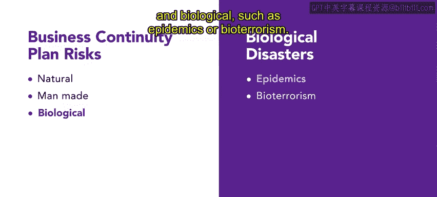

# HRCI《人力资源助理（员工关系、合规，4-5课／共5课）》：P129：安全与健康管理计划 🛡️

在本节课中，我们将要学习安全与健康管理计划。这些计划帮助组织确保员工的福祉，并维持一个安全的工作环境。我们将详细讨论不同类型的计划及其要求。

---

安全与健康管理计划，也被称为工伤与疾病预防计划。美国职业安全与健康管理局（OSHA）要求雇主制定具体的计划来保障员工安全，例如应急行动计划与火灾预防计划。员工人数超过10人的组织必须向OSHA提交书面计划；而员工人数为10人或更少的组织，仅在OSHA要求时才需提交。这些计划的核心目的是：**识别工作场所的风险与危险，建立减少或消除危害的程序，并确保员工接受适当的培训，以识别、预防和减轻这些风险。**

所有安全与健康管理计划都应包含几个关键要素。以下是这些要素的详细说明：

*   **组织政策声明**：计划应清晰阐述组织关于该计划的基本政策。
*   **高层管理支持声明**：计划应包含高层管理人员的支持声明，强调他们对计划成功的参与和承诺。
*   **员工参与与培训**：计划应详细说明员工如何参与该过程，以及他们将如何接受必要的培训，以确保他们理解并能够实施安全措施。
*   **责任人与报告流程**：计划应明确指定计划的负责人，以及向负责人报告问题的流程。
*   **记录保存与合规**：计划应说明组织将如何维护OSHA要求的记录，并确保符合监管要求。

---

上一节我们介绍了计划的核心要素，本节中我们来看看几种常见的安全与健康管理计划类型。这些计划针对不同的问题，包括火灾预防、业务连续性、应急行动、灾难恢复和员工培训。

以下是几种主要计划类型的详细介绍：

*   **火灾预防计划** 🚒
    该计划是识别和处理组织内部火灾隐患的指南。它概述了具体的火灾危险，并提供了有效处理这些危险的说明。计划会指明可用的灭火设备及其位置，并为正确处理潜在易燃或可燃材料提供明确指导，以最大限度地降低火灾风险。

*   **业务连续性计划** 🔄
    这类计划确保组织在紧急情况期间及之后能够维持运营。业务连续性风险主要分为三大类：
    1.  **自然灾害**：如飓风、洪水、火灾或地震。
    2.  **人为灾害**：包括恐怖主义、盗窃、计算机黑客攻击、劳资纠纷或关键领导员工的意外离职。
    3.  **生物灾害**：如流行病或生物恐怖主义。
    业务连续性计划涵盖财务、实物资产、信息和人力资源等各个方面。通过制定明确的业务连续性计划，组织可以最大限度地减少中断，确保即使在充满挑战和意外的情况下也能持续运营。

*   **应急行动计划** 🚨
    这些计划有助于确保员工在紧急情况和工作场所疏散期间的安全。一个有效的应急行动计划应指定负责人，并包含疏散政策、楼层平面图及逃生路线。计划应提供关闭关键操作的指示，以及疏散后清点所有员工安全的方法。计划还应包含通知程序，包括警报系统，并为残障人士、访客和临时员工提供便利。此外，应急行动计划应概述针对特定事件（如火灾、龙卷风、地震和暴力袭击，包括恐怖主义）的处理程序。
    > **注意**：应急响应计划与应急行动计划不同。**行动计划侧重于在紧急情况下保护员工**；而**响应计划侧重于保护记录和资源，确定责任人，并提供保护这些宝贵资产的指导**。

*   **灾难恢复计划** 🏗️
    那么，如果紧急情况破坏了财产、系统和流程，组织将如何继续前进？灾难恢复计划概述了在最初的紧急情况和响应结束后，组织应如何继续运作。这类计划指明了危机恢复期间可用的设备和地点。恢复措施将根据每个组织及其风险性质的不同而有所变化。

*   **安全培训计划** 🎓
    安全培训计划是全面安全与健康管理计划的重要组成部分。这些计划告知员工如何处理工作场所危害并维护安全的工作环境。通常，人力资源部门负责制定和实施此类培训。安全培训计划始于彻底的风险评估，以识别工作场所的安全隐患。随后，调查人员会探究具体威胁，以确定员工培训是否能积极减轻或消除这些威胁。组织确定员工需要了解的基本信息，并基于这些发现设定培训目标。接下来，他们制定并实施培训计划以实现这些目标。定期评估计划的有效性，以便主动进行调整，增强其影响力。通过遵循这种结构化方法，组织确保员工获得必要的培训，以有效应对工作场所危害并维护安全的工作环境。

---

本节课中我们一起学习了安全与健康管理计划的组成部分。这些计划对于组织优先考虑员工福祉和维持安全工作环境至关重要。