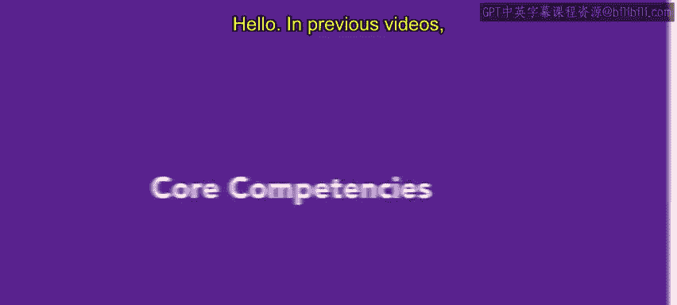
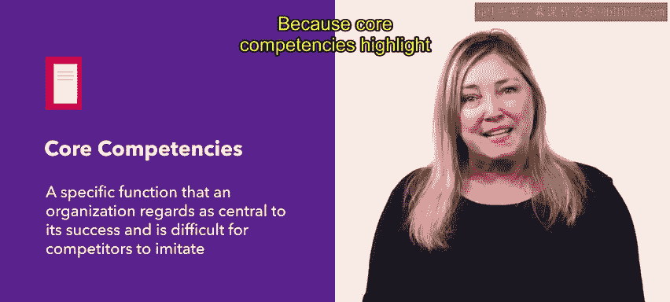

# HRCI《人力资源助理（员工关系、合规，4-5课／共5课）｜HRCI Human Resource Associate》 - P12：7_核心能力.zh_en - GPT中英字幕课程资源 - BV1qE4m19788

Hello， in previous videos， you learned about mission and vision statements。

 Now we're going to focus on core competencies。 Let's get started。😊。

An organization's core competencies are things that it does best， or its strengths and skills。

 It is a specific function that an organization regards as central to its success and is difficult for competitors to imitate Or use their core competencies to differentiate themselves from their competitors。

😊，Core competencies can be related to technology， production， culture， community。

 knowledge management， or a combination of these。Because core competencies highlight areas of value within an organization。

 they should be fostered and supported with resources for this reason。

 it could be helpful to identify core competencies during strategic planning let's look at some examples of common core competencies and what they mean。

Buying power is a core competency of some organizations that use their large influence to outbu competitors。

Company culture is a great core competency that appeals to job seekers。Prioritizing high pay。

 great benefits and effective human resource management gives your organization a strong and valuable reputation。

Partnerships are a core competency when organizations focus their relationships to maximize efficiency Finally。

 specialization is a core competency for organizations that offer unique goods or services that few other organizations can。

Target， a company well known in many households for their product availability and affordability has many core competencies。

 For example， Targ focuses on internal processes like sales performance management。

 Their managers are consistently trained on forecast accuracy。

 skills training and vertical management Targs other core competencies include research and development。

 innovation and marketing， affordability， sustainability， relevancy and culture。

 These competencies are supported in their mission statement to help all families discover the joy of everyday life。

😊。

As a reveal， an organization's core competencies are skills and strengths that make them stand out from their competitors core competencies are essential to an organization's business operation later you will learn about developing a value statement。

😊。

