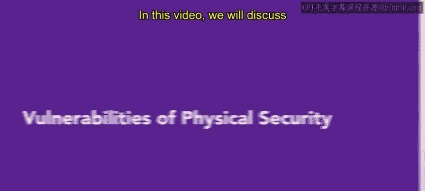
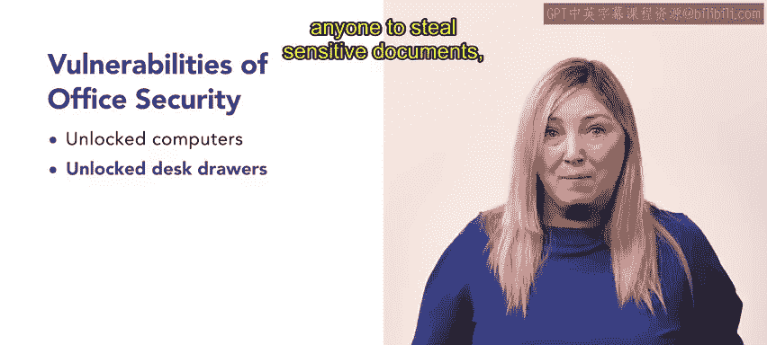

# HRCI《人力资源助理（员工关系、合规，4-5课／共5课）》：P130：物理安全的脆弱性 🔒

在本节课中，我们将讨论工作场所物理安全的脆弱性，包括建筑安全、人员安全和办公室安全。了解不同类型的脆弱性时，请思考它们可能如何影响你工作场所的安全，以及为何有必要理解和解决这些问题。

## 建筑安全的脆弱性 🏢

上一节我们介绍了物理安全的重要性，本节中我们来看看建筑本身可能存在的安全风险。建筑是物理安全的重要组成部分，但某些脆弱性可能会损害其安全性。以下是几种常见场景：

*   **高流量区域的建筑**：位于人流密集区域的建筑可能存在风险。持续的人流和活动可能创造一个环境，使员工难以识别非本单位人员或潜在威胁。这种高流量增加了未经授权进入的可能性，并损害了建筑的整体安全。
*   **偏远地区的孤立建筑**：位于偏远地区的孤立建筑特别容易遭到闯入，因为窃贼可能认为被察觉或干预的风险较低。这些建筑的位置使得潜在入侵者更容易不被注意，增加了未经授权进入和安全漏洞的可能性。
*   **靠近自然景观的建筑**：靠近湖泊等自然景观的建筑，以及靠近树林的建筑，可能为犯罪活动提供额外的诱惑。
*   **相互连接的建筑**：相互连接或与其他结构相连的建筑对潜在入侵者更具吸引力。这是因为入侵者可以利用相邻建筑中较弱的安全措施来进入目标建筑。这种相互连接的性质创造了犯罪分子可以利用的潜在入口点。
*   **共享工作空间**：工作场所的一个新兴趋势是共享工作空间，尤其是在小型组织中。在共享环境中，员工必须保持更高水平的安全意识，并保护敏感信息。这包括在不主动工作时将敏感数据置于视线之外。

## 人员安全的脆弱性 👥

了解了建筑环境的风险后，接下来我们探讨人员管理方面的安全威胁。人员安全中的一个重大脆弱性与丢失或未报告的访问卡或身份徽章有关。

*   **丢失的访问卡/身份徽章**：陌生人如果找到这些徽章，可能会利用它们未经授权进入安全区域，或将其出售给有恶意意图的人。
*   **无人陪同的访客**：如果员工让访客无人陪同，这会创造一个危及场所安全和安保的机会。组织应建立协议来区分访客和员工，例如使用身份徽章。
*   **缺乏指定的接待区**：如果组织没有指定接待区，无人陪同的访客可能会四处游荡，直到找到可以提供帮助的人。这种情况存在风险，因为访客可能进入未经授权的区域，或发现敏感信息或设备。一个专门的接待区有助于为访客提供一个集中登记和获得适当指导的地点。
*   **区域权限不明确**：在某些地点，关于哪些区域禁止进入、哪些区域适合访客，缺乏明确性。因此，员工可能会无意中将访客引导至限制区域，而没有意识到这些区域是禁止进入的。此外，当访客无意中进入限制区域时，员工可能不会进行干预。
*   **尾随和冒充**：尾随和冒充是两种具体的现场社交工程策略，可以绕过物理安全措施。
    *   **尾随**：指未经授权的个人紧跟在授权人员身后，以进入限制区域。
    *   **冒充**：指假装成他人（例如员工），以欺骗安全措施并进入安全地点。这些策略利用了人类的信任，可能削弱物理安全措施的有效性。

## 办公室安全的脆弱性 💻

最后，让我们审视办公室内部的安全漏洞。办公室是日常工作的核心，其安全细节不容忽视。

*   **未关闭或未锁定的计算机**：未关闭或未锁定的计算机构成安全风险。当计算机未锁定时，他人可以轻易访问敏感信息，可能危及数据安全。
*   **未上锁的办公桌抽屉**：未上锁的办公桌抽屉也会造成安全漏洞。打开或未上锁的抽屉允许任何人窃取敏感文件，损害重要信息的机密性。
*   **无人看管的设备**：无人看管的设备成为入侵者的主要目标。正确保护并监控设备以防止未经授权的访问和保护敏感信息至关重要。这包括锁定屏幕、使用强密码以及安装安全软件来检测和防止未经授权访问。
*   **无人值守的办公桌**：当员工离开办公桌无人值守时，可能会暴露未锁定的计算机、无人看管的设备，以及包含密码的敏感文件或便利贴，这些都可能被潜在入侵者看到。实施“整洁桌面”政策有助于通过确保敏感信息始终得到适当保护来维护安全。
*   **缺乏敏感信息处置政策**：当组织缺乏处置敏感信息的政策时，员工可能会在不粉碎文件的情况下丢弃它们，或者在回收外部存储驱动器之前未能擦除数据。正确的处置包括安全粉碎和妥善处理电子存储设备，以降低这些风险并保护机密数据。

## 总结 📝

本节课中，我们一起学习了工作场所物理安全的三大脆弱性领域：建筑安全、人员安全和办公室安全。我们探讨了从建筑选址、访客管理到日常办公习惯中的各种具体风险。对于人力资源部门而言，通过实施适当的协议来解决这些安全漏洞，以降低风险并创造一个安全的工作环境至关重要。这些行动使组织能够保护其员工、资产和信息。