# HRCI《人力资源助理（员工关系、合规，4-5课／共5课）｜HRCI Human Resource Associate》 - P131：48_信息安全.zh_en - GPT中英字幕课程资源 - BV1qE4m19788

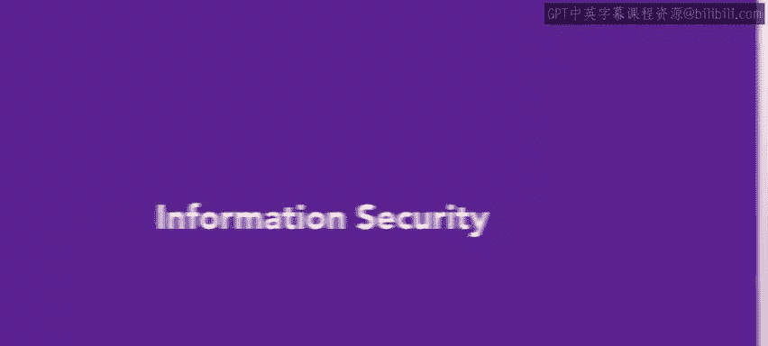

As you continue learning about HR and workplace hazards and threats。

 let's explore information security we'll discuss social engineering tactics and access control These key concepts are essential for HR professionals to understand in order to protect the organization of valuable data。

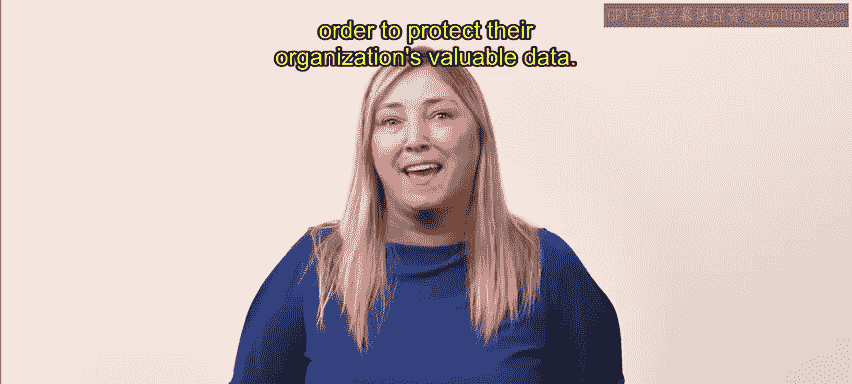

As you may recall， weve previously reviewed social engineering tactics such as tailgating and impersonation in a video on physical security vulnerabilities。

Let's build upon that knowledge to examine a few additional social engineering tactics。

 Let's start with phing。 fishingishing is a deceptive tactic where cyber criminals send fraudulent messages such as emails。

 phone recordings or social media messages that appear legitimate and trustworthy。😊。

These messages act as bait， enticing recipients to disclose of valuable information。😊。

The victims believe the messages are authentic and therefore share their information。Viishing。

 short for voice phishing， is a cyber crime that uses phone calls to trick individuals into revealing personal information。

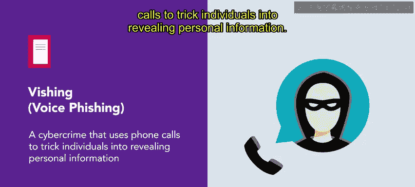

For example， you might receive a call with a prered voice message， apparently from your bank。

 asking you to verify sensitive details such as your account number。😊，The recording sounds authentic。

 leading you to enter your personal information。This deception can allow the criminal to gain unauthorized access to your account。

 potentially leading to financial loss or identity theft。

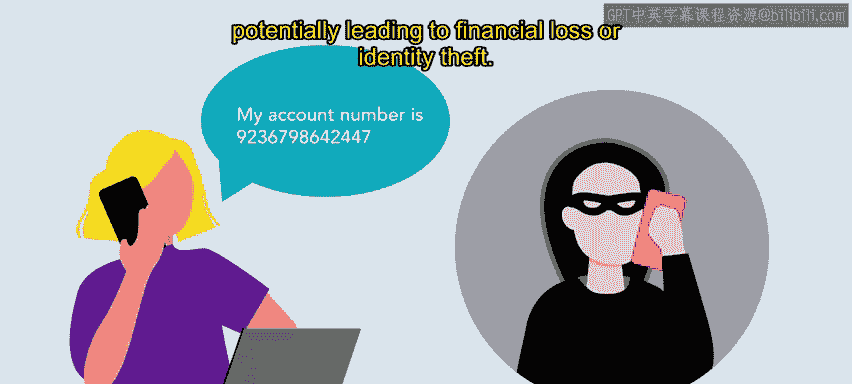

A quid pro quo attack is another tactic in which cyber criminalris make random calls to individuals within an organization。

 pretending they are from the tech support team。They offer support and return for their desired goal。

 sensitive information。

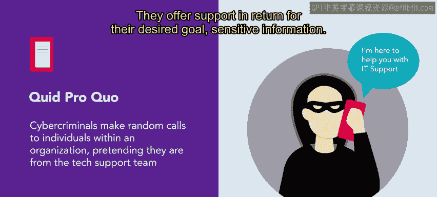

For example， criminals claim to be returning a call and hope to eventually connect with someone who genuinely needs technical assistance。

The attackers pose as helpful experts and instruct the individual to type in commands that install malware or grant them unauthorized access to the victim's computer and the organization's network。

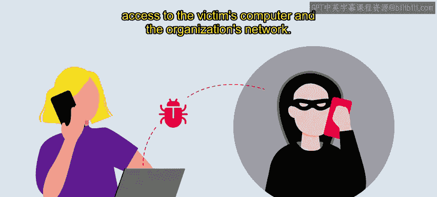

Dumpster diving is the act of searching for valuable or sensitive information through discarded trash。

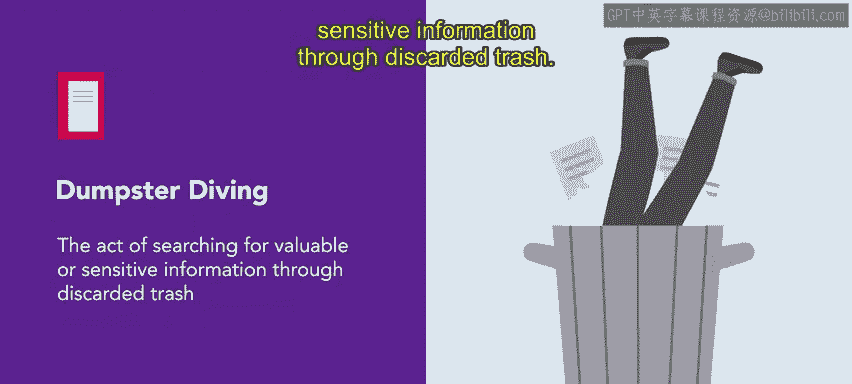

Hackers may use dumpster diving to find access codes， passwords written on sticky notes。

 sensitive documents that should have been shredded， calendars， phoneless， or organizational charts。

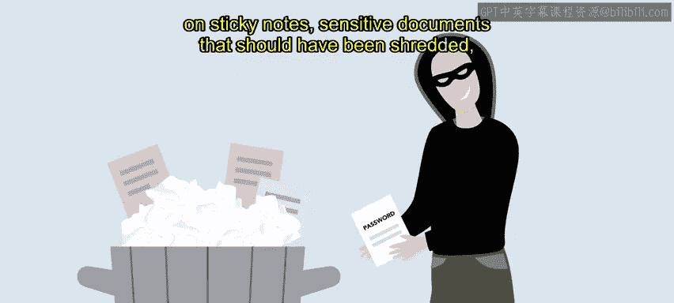

Suppose you come across a USB drive on the ground， you pick it up and insert it into your computer to find out who it belongs to。

This innocent action known as baiting opens the door to potential danger baiting involves dropping something like a USB。

 flash drive， CD or other portable media and the hopes that someone puts it into their computer when they do their computer may be infected with malware and their sensitive data is at risk。

😊。

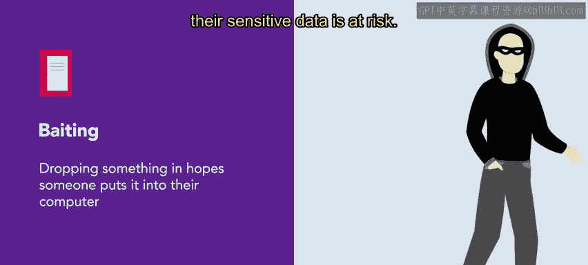

Shoulder surfing involves looking over someone's shoulder to get information for instance。

 a criminal might stand behind you while using an ATM。

 a computer or an electronic device to obtain your personal information。

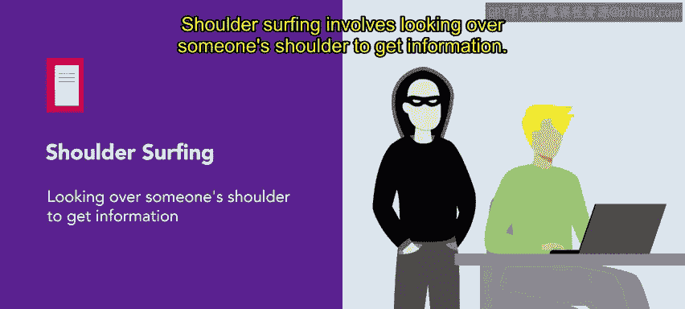

Attackers can also use binoculars or other vision enhancing devices to shoulder surf from long distances。

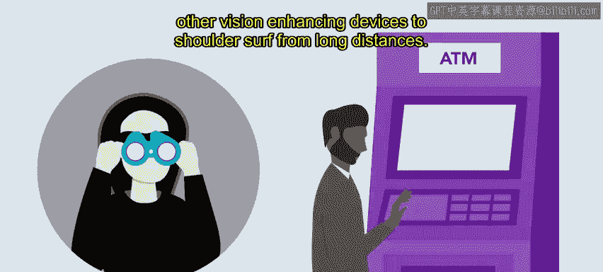

Access control can mitigate social engineering vulnerabilities。

Access control ensures the right people have access to the right information at the right time。

Access control solves two problems。 First， it determines who should access what information。 Second。

 it determines if the person trying to access information is who they say they are。😊。

Let's review the key factors that contribute to access control。😊。

Identification is the first step in access control。It ensures that users claim a specific identity。

 such as an account number or username to access resources or information。😊。

By establishing their identity， individuals receive the appropriate access level。

 which helps maintain information security and control within an organization。😊。

Authentication is a process of verifying an individual's identity before granting them access to resources。

😊，By validating a password or pin， an ID badge or token， or a fingerprint。

 organizations can safely verify an identity。😊，2 factor authentication has become popular。

 This requires individuals to provide multiple verification forms， such as a password。

 as well as a code sent to their smartphone。 Another authentication approach uses software or hardware tokens that generate a unique code synced with the system。

😊，This additional code is entered along with a password。

 adding an extra layer of security to the authentication process Authorization determines if the user or entity has the appropriate permission to perform certain actions or access resources。

😊，An individual's rights and permissions might be limited based on job function。

 seniority or other classifications。Audit logs create accountability by monitoring and tracking user activity on a system by maintaining detailed records of user actions。

 organizations can ensure that employees use the system appropriately and according to policy。😊。

Audit logs also help deter malicious activities as they identify unauthorized access or suspicious behavior。

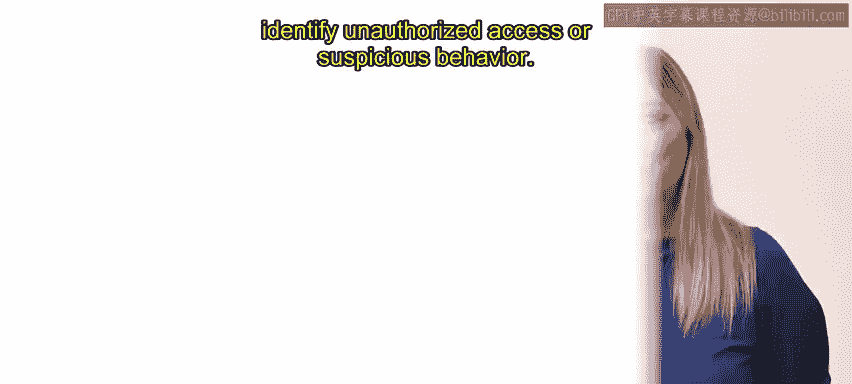

You've just learned about various information security factors such as social engineering tactics and protocols to safeguard valuable information。

As an HR professional， you will play a vital role in protecting your organization's data。

It's important to understand these tactics and implement effective control measures。

