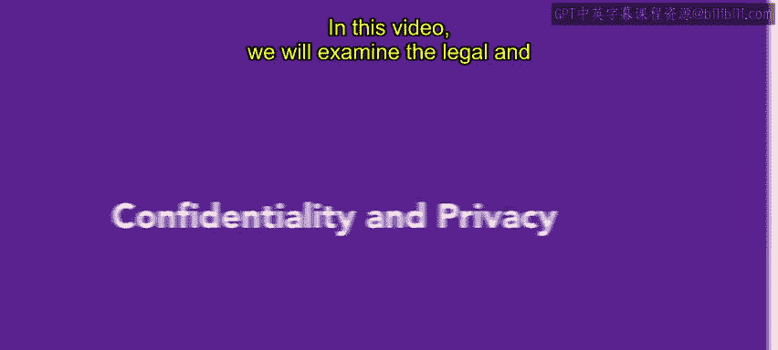
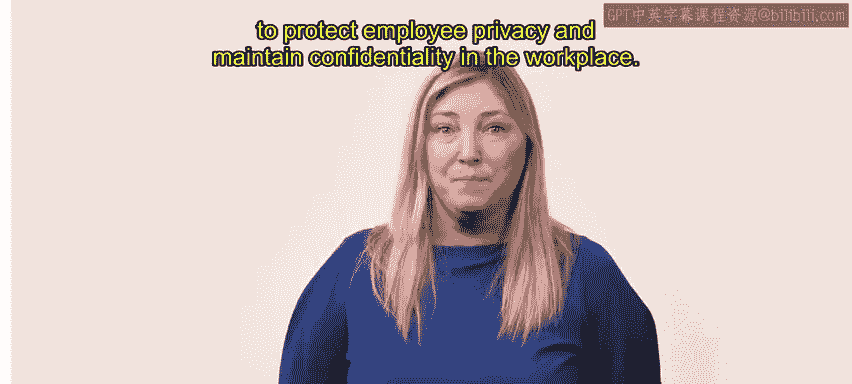

# HRCI《人力资源助理（员工关系、合规，4-5课／共5课）｜HRCI Human Resource Associate》 - P132：49_保密和隐私.zh_en - GPT中英字幕课程资源 - BV1qE4m19788

In this video， we will examine the legal and compliance implications surrounding data collection。

 storage， and analysis， as well as the potential risks and consequences of violating employee privacy。

By the end of this video， you will understand the measures necessary to protect employee privacy and maintain confidentiality in the workplace。

😊。

Data collection goes beyond monitoring employees and may involve accessing information about their activities outside of work。

While a data collection has its benefits， HR professionals must be cautious of the potential legal and brand consequences of violating employee privacy。

To better understand this process， let's review current US laws related to data collection。

 storage and analysis the Electronic Communications Privacy Act passed in 1986。

 made it illegal to monitor oral or wire-based communications unless an organization has a legitimate need to do so or an employee consents。

 the Storward Communications Act was passed as part of the electronicic communicationations Pri Act。

It protects the storage of electronic communications like emails。Generally。

 organizations can access communications stored on their wire or electronic communication services。

 such as employerer provided email service， however。

 they should inform their employees about this policy to ensure transparency and awareness。

 the computer fraud and abuse Act prohibits the intentional access of a computer without authorization or exceeding authorized access。

 resulting in the acquisition of information from a protected computer。😊。

While initially passed to combat hacking， organizations have also used this act to charge employees who access unauthorized information on electronic devices。

 systems or networks owned by the organization。Employee monitoring laws differ by state， therefore。

 organizations are responsible for proactively gathering information and staying updated with applicable laws doinging so ensures compliance with regulations and avoids potential legal issues。

😊。

It's important to remember that closely monitoring employees can negatively impact an organization's reputation。

 affecting employee recruitment and retention and creating an unhealthy work environment。

 transparent communication regarding data collection practices can help mitigate these effects In addition to privacy concerns and unlawful data collection。

 organizations should also be aware of external security risks such as equipment theft and cyber crimes。

😊，HR professionals play a vital role to ensure compliance， safeguard sensitive information。

 and promote a healthy work environment。

