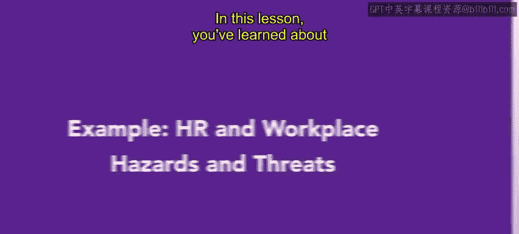
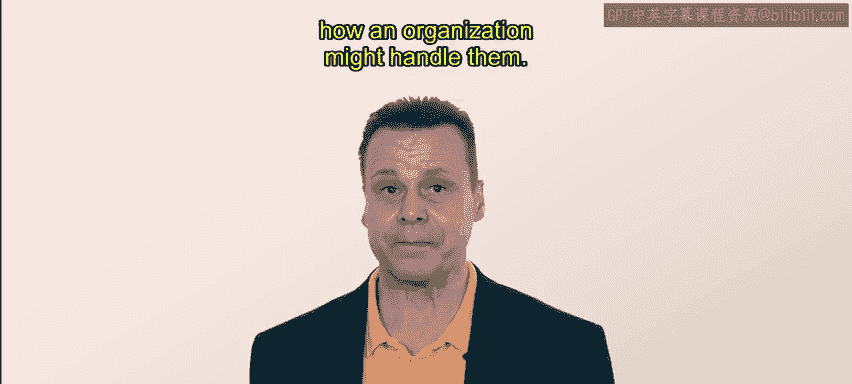
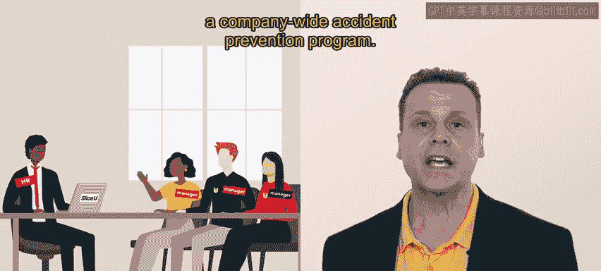
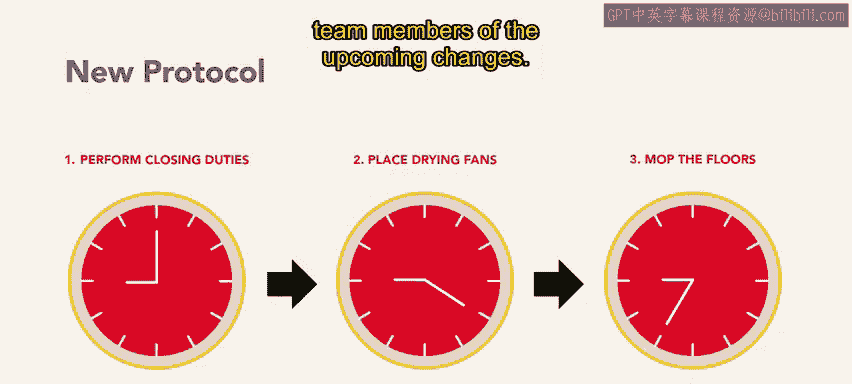
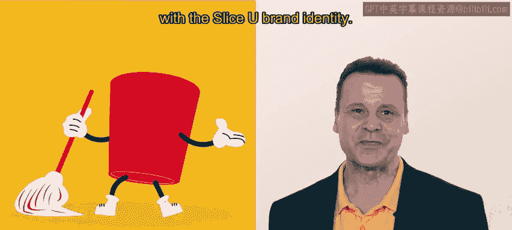
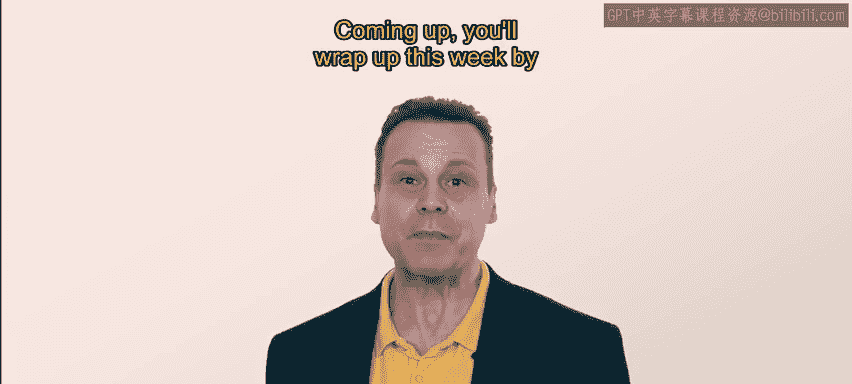

# HRCI《人力资源助理（员工关系、合规，4-5课／共5课）｜HRCI Human Resource Associate》 - P133：50_示例：人力资源与工作场所危害和威胁.zh_en - GPT中英字幕课程资源 - BV1qE4m19788

In this lesson， you've learned about hazards and threats in the workplace。

 Now we'll examine a real world example。 how an organization might handle them。

For this example， we'll use slicelicu。 Slicu is a chain of pizza restaurants with many locations near college campuses。

They make delicious，rely priced pizzas。Jay is an HR specialist working at SliceU headquarters。

Recent incidents at two different slicelicy locations have been brought to Jay's attention。

At these locations， two different slicelicu employees have fallen on slippery floors。Luckily。

 no one was seriously hurt in either instance。But Jay wants to proactively address this issue so that it doesn't happen again。

To begin， Jay identifies wet floors as a tangible hazard。

 This type of physical hazard involves unsafe object conditions or procedures As an organization Slic you prides itself on its cleanliness。

 The floors are moed every night， as one of the closing duties in both instances where people slipped and fell。

 the floors were being cleaned while other employees were completing their closing duties。

Jay had given this problem some thought and spoken with restaurant managers from around the company as an HR team member。

 Jay's role empowers them to create a company wide accident prevention program。

J develops a new protocol that requires mopping to occur only after all other closing duties have been completed。

Jay also orders new floor drying fans for each location。 Wet floors cannot be avoided。

 at least not entirely。But the new protocol should improve safety。

Ja creates a series of informational messages， flyers and posters that inform team members of the upcoming changes。

To raise awareness about this new safety program， Jay also asked the Slic you design team to create an animated character named Sppy。

 Sppy can be included on all the materials sent out about the program。

Jay figures that something fun might draw attention of employees to the issue and Sppy spirit is consistent with the slice you brand identity。

😊。

Ja distributes the new material to all team members and makes sure the new mopping protocol is posted at every location。

 Workers appreciate the guidance and the new floor fans。 Some one even responded to the email。

 saying how much they love Spppy。Jaill is confident that this new program will help to prevent slips and falls in the future。

That's all from Jay， for now。Identifying hazards and creating methods to mitigate them is an important HR task。

When employees feel safe and cared for in the workplace。

 they're more likely to be productive and loyal to the organization。Coming up。

You'll wrap up this week by learning about harassment in the workplace and how to address it。

