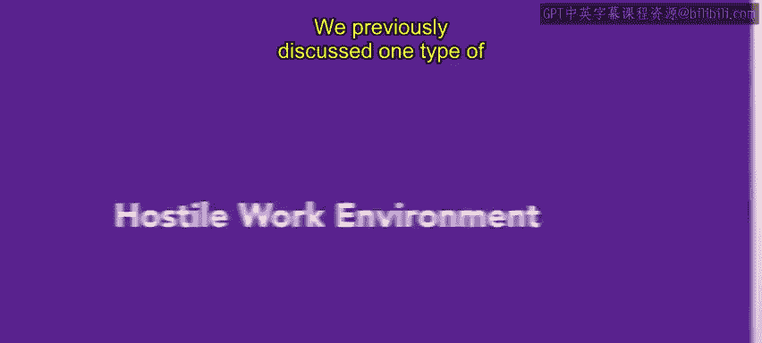
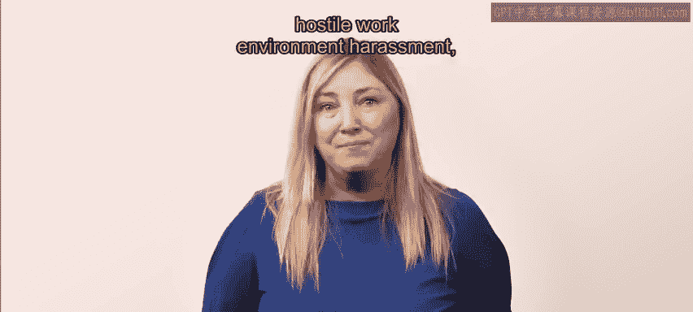
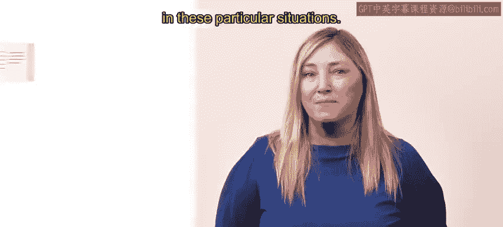
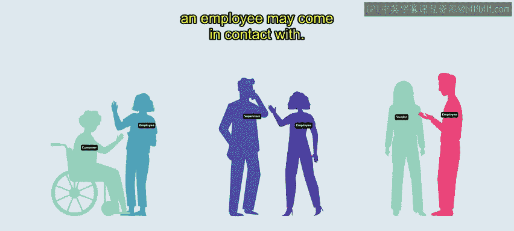
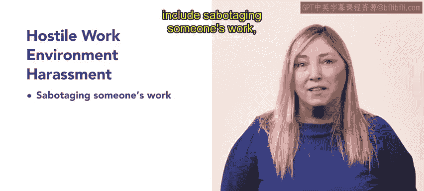
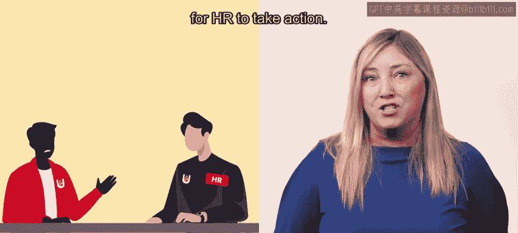
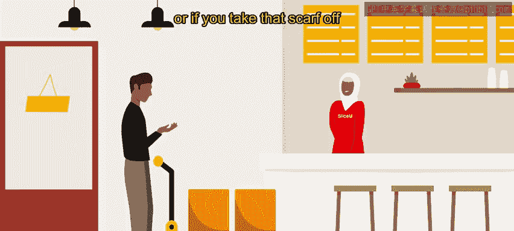
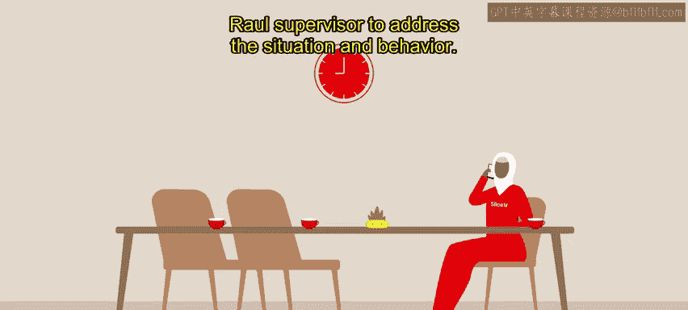
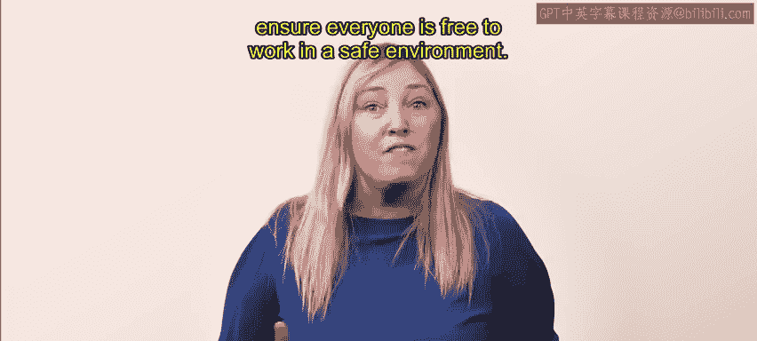
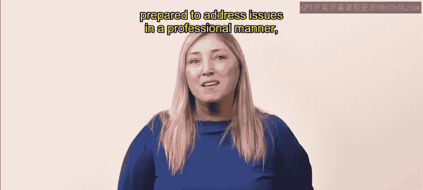

# HRCI人力资源助理（员工关系、合规）：4-5：敌意工作环境性骚扰 👥

在本节课中，我们将学习美国平等就业机会委员会定义的第二种非法性骚扰形式——敌意工作环境性骚扰。我们将明确其定义，探讨人力资源专业人员在处理此类情况中的角色，并通过一个具体案例来加深理解。

---

上一节我们介绍了“交换条件性骚扰”。本节中，我们来看看另一种更为常见的性骚扰形式：敌意工作环境性骚扰。

敌意工作环境性骚扰源于基于性别的行为，无论其是否出于故意，只要该行为不受欢迎，并造成了一种令人恐惧或不适的工作环境，即构成骚扰。

与交换条件性骚扰的一个主要区别在于，敌意工作环境性骚扰的制造者可以是**主管、同事、客户、供应商或员工可能接触到的任何其他人**。

---

根据EEOC的定义，敌意工作环境性骚扰通常包含以下行为：

以下是构成敌意工作环境的一些常见例子：

*   破坏他人的工作。
*   讨论性活动。
*   使用粗俗或冒犯性的语言。
*   讲粗鲁或不恰当的笑话。
*   使用命令式或控制性的威胁。

---

员工必须报告这些行为，人力资源部门才能采取行动。

作为人力资源专业人员，你必须进行调查，并判断这些行为是否满足以下条件：

以下是调查时需要确认的关键点：

*   行为是否多次发生。
*   是否对个人造成了伤害。
*   是否影响了整体工作环境。

---

让我们通过SliceU披萨连锁店的例子来具体分析。这是一家在大学校园营业至深夜的披萨店。

亚斯明是SliceU的一名收银员，已在此工作六个月。雇主知道她是穆斯林，因此她除了穿着工作服外，还会佩戴头巾。

亚斯明的老板、同事和送货司机都了解她的宗教背景，并且从未对她的头巾发表过任何评论。

每周，一位名叫拉乌尔的苏打水供应商会来为SliceU补充苏打水罐和瓶子。

拉乌尔在大家面前显得很友善，但当只有亚斯明在柜台时，他经常对亚斯明的头巾和身体发表粗鲁的评论。

拉乌尔多次对亚斯明说：“你不戴那个蠢东西在头上会更性感”，或者“如果你把那条头巾摘下来，周六晚上或许能约到人”。

亚斯明决定不再忍受。下一次拉乌尔来补充苏打水时，她藏起手机，录下了拉乌尔的伤人话语。

随后，亚斯明将拉乌尔的言论报告给了她的主管。她的主管立即与拉乌尔的主管讨论了此事，以处理这种情况和行为。

---

人力资源专业人员和员工必须共同努力，以创造一个受欢迎且相互尊重的工作场所。

这可能意味着需要与第三方合作，以确保每个人都能在一个安全的环境中自由工作。

---

避免敌意工作环境性骚扰是人力资源专业人员可能面临的挑战。

然而，你必须准备好以专业的方式处理问题，确保所有员工在工作场所都受到包容并感到舒适。

---

本节课中，我们一起学习了敌意工作环境性骚扰的定义、它与交换条件性骚扰的区别，以及人力资源专业人员在调查和处理此类投诉时应遵循的步骤和考量因素。通过案例，我们看到了及时报告和跨部门协作对于维护安全、尊重的工作环境至关重要。