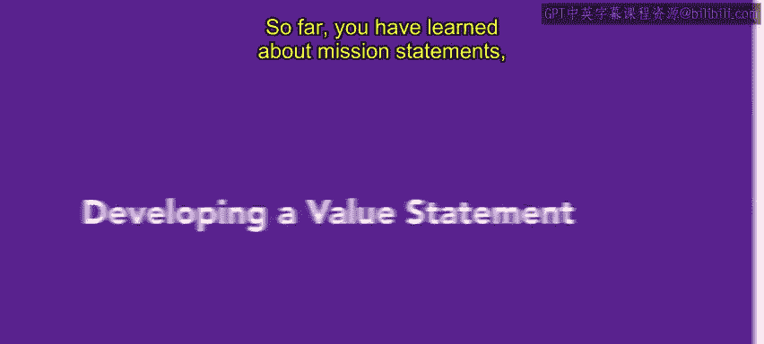
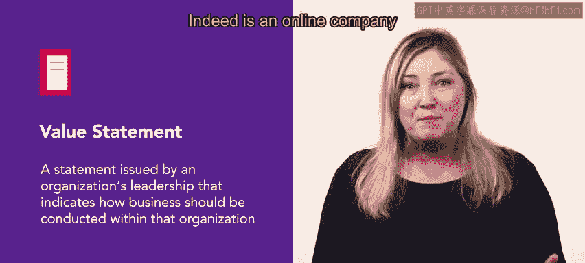
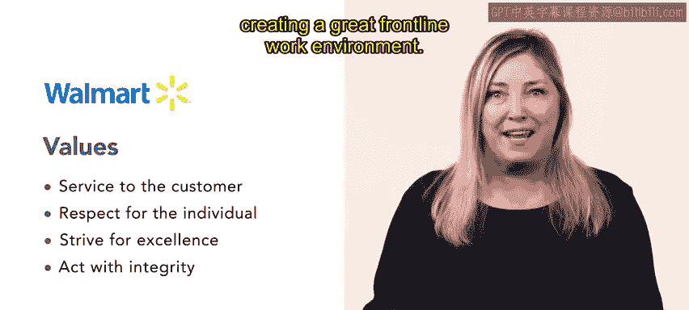

# HRCI《人力资源助理（员工关系、合规，4-5课／共5课）》 - P13：8_制定价值观声明

在本节课中，我们将要学习什么是价值观声明，以及如何制定一份有效的价值观声明。在此之前，我们已经了解了使命声明和愿景声明，本节我们将聚焦于价值观声明这一核心概念。

## 什么是价值观声明？📜

价值观声明是由组织领导者发布的声明，它指明了在该组织内应如何开展业务。这些价值观是指导组织所有行动的原则。

常见的公司价值观可以包括：诚信、尊重、卓越的产品与服务以及团队合作。

## 如何制定价值观声明？🛠️

Indeed是一家帮助招聘领域专家的在线公司，它提供了一个制定价值观声明的建议流程。以下是该流程的详细步骤。

### 第一步：集思广益，列出潜在价值观

首先，通过头脑风暴列出潜在的价值观至关重要。通过询问员工他们认为组织的核心价值观是什么，以及他们希望在未来看到哪些价值观，来创建一个包含当前和潜在价值观的全面列表。

### 第二步：审查、分组并筛选价值观

接下来，审查列出的价值观。将相似的价值观分组，并剔除那些你认为不能代表你的组织，或与其他组别重叠过多的价值观。完成分组后，确定哪些价值观对公司的成功至关重要。确保你选择的价值观数量是可管理的。

### 第三步：起草价值观声明

下一步是使用你确定的最终价值观集合来起草价值观声明。这些声明通常以项目符号或编号列表的形式呈现。将列表提炼为简短、精炼的语言，以便清晰地传达价值观。

### 第四步：与各方审查并定稿

声明起草完成后，应与领导层、员工以及客户或顾客一起进行审查。征求反馈意见，并利用他们的输入来修订并最终确定你的声明。

### 第五步：向员工和客户传达价值观

向员工和客户传达组织的价值观至关重要。你可以通过为员工提供培训、在组织网站上发布价值观，或在工作场所的公共区域张贴它们来实现这一目标。

### 第六步：将价值观融入日常实践

最后，将价值观融入日常业务实践和流程中。确保它们被广泛提供，以供查阅和参考。

## 案例分析：沃尔玛的价值观声明 🏪

沃尔玛是一家知名的家庭用品、服装、杂货等零售商。他们拥有四项企业价值观：

1.  **服务顾客**
2.  **尊重个人**
3.  **追求卓越**
4.  **诚信行事**

这四项价值观体现了沃尔玛所代表的一切，包括他们专注于提供卓越的客户服务和创造良好的前线工作环境。

## 总结 📝

价值观声明是由组织领导者发布的声明，它指明了在该组织内应如何开展业务。组织在其所有行为中遵循这套价值观至关重要。

本节课中，我们一起学习了价值观声明的定义、制定流程，并通过沃尔玛的案例了解了价值观声明的实际应用。价值观声明是组织文化的基石，它指导着组织的行为和决策，确保所有成员朝着共同的目标前进。