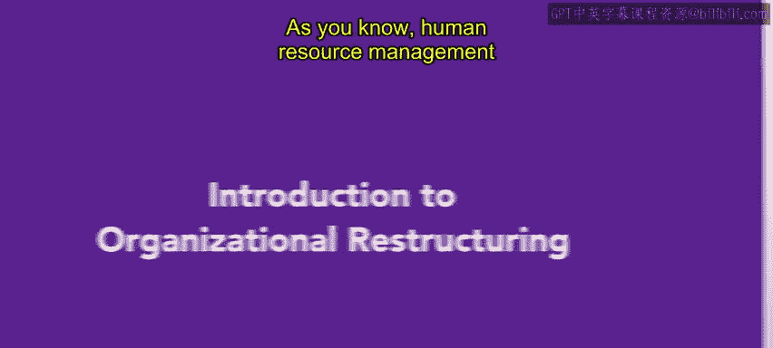
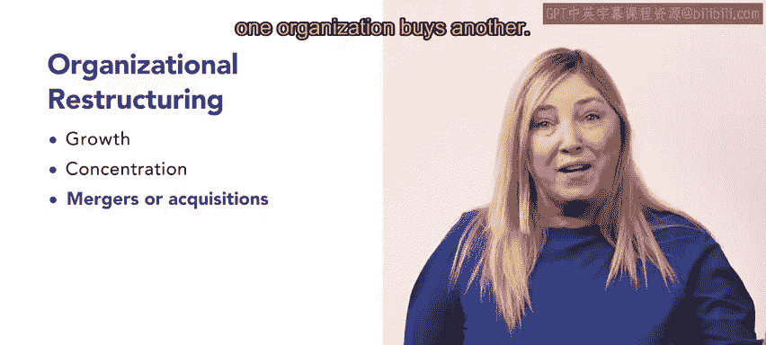
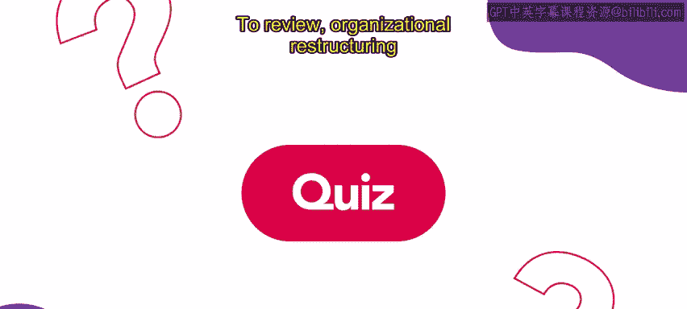

# 📘 entity["organization","HRCI","human resources certification body"]《人力资源助理（员工关系、合规）》：第5课：组织重组简介  


## 🌟 课程概述  



在本节课中，我们将系统学习**组织重组（Organizational Restructuring）**的基本概念、产生原因以及四种常见策略。通过本节内容，你将理解组织为何需要重组、人力资源在其中扮演的角色，以及不同重组方式各自的核心目标，为后续深入学习具体案例打下基础。  


## 🧩 人力资源管理与组织重组  

在上一部分中，我们已经了解了人力资源管理的整体职责。本节将在此基础上，进一步聚焦其中一个关键任务：**组织重组**。  

人力资源管理涉及多种任务和责任。  

这些任务包括在组织设计中实施相关实践和政策，以及招聘和留住员工。  

人力资源的另一个重要方面，是协助组织进行重组。  

为了更清楚地理解组织重组的背景，下面我们来看一看组织为什么会发生重组。  


## 🔄 组织重组的成因  

在了解了人力资源在重组中的作用之后，本节将解释**组织重组产生的原因**。  

组织重组可能由多种因素引起，例如市场波动、竞争压力、客户需求变化，以及在组织内部识别出冗余岗位或资源。  

这些因素往往会影响组织的效率和竞争力，因此企业需要通过重组来重新配置资源。  

在明确了重组的原因之后，接下来我们将系统介绍组织重组的具体策略。  


## 🧠 组织重组的四种策略  

基于组织目标和现实情况，企业通常会选择不同的重组方式。以下是组织重组中常见的四种策略。  


### 🚀 支持增长（Growth）  


首先，我们来看第一种策略：**支持增长**。  

这一策略或阶段的核心目标，是通过人力资源配置来推动组织扩张。  

该策略包括招聘和留住高质量员工，以支持组织的业务模式。  

可以用一个简单公式来概括这一策略：  

```text
组织增长 = 高质量员工 × 业务模式支持
```  

在完成对增长型重组的理解后，我们继续来看第二种策略。  


### 🎯 集中化（Concentration）  

在支持增长之后，第二种组织重组策略是**集中化**。  

在这一策略中，组织会淘汰不盈利的产品和服务，转而专注于能够带来利润的部分。  

其核心逻辑可以用以下方式表示：  

```text
保留 = 盈利产品与服务  
淘汰 = 非盈利产品与服务
```  

通过集中资源，组织能够提升整体运营效率。接下来，我们将介绍第三种更具结构性变化的策略。  


### 🤝 合并或收购（Merger or Acquisition）  

在集中化之后，第三种重组策略是**合并或收购**。  

合并是指两个不同的组织合并成为一个新的组织。  



收购是指一个组织购买并控制另一个组织。  

可以用如下关系来理解：  

```text
合并 = 组织A + 组织B → 新组织  
收购 = 组织A → 控制组织B
```  

这种策略通常用于快速扩张规模或获取关键资源。接下来，我们将进入最后一种重组方式。  


### 📉 裁员（Downsizing）  

在前三种策略之后，最后一种组织重组策略是**裁员**。  



裁员的核心目标，是通过减少岗位数量来提高组织的生产力和盈利能力。  

这些岗位的削减可以是临时的，也可以是永久的。  

其基本思路可以概括为：  

```text
裁员 → 成本下降 → 生产力与盈利能力提升
```  

理解了裁员策略后，我们已经完整学习了组织重组的四种主要方式。  


## 🧑‍💼 人力资源在组织重组中的角色  

在回顾了各类重组策略之后，有必要再次强调人力资源的作用。  

组织重组是一种常见的商业战略。  

在组织重组过程中，需要考虑的四种方法包括：支持增长、集中化、合并或收购，以及裁员。  

人力资源专业人员在每一种方法中都扮演着重要角色，并协助组织确保重组过程顺利、有效地进行。  

在接下来的课程中，你将进一步学习每一种重组流程，并通过具体示例加深理解。  


## ✅ 本节课总结  


在本节课中，我们一起学习了**组织重组的基本概念**、**重组发生的原因**以及**四种常见的组织重组策略**：支持增长、集中化、合并或收购和裁员。  

同时，我们也明确了**人力资源专业人员在组织重组中的关键作用**，为后续深入学习各类重组流程和实际案例奠定了基础。