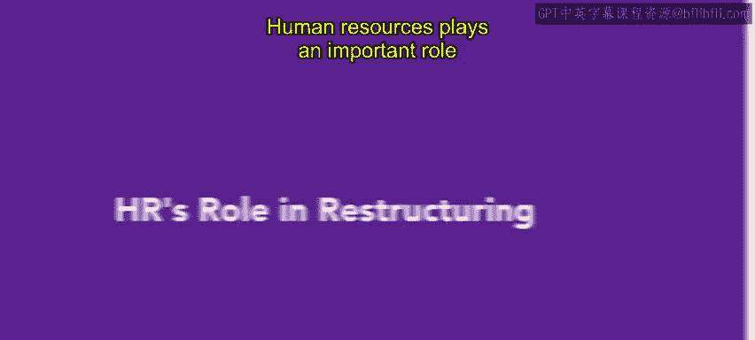
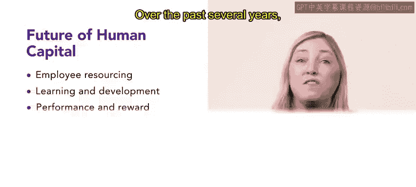
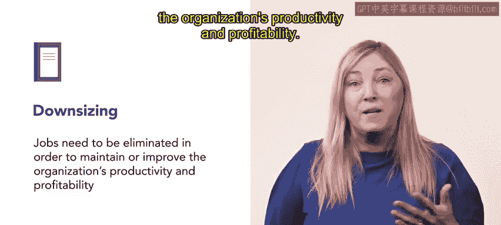

# HRCI《人力资源助理（员工关系、合规，4-5课／共5课）》：P142：59_人力资源在重组中的角色

在本节课程中，我们将学习组织重组的概念，并重点探讨人力资源部门在这一过程中的核心角色与职责。理解这些内容对于人力资源专业人士有效支持组织战略至关重要。

人力资源在组织的重组过程中扮演着重要角色。

## 🏢 常见的组织业务战略

组织内部常见的业务战略包括增长、集中、兼并与收购以及裁员。人力资源专业人士需要理解并协调这些战略目标，使其与组织整体目标保持一致。

以下是四种常见业务战略的详细说明：

*   **增长**：在组织的增长阶段，招聘和留住最优秀的员工至关重要。组织通常会鼓励现有员工推荐新申请人，或提供搬迁激励、奖金等奖励措施来吸引人才加入。
    *   **示例**：Urban Attire公司正在美国大规模扩张。为支持招聘，其人力资源部门决定向成功推荐新员工的现有员工提供100美元的激励奖金。
*   **集中**：在集中战略下，组织会淘汰不支持利润的业务单元，转而支持盈利的单元。人力资源经理的角色是支持组织保留的业务单元，并为未来的成功招聘和保留最需要的员工。
    *   **示例**：Urban Attire关闭了一家业绩不佳的门店。为了保留员工，他们将这家店的员工调往该地区另一家业绩更好的门店。人力资源部门负责确保员工调动的平稳过渡。
*   **兼并与收购**：这通过新的合资企业或将一个组织吸收到另一个组织中，从而合并两个组织。作为人力资源专业人士，你将在并购的每个阶段都发挥积极作用，包括交易提出前、尽职调查、整合规划以及整个实施过程。
    *   **并购前**：人力资源部门可以通过绘制**组织架构与流程关联图**来协助准备，明确本组织及目标组织的部门设置与相互联系。
    *   **并购中的人力资本战略**：在考虑组织未来人力资本时，有三个主要组成部分有助于设定统一组织的战略方向：
        1.  **员工资源配置**：考虑谁将担任哪些高管职位，以及谁应进入董事会。
        2.  **学习与发展**：思考工作文化的异同。如果存在差异，考虑如何解决这些差异。
        3.  **绩效、奖励与服务提供**：思考如何保留最优秀的人才。同样，分析如何调整两个组织的绩效与奖励体系。
    *   **示例**：Urban Attire将一家快速成长的年轻服装公司视为重要竞争对手，并将其设定为收购目标。收购该品牌将确保Urban Attire保持市场领先地位。在提出200万美元的收购要约并被接受后，Urban Attire的人力资源部门评估并调整了员工资源配置、学习与发展以及绩效奖励体系，以确保合并成功。
*   **裁员**：当组织认为需要精简规模以维持或提高生产力和盈利能力时，就会采取裁员策略。在解雇员工时，人力资源应作为员工权益的维护者，确保过程体面且公平。进行离职面谈和建立再就业支持以帮助员工寻找新工作非常重要。同时，确保组织避免不当解雇和任何可能引发诉讼的理由也至关重要。
    *   **替代方案：共享工作**：如果组织员工过剩但不想实施大规模裁员，可以采用共享工作计划。该计划允许员工减少工作时间，并领取部分失业保险金。但请注意，并非所有州都允许员工在减少工时的情况下领取失业补偿。
    *   **示例**：在收购年轻品牌后，扩张后的Urban Attire面临员工过剩的问题。经过讨论，人力资源部门决定采取部分裁员的方案，裁减15%的销售助理。人力资源部门通知门店经理需要解雇的员工数量，由经理确定具体人选。人力资源团队与每位被解雇的员工进行离职面谈，并提供未来工作的推荐。

## ⚖️ 《工人调整与再培训通知法案》（WARN法案）

在被解雇的情况下，组织可能需要遵守《工人调整与再培训通知法案》（WARN法案）。

根据美国劳工部的规定，该法案旨在为工人提供充足的时间，为他们目前所从事的工作与新工作之间的过渡做好准备。WARN法案的一个重要方面是**提前通知要求**。法律规定，在大规模裁员或工厂关闭的情况下，组织需要提前60天提供书面通知。这份通知会启动与州政府的快速响应程序，包括提供劳动力市场信息、职业培训和安置服务。

在兼并与收购中，如果整个企业或部分企业关闭，负责传达关闭书面通知的一方将取决于关闭发生的时间。**如果关闭在销售生效前发生，卖方需要发出通知；反之，如果关闭在销售后发生，买方需要发出通知**。人力资源专业人士很可能需要参与通知过程，例如回答相关问题，并帮助受影响的工人过渡到新的工作或培训项目。

## 🎯 总结与过渡

为了使人力资源经理成为有效的战略合作伙伴，其战略和目标与组织的战略和目标保持一致至关重要。作为人力资源经理，组织重组很可能在你职业生涯的某个时刻发生，因此理解这些常见业务战略之间的区别非常重要。

在接下来的课程中，你将了解更多关于离岸外包和业务外包的知识。

