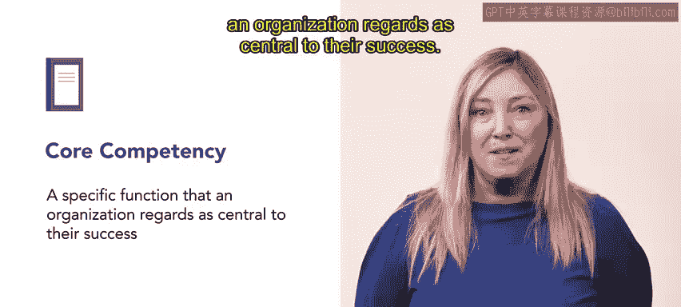
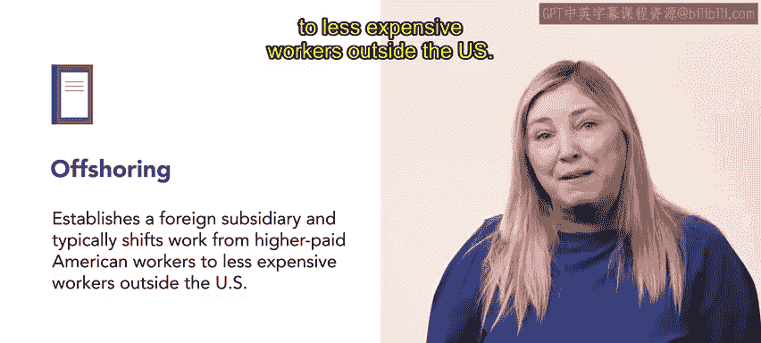

# HRCI《人力资源助理（员工关系、合规）》：第4-5课：离岸外包与外包 🌍  


## 📘 课程概述  


在本节课中，我们将学习两种常见的企业战略：**外包（Outsourcing）**和**离岸外包（Offshoring）**。  

上一节视频中，我们学习了人力资源在组织重组中的角色。本节课将进一步探讨在人力资源专业人员支持组织发展过程中，常见的两种业务战略。  

外包和离岸外包都是帮助企业更顺畅运行的重要方式。接下来，我们将分别介绍这两种战略的定义及实际案例。  


## 🔄 一、外包（Outsourcing）  

在了解组织如何优化资源之前，我们先来看第一种策略——外包。  

**外包**是指企业支付给外部机构，由其负责执行某些专业化的业务职能。  

这些职能通常不属于企业的**核心竞争力（Core Competency）**。  

因此，企业将这些职能交由专业机构负责，可以提高效率并降低成本。  


### 🔑 核心概念  

**核心竞争力（Core Competency）**是指组织认为对其成功至关重要的特定职能。  

可以用公式表示为：  

```text
企业成功 = 核心竞争力 + 有效支持职能
```

当某项职能不属于核心竞争力时，可采用外包策略：  

```text
非核心职能 → 外部供应商
```


### 📌 常见的外包案例  

以下是常见的外包业务类型：  

- 安保服务（Security）  
- 餐饮服务（Food Service）  
- 薪资管理（Payroll）  



为了更好地理解，我们来看一个具体案例。  

假设一家连锁餐厅销售饮料。该餐厅将饮料机的补货和维护工作外包给第三方供应商。  

在这种安排下，员工只需保持饮料机清洁，而无需负责补充饮料或维修设备。  

通过这种方式，企业可以将精力集中在自身核心业务上。  


## 🌏 二、离岸外包（Offshoring）  

在了解了外包之后，我们再来看另一种常见战略——离岸外包。  

**离岸外包**是指企业在国外设立子公司，并将部分工作从高薪国家转移到劳动力成本较低的国家。  

通常情况下，美国企业会将部分工作从美国本土转移到其他国家，以降低人力成本。  

可以用公式表示为：  


```text
高成本国家工作 → 低成本国家子公司
```


### 📌 离岸外包的常见领域  

当企业需要处理大量劳动密集型工作时，离岸外包非常常见。  

以下是常见的离岸外包职能：  

- 客户服务（Customer Service）  
- 技术支持（Technical Support）  
- 计算机编程（Computer Programming）  

例如，一家全球性公司可能会将部分电子邮件和在线聊天客户服务工作交由海外员工负责。  

通过这种方式，企业可以在控制成本的同时，保持服务质量。  




## 🔍 三、外包与离岸外包的区别  

在分别介绍了两种战略之后，我们可以对它们进行简单对比。  

```text
外包（Outsourcing）= 是否由外部公司执行
离岸外包（Offshoring）= 是否转移到国外
```

两者的区别在于：  

- 外包关注“是否由外部机构执行”  
- 离岸外包关注“是否在国外执行”  

企业可以同时使用这两种方式，也可以单独使用其中一种。  


## 🎯 人力资源的角色  

现在你已经了解了外包与离岸外包的区别。  


作为人力资源专业人员，需要支持企业在实施这些战略时的人力规划、沟通协调与合规管理。  

在人力资源的实际工作中，这包括：  

- 员工岗位调整  
- 跨国用工合规  
- 组织结构优化  
- 员工关系管理  


## 📝 课程总结  

本节课中，我们一起学习了：  

- 外包的定义与核心概念  
- 核心竞争力的含义  
- 外包的常见案例  
- 离岸外包的定义与应用场景  
- 外包与离岸外包的区别  
- 人力资源在支持这些战略中的作用  

通过理解这两种业务战略，人力资源专业人员可以更好地支持组织重组与业务发展。  


下一步，我们将进一步探讨人力资源在组织重组中的具体实践案例。