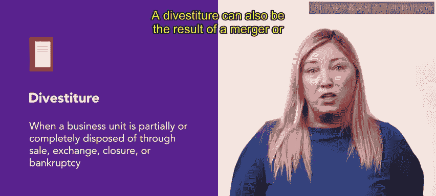

# HRCI《人力资源助理（员工关系、合规，4-5课／共5课）》：P146：63_资产剥离

在本节课中，我们将要学习资产剥离的概念及其在组织运营中的应用。我们将探讨资产剥离的定义、发生原因、对组织的影响以及人力资源部门在其中扮演的关键角色。

上一节我们介绍了业务连续性的基础知识，本节中我们来看看资产剥离。

**资产剥离**是指一个业务部门通过**出售、交换、关闭或破产**等方式被部分或完全处置的过程。

资产剥离通常发生在组织的领导层认为某个业务单元不再符合其战略目标时。资产剥离也可能是并购活动导致某个业务单元变得冗余的结果。

资产剥离可能使组织实现盈利、削减成本、偿还债务并提升股东价值。

在资产剥离过程中，人力资源团队通常需要与企业发展战略团队就以下议题进行协商，例如员工保留计划。

以下是人力资源部门在资产剥离中的主要职责：

*   收集与员工相关的内容信息，例如薪酬与福利。
*   确保与资产剥离相关的内容可供需要的人员访问，同时维护员工的隐私与保护。

资产剥离过程可能令人不快或失望，但人力资源专业人员以同理心处理此过程至关重要，以保持组织的平稳运行。

接下来，你将学习关于无薪休假的内容。

本节课中我们一起学习了资产剥离。我们明确了资产剥离是业务部门通过出售、关闭等方式被处置的过程，理解了其发生的原因在于战略不符或业务冗余。我们还认识到，资产剥离能帮助组织优化结构、提升价值，而人力资源部门在其中承担着信息收集、隐私保护和员工关系维护等关键职责，需要以专业且敏感的态度确保过渡期的稳定。