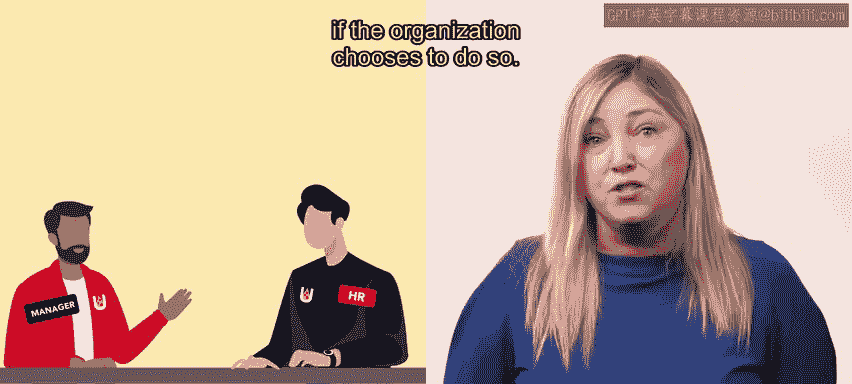

# HRCI《人力资源助理（员工关系、合规，4-5课／共5课）》 - P147：64_休假

## 概述

在本节课中，我们将要学习人力资源在维持组织连续性方面扮演的另一个重要角色：**休假**。我们将了解什么是休假，它与裁员有何不同，以及人力资源部门在此过程中的职责。

## 😊 什么是休假？

上一节我们介绍了人力资源在组织连续性中的角色，本节中我们来看看一种具体的应对措施：休假。

**休假**是一种强制性的工作暂停。雇主强制要求员工减少工作时间，或暂时离开工作岗位，且通常没有自动获得薪酬的权利。

每个组织自行决定休假的期限以及员工在此期间是否继续享受健康福利。其预期是，在休假结束后，员工将恢复全职工作或以减少的工时返回工作岗位。

例如，像COVID-19这样的危机常常导致组织安排员工休假。在疫情初期，包括减少人员配置和关闭餐厅在内的安全要求，导致苏餐厅几乎所有员工都被安排休假。

## 😊 人力资源在休假过程中的角色

了解了休假的基本定义后，我们来看看人力资源部门如何参与这个过程。以下是人力资源参与的几个方面：

首先，实施休假的组织必须遵守《公平劳动标准法案》，人力资源部门可以帮助确保组织保持合规。

其次，人力资源部门可以参与决定哪些员工应该被安排休假的团队。这些决定会考虑各种标准，例如哪些职位对组织运营最为关键。

此外，人力资源部门还负责向员工解释休假条款，并及时与他们沟通更新信息。

## 😊 休假与裁员的区别

上一节我们介绍了人力资源在休假中的角色，本节中我们来区分一下休假与裁员。

**裁员**发生在没有足够的工作给所有员工，且雇主需要削减成本时。当员工被裁员后，如果组织选择这样做，他们最终可以被重新雇用。

人力资源部门通常与主管和经理合作，决定哪些员工被裁员。在这些情况下，人力资源部门负责将决定传达给员工，并解释诸如遣散费和再就业服务等计划。

人力资源部门还需确保遵守州和联邦法律，例如《联邦工人调整和再培训通知法案》（WARN法案），该法案要求某些组织在裁员前提供30天的通知。

## 😊 总结

在危机时期，休假可以成为维持业务连续性的关键工具。本节课中我们一起学习了休假的基本概念、人力资源部门在此过程中的职责，以及休假与裁员之间的核心区别。理解这些内容有助于人力资源助理在员工关系和合规方面更好地履行职责。

