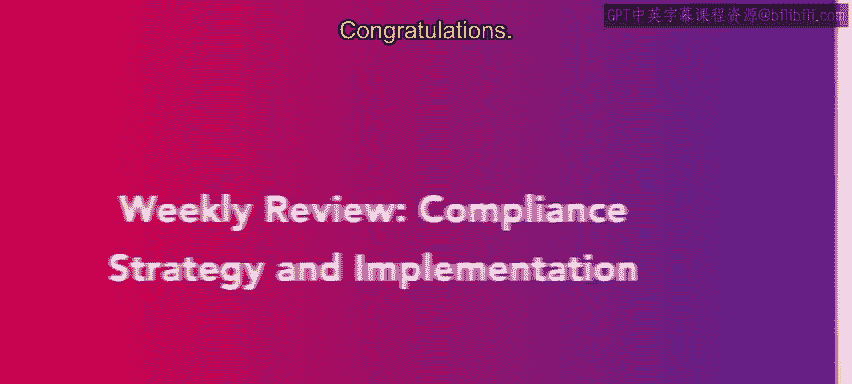

# HRCI《人力资源助理（员工关系、合规）》：第4-5课：每周回顾——合规策略与实施 📘


## 📌 课程概述

在本节课中，我们将回顾本周所学习的**合规与风险管理**相关内容。  

重点包括：人力资源在**组织重组**与**业务连续性管理**中的作用，以及如何制定与实施合规策略。


---

## 一、合规与风险管理学习回顾 🛡️


上一节内容我们学习了合规的基础知识。本节中，我们对本周的学习成果进行系统梳理。


本周你完成了关于**合规与风险管理**的学习，并深入理解了合规策略与实施的核心内容。


在人力资源工作中，合规与风险管理可以用一个简单的逻辑公式来表示：  

```text
合规管理 = 风险识别 + 合规策略制定 + 合规实施 + 持续监控
```




这一公式说明，合规不是一次性的任务，而是一个持续循环的过程。


---

## 二、人力资源在组织重组中的角色 🔄


在了解了合规总体框架之后，本节我们来看人力资源在组织结构变化中的具体作用。

首先，你学习了人力资源在**组织重组**中的重要角色。


组织重组通常包括以下几种形式：  

- 并购（Mergers）  
- 外包（Outsourcing）  
- 战略调整（Business Strategy Changes）  


在人力资源管理中，这一过程可以理解为：  

```text
组织重组 = 业务战略变化 → 人力结构调整 → 合规风险评估 → 政策更新
```


这意味着，当企业战略发生变化时，人力资源部门必须同步评估合规风险，并调整相关政策与流程。


---

## 三、人力资源在业务连续性中的作用 🔁


在理解了组织重组之后，本节进一步探讨人力资源在**业务连续性管理**中的职责。

你学习了人力资源如何支持企业在变化或危机情况下保持运营稳定。


业务连续性相关情境包括：  

- 资产剥离（Divestitures）  
- 暂时停职或休假（Furloughs）  


在人力资源管理框架中，可以用以下逻辑表示：  

```text
业务连续性管理 = 风险预案 + 员工沟通 + 法律合规 + 执行监督
```


在人力资源实践中，合规策略的制定与实施是确保业务持续运行的关键环节。


---

## 四、合规策略与实施的重要性 🎯


在前面各节内容的基础上，我们总结合规策略与实施在人力资源工作中的核心地位。

制定与实施合规策略，是人力资源管理中的重要组成部分。


这一过程通常包括以下步骤：  

1. 识别潜在法律风险  
2. 制定合规政策  
3. 培训与沟通  
4. 监督执行  
5. 定期评估与改进  


用流程图逻辑表示为：  

```text
风险识别 → 策略制定 → 实施执行 → 监督评估 → 持续改进
```


这一流程确保企业在变化环境中依然保持合法、稳定与高效运作。


---

## 🧾 课程总结


本节课中，我们一起回顾了本周关于**合规与风险管理**的学习内容。

我们重点梳理了：  

- 人力资源在组织重组中的作用  
- 人力资源在业务连续性管理中的职责  
- 合规策略制定与实施的完整流程  


通过本周学习，你已经掌握了合规策略与实施的基本框架，并理解了其在人力资源工作中的关键意义。