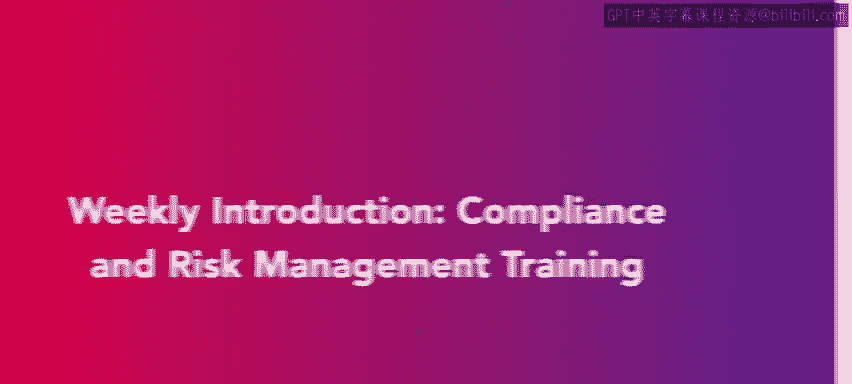

# HRCI《人力资源助理（员工关系、合规，4-5课／共5课）》：P149：66_每周介绍：合规与风险管理培训📚

在本节课中，我们将学习合规与风险管理培训的基本知识。你将了解风险管理政策和程序，并了解如何在业务中实施这些政策。最后，我们会回顾一些关键的合规培训内容，帮助你更好地准备APHR考试。

## 风险管理政策与程序

本节中，我们将首先介绍风险管理政策与程序。了解这些政策是管理企业风险的基础。

### 风险管理政策

风险管理政策是指导企业识别、评估和应对潜在风险的正式文件。这些政策通常涵盖如下几个方面：

1. **风险识别**：明确潜在的风险源。
2. **风险评估**：评估风险发生的可能性和影响程度。
3. **应对措施**：制定减少或避免风险的措施。

### 常见的风险管理政策

在业务中，企业可能会采用以下几种常见的风险管理政策：

1. **健康与安全政策**：确保员工在工作中不受伤害。
2. **合规性政策**：确保公司遵循所有法律法规。
3. **数据保护政策**：确保公司数据不被泄露或滥用。

## 风险管理程序

除了政策，风险管理程序也是企业管理风险的关键组成部分。在本节中，我们将重点介绍几个关键的程序。

### 新员工入职培训

新员工入职培训是确保新员工了解公司风险管理政策的重要途径。通过这一过程，新员工能够：

1. 了解公司的风险管理理念。
2. 学习如何遵守相关的安全规定与合规性要求。
3. 掌握应急预案和操作流程。

### 持续培训

持续的员工培训有助于确保所有员工时刻保持对风险管理的高度敏感性。包括：

1. 定期进行合规性培训。
2. 不断更新和强化员工的安全意识。

### 合规性培训

合规性培训是确保公司所有操作符合法律法规的关键。通过合规性培训，员工能够：

1. 理解并遵守相关法律和行业标准。
2. 确保公司在日常运营中避免法律风险。

## 总结

本节课中，我们一起学习了合规与风险管理培训的核心内容。我们首先了解了风险管理的政策与程序，接着介绍了新员工入职培训、持续培训以及合规性培训的内容。掌握这些知识将帮助你更好地理解如何在企业中管理风险，并为你的APHR考试做好准备。