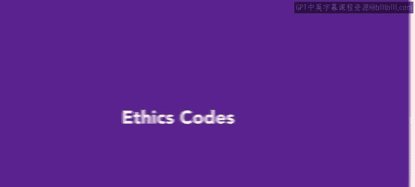
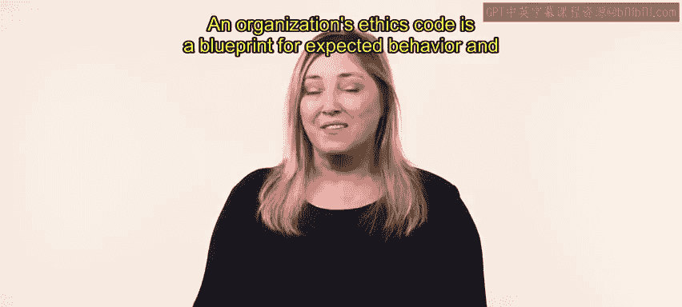
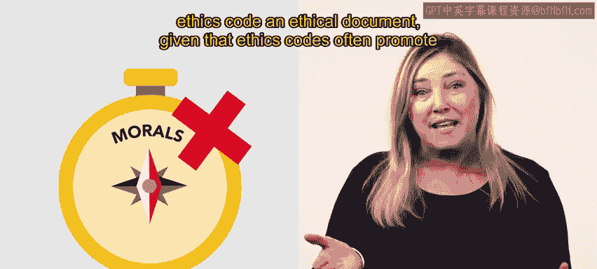

# HRCI《人力资源助理（员工关系、合规）》：第4课：道德准则 🧭




## 📘 课程概述  

在本节课中，我们将学习什么是组织的道德准则（Ethics Code）、它包含哪些核心要素，以及人力资源专业人员在制定与维护道德准则中的重要作用。通过本课内容，你将理解道德准则如何规范员工行为、保护组织利益，并为决策提供依据。


---

## 🏢 一、HR在建立道德准则中的角色  


在组织中，除了使命（Mission）和愿景（Vision）陈述之外，人力资源专业人员在建立和维护组织道德准则方面也发挥着重要作用。  

道德准则是组织期望行为以及违规后果的蓝图，其核心可以用公式表示：  

```
道德准则 = 期望行为 + 违规后果 + 组织原则 + 社会责任 + 长期目标
```  

道德准则通常包括以下内容：  

- 组织的基本原则  
- 组织的社会责任与义务  
- 组织的长期目标  
- 组织与股东之间的关系  
- 组织所支持和倡导的行为与行动类型  


上一节我们了解了道德准则的基本定义，接下来我们来看它如何规范员工行为。




---

## ⚖️ 二、道德准则如何规范员工行为  


道德准则还会说明，当员工行为被视为不道德时，应如何处理。  

它会告知员工：  

- 公司限制或禁止哪些行为  
- 若违反准则，将面临哪些惩罚措施  


需要注意的是，道德准则并不会在所有情境下规定员工必须遵循的具体规则，而是提供一般性指导原则：  

```
道德决策 = 一般行为准则 + 情境判断
```  

员工可以根据这些指导原则，在具体情境中判断自己应采取的行为。  


在理解了道德准则的基本功能之后，我们进一步来看它通常涵盖哪些具体议题。


---

## 📋 三、道德准则涵盖的常见议题  


道德准则与行为准则通常涵盖多种重要议题，以下是常见内容：  

- **利益冲突（Conflicts of Interest）**：指个人可能因某项商业决策或行为而获得私人利益的情形  
- **保密义务（Confidentiality）**：包括商业机密或员工个人信息等需要保密的信息  
- **骚扰（Harassment）**：包括广义骚扰以及性骚扰  
- **盗窃或滥用公司财产**  
- **数据滥用**  
- **员工举报违规行为的义务**  
- **违反准则后的制裁与纪律处分**  
- **投诉受理与调查程序**  


这些议题共同构成组织行为规范的框架。  


为了更好理解，我们来看一个具体示例。


---

## 🍽️ 四、案例：食品安全规范  


假设某组织的人力资源团队在行为准则中加入了食品处理安全相关内容。  

规定包括：  

- 所有员工必须参加经当地卫生部门批准的食品安全课程  
- 厨房员工必须穿着适当的工作服  
- 服务人员必须遵守接待与服务相关规范  


这一案例说明，道德准则不仅涵盖抽象原则，也可以包含具体操作规范。  


在了解了道德准则的实际应用后，我们来看外界对其性质的讨论。


---

## 🤔 五、对道德准则性质的讨论  


一些批评者认为，将组织的道德准则称为“道德文件”具有一定误导性。  

原因在于，道德准则通常强调的是行为规则和规章制度，而不是某种特定的道德理论体系。  


在理论探讨之外，学者也对道德准则的实际价值进行了总结。


---



## 🎓 六、道德准则的两大功能  


教育家与思想领袖 **entity["people","Dr. Quinn Mills","harvard mit educator"]** 曾在 **entity["organization","Harvard Business School","business school boston us"]** 和 **entity["organization","MIT Sloan School of Management","business school cambridge us"]** 任教。他指出，道德准则为组织提供两项重要功能。  


### 1️⃣ 建立统一行为标准  

首先，道德准则明确规定组织成员应遵循的行为规则和标准，同时也帮助建立对他人行为的期望。  

在当今复杂的社会环境中，组织内部存在多种群体和亚文化，不同员工可能带来不同的道德预期。  

道德准则的作用可以表示为：  

```
组织行为一致性 = 统一规则 + 共同标准
```  

它为所有人提供一套统一的规则与规范，使员工能够按照共同标准行事，并期待他人遵守同样标准。  


### 2️⃣ 提供决策保护  

其次，道德准则在决策受到质疑时提供保护。  

当有人质疑某项决策时，可以依据道德准则进行解释：  

```
决策依据 = 组织期望 + 道德准则要求
```  

决策者可以说明，该行为部分是基于组织道德准则的要求，是组织期望其履行的职责。  


通过这两项功能，道德准则不仅规范行为，也为组织提供制度保障。  


---

## 🛡️ 七、HR团队的责任  


了解道德准则包含的内容，以及它如何帮助组织和员工实现自我保护，是人力资源团队的重要职责。  


在后续课程中，我们将继续学习如何创建一个有效的道德准则。


---

## 📝 课程总结  


本节课中，我们学习了：  

- 道德准则的定义与基本结构  
- 道德准则如何规范员工行为  
- 常见涵盖议题及具体示例  
- 学者对道德准则功能的总结  
- 人力资源在制定与维护道德准则中的责任  


通过本课内容，我们理解了道德准则不仅是行为规范工具，也是组织治理与风险防控的重要机制。