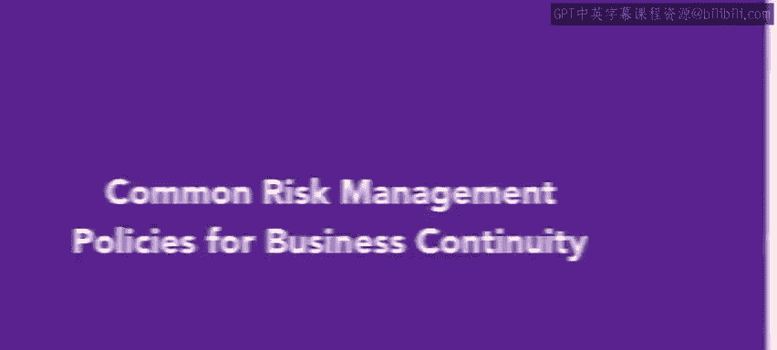

# HRCI《人力资源助理（员工关系、合规，4-5课／共5课）｜HRCI Human Resource Associate》 - P151：68_常见的业务连续性风险管理政策.zh_en - GPT中英字幕课程资源 - BV1qE4m19788

Previously， you learned about the risk management policies。 Now。

 you are going to learn about common risk management policies for business continuity。

 A business continuity plan is a prevention and recovery system for potential threats to an organization's operations。

It ensures that personnel and assets are protected and able to still function in the event of a disaster。

 such as a cyber attack or natural disasters like tornadoes， hurricanes， or tsunamis。

These threats can mean a loss of revenue， higher costs， and a drop in profits。

Although insurance might help with recovery， it does not cover all of the costs associated with disasters。

 including customers who move on to the competition。

There are four main steps in preparing a business continuity plan。

 The first step to prepare a business continuity plan is to conduct a business impact analysis。

 Every organization has unique conditions and factors that affect the needs of the continuity。

 Some of the factors that drive plan components are geographic location。

 availability of response resources， industry and the specialized needs of customers。

The next stage is to create recovery strategies it is important for HR to work with internal and external experts for this stage。

A jar will drive the brainstorming sessions to identify strategies in response to the business impact measures that were identified in step1。

Begin by identifying resources that can be used， then conduct a gap analysis and explore recovery strategies。

 Finally， implement the strategies。 The third step is to develop the actual plan。

 This step involves all available resources and tools to use in case of a disaster。 to start。

 develop the framework。 Next， select and train recovery teams。

 then write standard operating procedures。 Finally， get approval for the plan。

The fourth step is to practice the plan， which involves training the trainers in conducting drills to evaluate what worked and what needs modification。

To do so， develop tests and exercise them， train response teams。

 conduct tests and document the results and update the plan based on the test outcomes。

It is important to periodically update the plan， if needed。

Having a business continuity plan can help organizations navigate disasters such as cyber attacks and natural disasters that can severely impact profitability。

Doing this can save your business in case of an emergency Com up。

 you will examine risk management policies by reviewing examples。

