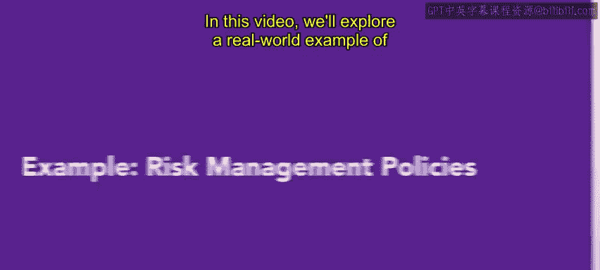
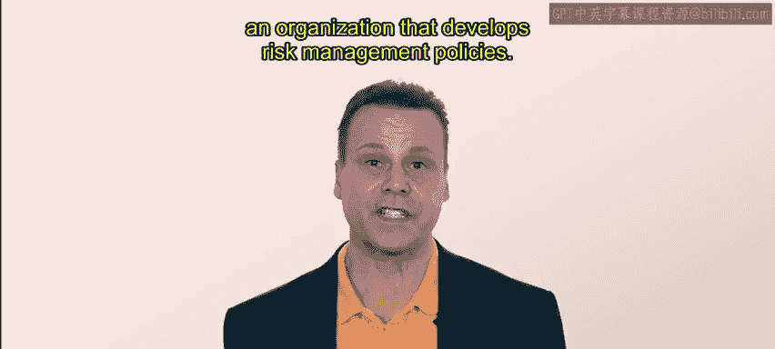
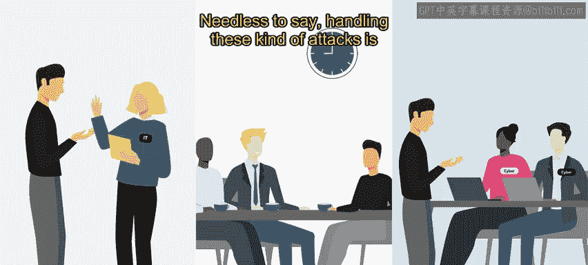
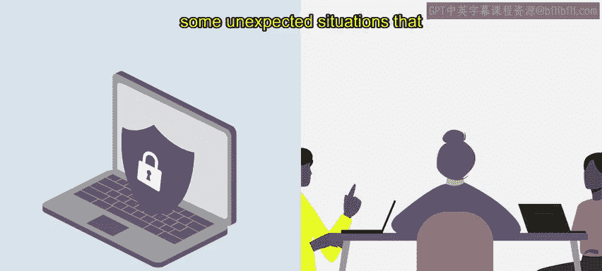

# HRCI《人力资源助理（员工关系、合规，4-5课／共5课）｜HRCI Human Resource Associate》 - P152：69_示例：风险管理政策.zh_en - GPT中英字幕课程资源 - BV1qE4m19788

In this video， we'll explore a real world example of an organization that develops risk management policies for this example。

 will fall a nearly an HR professional at urbanr attire。

Urban attire is a mid sized business that specializes in casual wear for the modern metropolitan lifestyle。

There are many people working at Urban attire， and the HR team is refreshing its risk management policies to apply to all members of the organization。

Specifically， Ne he is working on a business continuity plan for urban attire。Recently。

 one of U attire's competitors was hacked by a group of cyber criminals。

 The hackers accessed their system， held their data ransom and prevented them from accepting any credit card payments online or in store for two weeks。

This breachs was a huge issue for the competitor， and they ended up closing locations for the second week。

The competitor eventually reopened after switching to a different system。

 but they lost a lot of money and impact to their brand credibility。

Nary was shocked by the hack and realized that something similar could happen at urban attire。

 Ne he decides it's time to create a business continuity plan， specifically for cyber attacks。😮。

First， Neri conducts an impact analysis。In a retail setting。

 the amount of money lost will depend on the time of year。 So near reviews， slow periods。

 average periods and the busiest periods of the year to get an understanding of what the loss of sales during each period would mean。

Nary also connects with the I T team， the management team and third party cyber security experts to determine the response。

 resources that would be required， especially if any critical information or infrastructure was hacked。

Needless to say， handling these kind of attacks is expensive and can be extremely time consuming。

Next， Ne he begins generating a recovery strategy。Initially。

 Neary works with the I T team to understand what systems can be backed up。

 stored externally and reinsalled in case of a hack。

N he is also contracted with a cybersecurity firm that will proactively probe the system for weaknesses and assist if hacking should occur。

After that， Neie drafts the business continuity plan。The plan includes standard operating procedures。

 recovery teams， points of contact and templating messaging that urban attire can use in case of a cyber crime。

Nary presents the plan to the HR Department head， as well as the executive team。

 And after some small edits， the plan is approved。

Finally， Ne he works with the third party's cybersecurity firm and the IT team at Urban Attire to develop some practice scenarios。

Everyone involved in the hacking drills is excited and interested in the sessions。

 They can even find some unexpected situations that lead Ne to update the plants。😊。

With the plan in place， Ne he feels confident that urban attirees prepared for cyber attacks。

 Of course， a risk like this can't be completely removed。

 but having the plan in place will help to mitigate at least some of the risk。

That's all from Neie for now。Researching， writing and practicing risk management policies is a critical HR responsibility。

 A good plan may even mitigate tremendous and costly risks。

 but they will take thought and effort to create coming up。

 you'll wrap up this week with information about other risk management policies and procedures。

