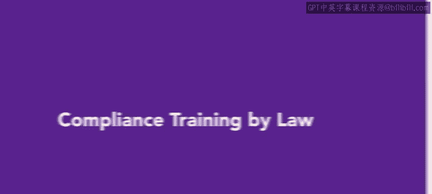
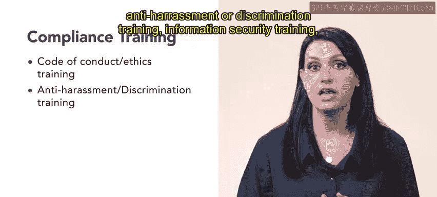
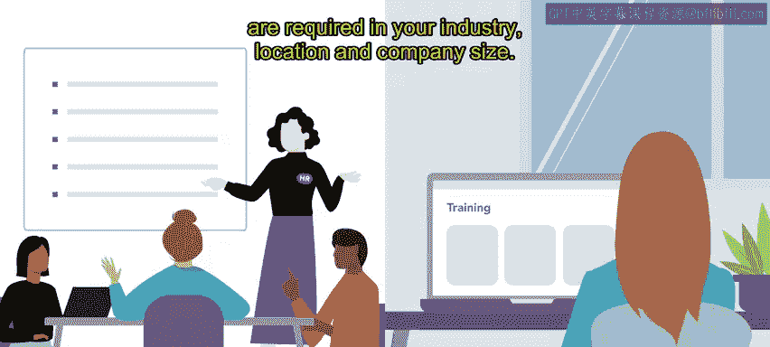
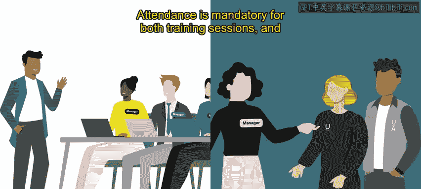

# HRCI《人力资源助理（员工关系、合规，4-5课／共5课）｜HRCI Human Resource Associate》 - P155：72_法律要求的合规培训.zh_en - GPT中英字幕课程资源 - BV1qE4m19788

As you'll recall from previous videos， there are many compliance trainings that are required by law。

 In fact， many safety standards include communication and training requirements for employers to follow。

 As an HR representative， you will be required to know what these requirements are。 Most importantly。

 federal and state specific requirements and take steps to complete them。

 This video will introduce you to those requirements。

Compliance training is any training that employees are required to take as regulated by the state。

 industry， or organization。There are many types of compliance training。

 the most common include the following。Coode of conduct or ethics training。

 anti harassment or discrimination training， information security training。

 health and safety training， diversity and inclusion training and management training。

 These trainings can be conducted in a variety of formats， including classroom instruction。

 virtual delivery， instructor led， self paced and many other options。

Part of your job as an HRR professional will be to know what compliance trainings are required in your industry。

 location and company size。

You will also need to ensure all employees receive the training and to document the completion or acknowledgecment of the training。

If you hold in person training， it is important to remember that there will be times when not every employee will be able to attend illness。

 Vas， meetings and other work commitments may conflict with the training schedule。

Because compliance training is required， it's important to have a backup plan in place。

 such as a makeup session。If employees fail to complete a required training。

 you must also determine a consequence， such as a disciplinary meeting with upper management As an example Ur attireess workforce includes people from many different backgrounds。

 the HR Department at Urban attire understands the importance of diversity and inclusion initiatives。

 so they hire experts in the field to leave required training for all employees each year。

The training， which is conducted in person at each store around the country。

 incorporates short lectures， videos and role play scenarios and more。

Although this is a large expense for urban attire， they believe in person delivery is the most effective approach because employees are more engaged than in a virtual setting。

Urban attire also has yearly information security training。

 because only a handful of employees work with sensitive information such as credit card numbers。

Employing customer information and seller data。 There are two forms for the training。

 The first is for those who work closely with the information， including upper and lower management。

These individuals receive quarterly in person training from the organization。

Employees who do not work closely with the sensitive information。

 such as sales associateociates participate in a yearly all staff meeting led by managers who attended the formal training。

Attendance is mandatory for both training sessions and makeup sessions are offered for those unable to attend。

To review， employees are required by the state， industry or organization to complete compliance trainings。

These include sexual harassment and code of ethics trainings。

 which can be delivered in a variety of ways as an HR professional。

 you will be expected to organize these trainings and ensure they are completed by all employees。

