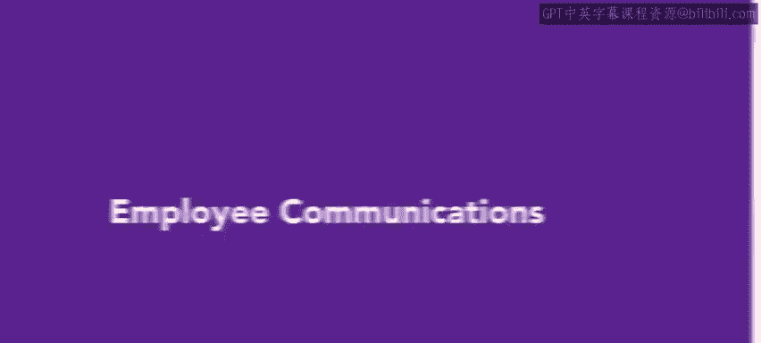
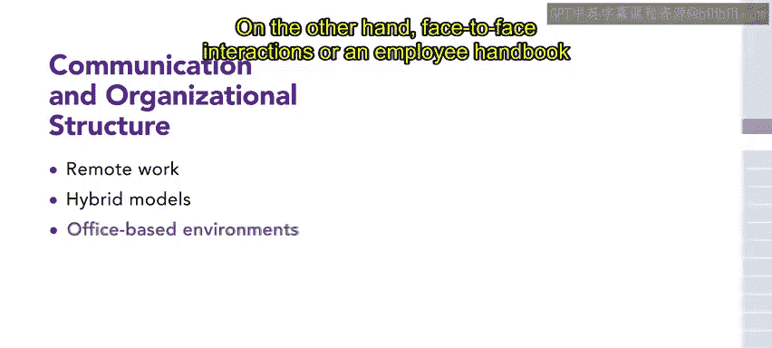
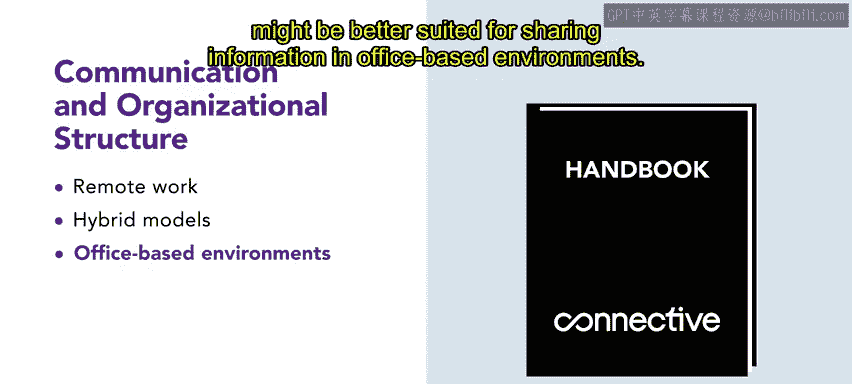
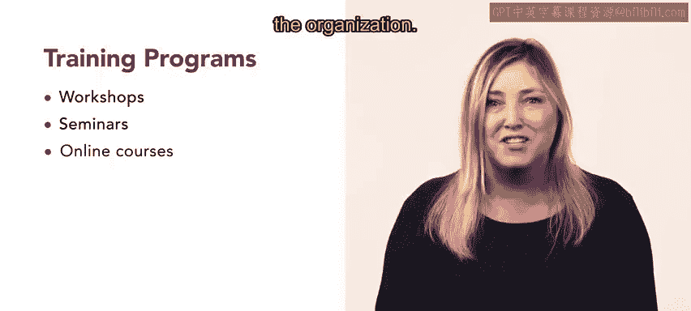
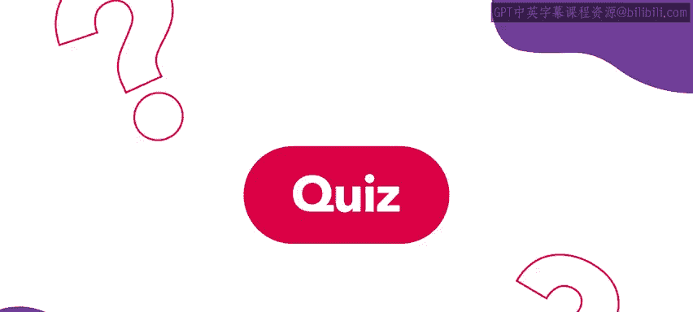
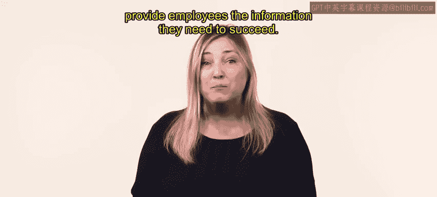

# HRCI《人力资源助理（员工关系、合规）》：第4课：员工沟通 📣  

在本节课中，我们将学习如何建立一套**全面的员工沟通策略**。我们将回顾组织伦理的影响，并重点讲解三大核心组成部分：员工手册、电子邮件沟通与培训项目。通过系统化的沟通机制，组织可以建立透明、统一且高效的文化环境。  

---

## 一、组织伦理与员工沟通的衔接 🧭  

在前一节中，我们学习了组织伦理，以及当组织投入大量精力制定道德标准时，这些标准会对员工产生怎样的影响。  

接下来需要解决的问题是：组织应当如何有效地向员工传达这些伦理标准。  

本节内容将围绕员工沟通展开，并讲解如何建立一套完整的沟通策略。  

当组织能够有效分享其价值观、核心能力与伦理原则时，就能构建一种透明且目标一致的文化。  

核心逻辑可以用公式表示：  

\[
有效沟通 = 价值观共享 + 信息透明 + 持续强化
\]  

---

## 二、员工沟通策略的整体结构 🏗️  

在明确伦理沟通的重要性后，本节将介绍沟通策略的整体结构。  

一个完整的沟通策略主要包含以下三个部分：  

- 员工手册（Employee Handbook）  
- 电子邮件沟通（Email Communication）  
- 培训项目（Training Programs）  

在制定沟通策略之前，必须首先考虑组织结构。  

组织结构会直接影响信息传递方式。例如：  

- 远程办公或混合办公  
- 传统办公室环境  
- 工厂轮班制度  

不同组织形态会显著影响管理层与人力资源部门与员工之间的沟通方式。  

例如：  

- 在远程或混合办公模式下，电子邮件是连接团队并实现有效信息共享的重要渠道。  
- 在办公室环境中，面对面沟通或员工手册更适合传递信息。  

因此，设计沟通策略时应遵循以下原则：  

\[
沟通策略 = f(组织结构, 工作模式, 员工特征)
\]  

通过理解并适应组织动态与员工特点，可以设计出与组织结构匹配的沟通方案，从而提升协作效率，并确保所有员工获得充分信息。  

---

## 三、员工手册：组织文化的核心载体 📘  

在确定整体策略之后，我们首先介绍第一个核心组成部分：员工手册。  

员工手册包含以下内容：  

- 组织政策  
- 工作流程  
- 员工福利  

它是员工的重要参考文件。  

组织通常在员工入职阶段发放员工手册。  

员工手册是一种详细且直接的方式，用于传达组织对员工的期望。  

同时，它也说明员工可以从组织中获得什么。  

可以将员工手册理解为组织文化的中心枢纽。  

其核心作用可以表示为：  

\[
员工手册 = 政策说明 + 期望管理 + 权利保障
\]  

---

## 四、电子邮件沟通：快速与高效的信息传递 ✉️  

在介绍员工手册之后，本节继续讲解第二个组成部分：电子邮件沟通。  

电子邮件是组织沟通策略中的重要工具。  

它可以有效传达以下内容：  

- 组织价值观  
- 组织愿景  
- 重要公告信息  

通过定期发送邮件更新与通知，组织可以持续强化核心价值观，分享相关新闻，并确保员工与组织使命保持一致。  

电子邮件的优势包括：  

- 传递速度快  
- 信息传播广泛  
- 可保留永久记录  

但电子邮件也存在劣势：  

- 信息过载  
- 每日筛选邮件耗时  
- 可能产生误解  

可以用简单模型表示：  

\[
邮件沟通效果 = 信息清晰度 - 信息过载风险
\]  

如果合理运用电子邮件，组织可以：  

- 增强员工归属感  
- 提高透明度  
- 促进对组织价值与目标的共同理解  

---

## 五、培训项目：强化理解与能力建设 🎓  

在讲解完电子邮件沟通后，本节最后介绍第三个组成部分：培训项目。  

培训是一种强有力的沟通方式。  

它不仅传递技能与知识，还促进员工对流程与制度的共同理解。  

培训通常为强制性安排，形式多样，包括：  

- 研讨会  
- 专题讲座  
- 在线课程  

培训的目标是为员工提供必要的工具与信息，使其能够取得优异表现。  

培训内容通常涵盖：  

- 沟通技巧  
- 冲突解决  
- 客户服务  
- 多元化与包容性  
- 技术能力  

其核心目标可以表示为：  

\[
培训成果 = 技能提升 + 认知统一 + 绩效提升
\]  

通过系统化培训，员工能够具备在组织中成功发展的关键能力。  

---

## 六、本课总结 📝  

在本节课中，我们学习了如何建立有效的员工沟通策略。  

我们重点分析了三个关键组成部分：  

- 员工手册  
- 电子邮件沟通  
- 培训项目  

同时，我们强调了组织结构在制定沟通策略中的重要作用。  

当组织结构、沟通工具与员工需求保持一致时，员工将获得完成工作所需的信息与支持。  

有效的沟通不仅促进信息传递，更能够强化组织文化、增强透明度，并推动组织整体成功。