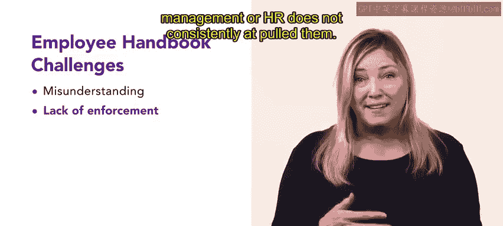

# HRCI《人力资源助理（员工关系、合规，4-5课／共5课）｜HRCI Human Resource Associate》 - P17：12_员工手册.zh_en - GPT中英字幕课程资源 - BV1qE4m19788

On their first day， a new employee receives a document known as an employee handbook。

 they refer to this document for any questions they have regarding the organization and their specific responsibilities within it。

 let's explore this valuable resource and how it is used to communicate an organization's policies。

 guide employee actions and create an efficient and dynamic workplace culture。

 as you have already learned， an employee handbook is part of an employee communication strategy。

It contains an organization's operating policies， procedures， vision， behavioral expectations。

 working conditions， safety protocols， and more it is typically updated yearly or when new policies arise and technology standards change。

 providing employees with an up-to-date reference when they have questions about the organization and its procedures。

😊。

Let's examine a few different sections of an employee handbook using Ur attire as an example。

The fashion brand recognizes the importance of aligning employees with the company's values and uses the employee handbook to communicate this essential information The updated handbook highlights the brand's new mission statement。

Providing fashionable and practical casual wear for the modern urban lifestyle along with its mission。

 the handbook emphasizes the brand's commitment to delivering a positive shopping experience and its ethical code that guides employees in providing quality customer service and affordable clothing。

Employees at Urban attire refer to the handbook for information on their benefits。

 such as healthcare， retirement plans， vacation policies。

 and procedures for requesting and tracking time off the employee handbook also outlines conduct expectations and guidelines on acceptable behavior。

 dress codes within their stores and the consequences of policy violations， Additionally。

 it details the disciplinary procedures and processes applicable if an employee fails to meet these standards。

Urban Attire's employee Handbook also includes an organization chart that outlines the reporting structure and key roles within the company。

Safety procedures are crucial in Urban Attire's handbook。

 including guidelines on emergency procedures， accident reporting。

 and measures to prevent workplace hazards across their several locations。

It also addresses privacy policies， proprietary information protection。

 and nondi agreements to protect the brand's intellectual property。

An employee handbook offers several significant benefits。First。

 it provides employees with a clear understanding of the organization's expectations of them。

These expectations promote accountability。Second， it facilitates open and transparent communication between employees and managers because everyone has equal access to the organization's policies。

Last， an employee handbook empowers employees。Conduct expectations and employee rights are clearly defined。

 which establishes an atmosphere of fairness On the other hand。

 there are challenges to employee handbooks a poorly written handbook can lead to misunderstandings and may prevent employees from following the organization's policies。

😊，Another challenge may arise when an organization does not enforce the policies within the handbookEmploys are less likely to take policies seriously if management or HR does not consistently uphold them。

😊。

In this video， you've explored the critical role of the employee Handbook as a tool for effective employee communication。

The manual helps build a positive work environment and promotes transparency through clear guidelines and policies。

Remember， the employee handbook is not just a document。

 but a powerful tool for shaping a cohesive organization。

