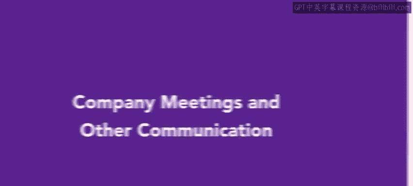
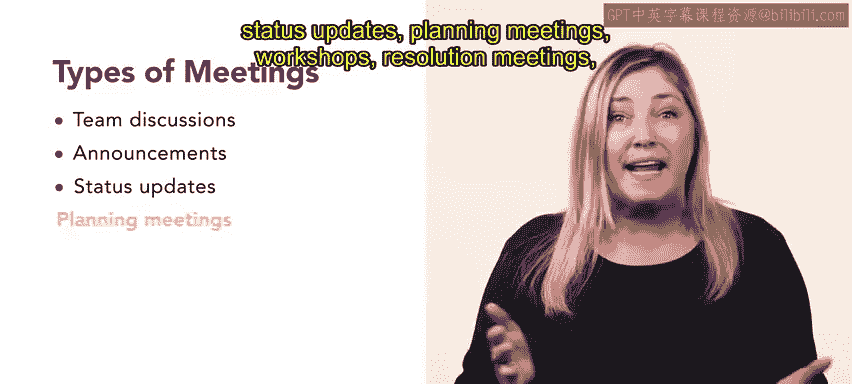
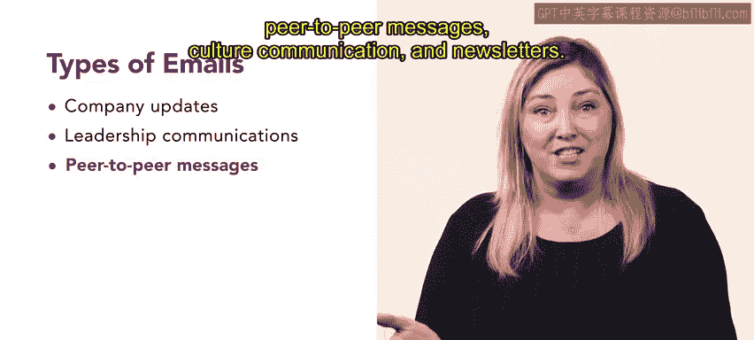

# HRCI《人力资源助理（员工关系、合规，4-5课／共5课）》：P18：13_公司会议和其他沟通

## 📝 概述
在本节课中，我们将探讨一个至关重要的员工沟通渠道——会议。我们将讨论定期会议如何强化组织的愿景、核心能力，并传递关键信息。同时，我们也将回顾电子邮件在更新员工信息方面所扮演的角色。

## 🗣️ 会议：强化使命与共享信息
上一节我们概述了沟通渠道的重要性，本节中我们来看看会议的具体作用。会议是统一思想、强化组织使命并共享员工相关信息的绝佳机会。

会议将员工聚集在一起，无论是面对面还是线上，旨在讨论重要更新、分享见解，并使团队朝着共同目标努力。以下是常见的会议类型：
*   **团队讨论会**：用于集思广益。
*   **公告会**：宣布流程变更。
*   **状态更新会**：同步项目进展。
*   **规划会议**：制定未来计划。
*   **研讨会**：进行技能或知识培训。
*   **问题解决会议**：处理特定挑战。
*   **短时站会**：团队快速同步进度、挑战和目标。

在会议中，管理者和人力资源部门有机会传达组织的价值观，例如客户服务标准和道德准则。会议也是展示期望、提供绩效更新和分享冲突解决指南的平台。当员工和高层围绕共同目标达成一致时，组织能提升生产力并保持专注。

此外，团队会议为团队凝聚和关系建设提供了平台。它们促进了员工间的沟通和知识共享，同时也为员工提供了做出决策所需的工具和资源。

## 📧 电子邮件：高效的全员沟通
除了会议，定期的电子邮件沟通也至关重要。电子邮件提供了一种便捷高效的方式，可以不受地理位置或时区限制地向所有员工分享重要信息。

组织可能会发送多种类型的电子邮件，包括公司更新、领导层通讯、同事间消息、文化宣传通讯和新闻简报。对于拥有远程员工的组织而言，电子邮件对于全公司范围的沟通至关重要。它让每个人都能了解并讨论重要议题和变化，提供了重要信息的书面记录，并允许员工在需要时查阅细节。

以下是一个示例：
> Connective是一家在电信行业处于核心地位的公司，致力于帮助企业保持连接并高效协作。Connective的人力资源经理每月会向全体员工发送一封公司范围的电子邮件。这份月度通讯提供关于关键举措、行业趋势以及组织目标和成就的更新。这些信息邮件保持了透明度，赋能了员工，并强化了公司的使命、愿景、核心能力和价值观。

## ✅ 总结
本节课中我们一起学习了有效的内部沟通是任何成功组织的基石。团队会议和定期电子邮件是健康组织文化的重要组成部分。你刚刚学习了组织如何利用会议和电子邮件来统一团队、分享组织更新，并提升员工的积极性和生产力。😊