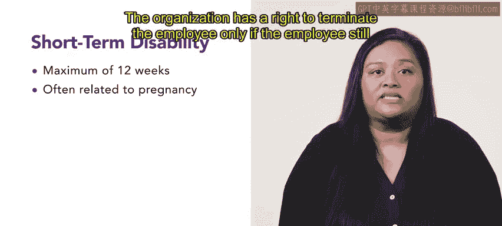

# HRCI《人力资源助理（员工关系、合规，4-5课／共5课）》：P1：79_残疾福利索赔

在本节课中，我们将继续探讨索赔相关议题，重点学习与工伤赔偿不同的**残疾福利索赔**。

上一节我们讨论了工伤赔偿，本节中我们来看看残疾福利索赔。残疾福利是授予那些因与工作无关的伤病而无法履行工作职责的个人的。这类福利通常由私营保险公司提供，或者在情况足够严重时，由政府的社会保障残疾保险提供。

残疾福利通常分为**短期残疾**和**长期残疾**。保险公司通常需要员工、雇主及员工医疗专业人员提供的文件来验证索赔。提交文件后，保险公司会调查残疾的严重程度，并决定批准或拒绝残疾福利。

以下是关于长期残疾福利的要点：
*   **持续时间**：长期残疾福利可持续**2至5年**，或直至法定退休年龄。
*   **涵盖范围**：此类索赔可涵盖多种不同病症，包括中风等神经性损伤或脊椎骨折等身体损伤。

如果员工在索赔规定的期限后仍无法恢复工作，组织可以选择保留或终止该员工的雇佣关系。

接下来，我们看看短期残疾福利。短期残疾福利通常最长持续**12周**。这类索赔通常与怀孕相关，涉及产前和产后的一段时间。

以下是关于短期残疾福利的关键规定：
*   **法律依据**：根据《家庭和医疗休假法》，组织在员工短期残疾期间必须保留其工作岗位并继续提供福利。
*   **终止权利**：组织仅在员工在 allotted time 后仍无法工作时，才有权终止雇佣关系。

与处理所有类型的索赔一样，在整个过程中保持准确和彻底至关重要，这有助于维护组织的记录并满足所有法律要求。

本节课中，我们一起学习了残疾福利索赔的基本概念、分类（STD/LTD）以及相关的处理流程和法律要求。准确、合规地处理此类索赔是人力资源工作的重要组成部分。