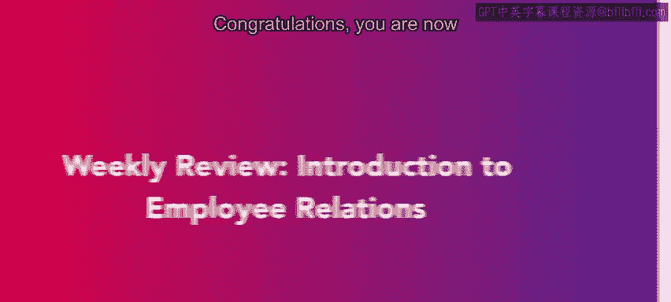
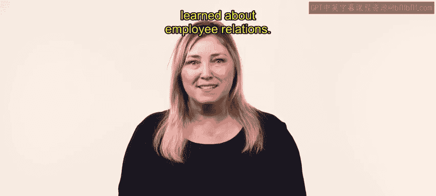
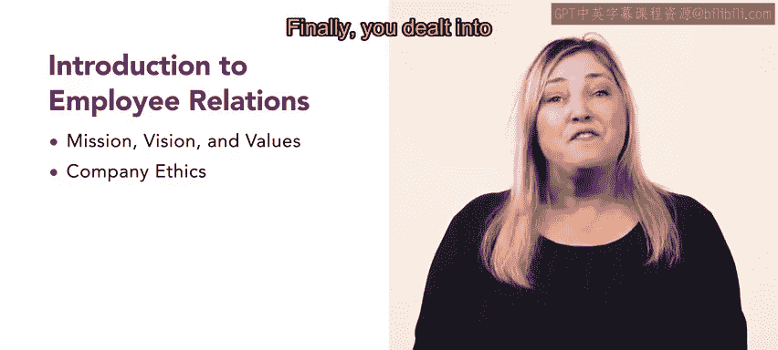
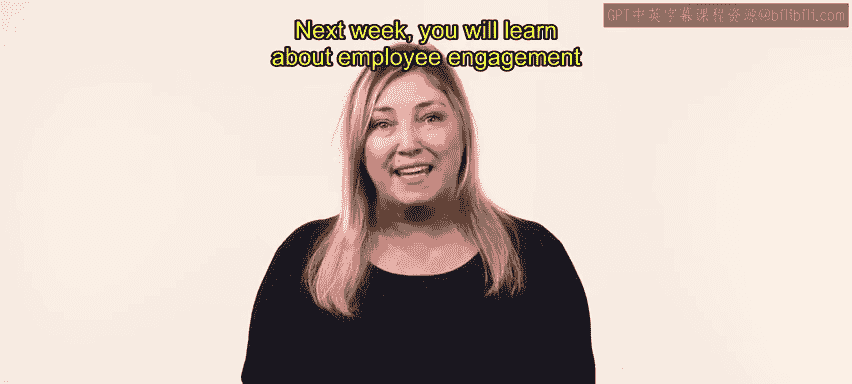

# HRCI人力资源助理课程：P21：每周回顾：员工关系导论 🎯

在本节课中，我们将回顾过去一周关于员工关系的学习内容，梳理核心知识点，并为下一阶段的学习做好准备。

## 概述

恭喜你，在成为人力资源专业人士的道路上又前进了一周。本周我们重点学习了员工关系。课程从了解组织的使命和愿景声明开始，并探讨了如何制定它们。我们还学习了组织如何建立愿景和核心能力。所有这些对于在组织中建立独特的身份至关重要。

## 本周核心内容回顾

上一节我们介绍了课程的整体框架，本节中我们来具体回顾本周学习的三个核心模块。

### 1. 组织使命、愿景与核心能力

本周伊始，我们学习了组织的使命和愿景声明，以及如何创建它们。以下是相关的核心要点：
*   **使命声明**：定义了组织存在的根本目的和核心业务。
*   **愿景声明**：描绘了组织未来希望达到的理想状态。
*   **核心能力**：是使组织区别于竞争对手的独特优势和技能组合。

这些元素共同构成了组织独特的身份标识。

### 2. 人力资源伦理与政策

接下来，我们探讨了与人力资源相关的伦理问题。这包括制定职业道德规范（**Code of Ethics**）和社交媒体政策（**Social Media Policy**）。在你的HR职业生涯中，创建这两类政策将是必备技能。

### 3. 组织手册与员工沟通

最后，我们深入研究了组织手册和员工沟通。我们特别学习了选择沟通策略的重要性，以及会议和培训如何成为确保组织良好运行的重要组成部分。有效的沟通策略可以概括为以下公式：
**有效沟通 = 明确目标 + 合适渠道 + 及时反馈**

## 总结与展望

本节课中，我们一起回顾了关于员工关系的基础知识，包括组织身份构建、HR伦理政策制定以及内部沟通管理。

下周，我们将进入新的学习主题：员工敬业度以及在组织中创建包容性文化。敬请期待。