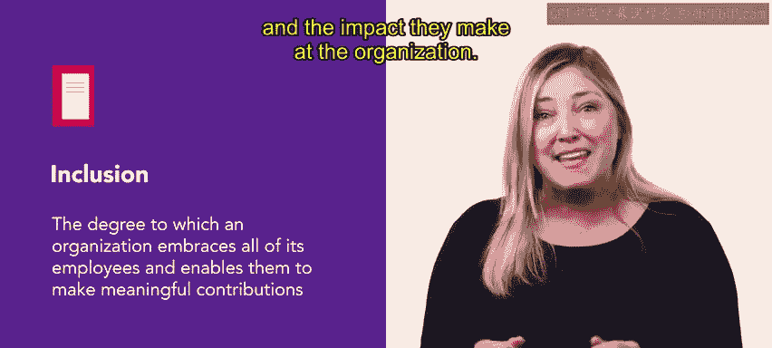
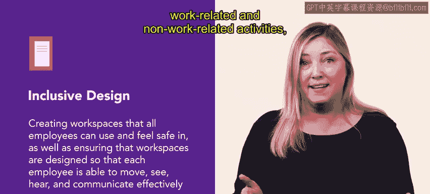

# HRCI《人力资源助理（员工关系、合规，4-5课／共5课）｜HRCI Human Resource Associate》 - P23：18_包容性文化简介.zh_en - GPT中英字幕课程资源 - BV1qE4m19788

People who feel supported and empowered through their interactions and experiences with the broader organizational culture are able to contribute best at work。

 A great way to help the culture be more supportive is to make sure it's inclusive In this video。

 you'll learn about what inclusion is and why it matters。

 Inclusion is defined as a degree to which an organization embraces all of its employees and enables them to make meaningful contributions on the surface。

 it is an organizational effort and practice in which individuals of different backgrounds and experiences are culturally and socially accepted。

 welcomed and treated equally at a deeper level， inclusion is about ensuring that employees feel a sense of belonging。

 It is about creating an environment in which people feel respected and valued for who they are and the impact they make at the organization。

😊。

Achieving diversity and inclusion goals often requires changes in culture。

 policies and practices inclusionnc also demands shifts in leaders and employees mindsets。

 effective steps toward inclusion， engage each individual and empower them to contribute to the organization's success。

😊，Positive shifts in culture and attitudes create higher performing organizations in these organizations。

 motivation， morale and productivity increase changes that bring about these shifts often involve inclusive design。

 which aims to remove the barriers that create undo effort and separation in the workplace。

 inclusive design involves creating workspaces that all employees can use and feel safe in。

 as well as ensuring that workspaces are designed so that each employee able to move， see。

 hear and communicate effectively。

Inclusive design also enables everyone to participate equally。

 confidentially and independently in work related and non work related activities， programs。

 and opportunities。

Inclusion means that all employees， regardless of backgrounds， experiences， and differences。

 are respected and appreciated as valuable members of the organization。

 able to participate in workplace activities， programs， and projects， compensated fairly。

 and have careers that use their skills and knowledge to the fullest。

Intentionally creating an inclusive workspace can make a significant difference in company culture and employee satisfaction。

Coming up， you'll learn about how to create an inclusive workplace。

