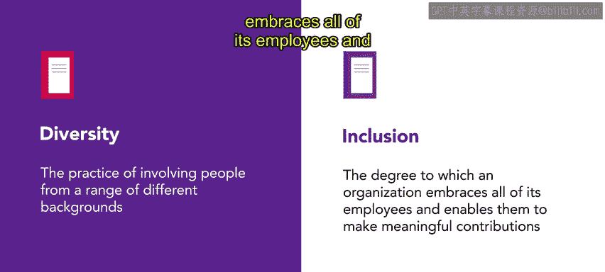

# HRCI《人力资源助理（员工关系、合规，4-5课／共5课）》：P25：20_多元化与包容 🤝

在本节课中，我们将学习如何促进工作环境中的多元化和包容。多元化和包容是帮助员工感受到支持、创造积极工作环境的重要因素。

## 多元化与包容的定义

首先，我们来定义这两个常常一起使用的概念：

- **多元化**：指的是涉及来自不同背景的人员，体现了不同性别、种族、文化、经验等方面的差异。
  
- **包容性**：指的是组织拥抱所有员工，使其能够做出有意义的贡献的程度。

### 公式表示：

- **多元化** = 不同背景的人群参与
- **包容性** = 员工平等参与、贡献的程度

## 多元化与包容对员工参与的影响

多元化与包容对员工的参与度有着重要影响。它能让每个员工感受到支持和欢迎，不论他们在组织中的职位如何，都能平等地参与和发展。

## 创建和维持多元化与包容性工作环境的方法

创建一个多元化与包容性的工作环境有多种方法。以下是一些最常见的措施：

- **政策改变**：制定支持多元化与包容的公司政策。
- **定向招聘**：有针对性地招聘来自不同背景的员工。
- **培训**：为员工提供多元化和包容性方面的培训。
- **员工资源小组**：组织和支持员工群体，促进多样性和包容性。
- **灵活安排**：为员工提供灵活的工作时间安排。
- **社区外展**：通过与社区的互动，扩大多元化影响力。

## 多元化与包容对组织的益处

近年来的研究表明，当组织重视多样化的视角和贡献时，工作环境会更加创新，生产力和输出更具价值和前沿性。多元化与包容的组织不仅对员工有益，也对业务发展具有积极影响。

## 多元化与包容对组织的影响

坚实的多元化和包容性措施不仅有助于组织内部的成长，还能帮助树立积极的品牌形象。接下来，我们将进一步学习这些措施。

---

在本节课中，我们一起学习了多元化与包容的定义、实施方法以及其对组织和员工的好处。通过这些措施，企业能够创造一个更加创新和具有竞争力的工作环境。