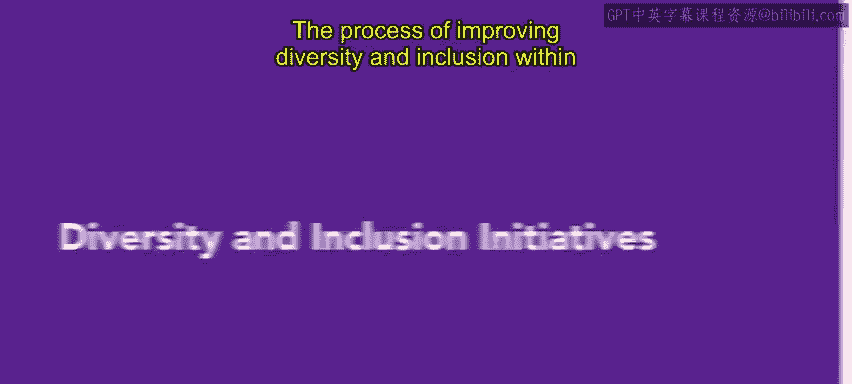
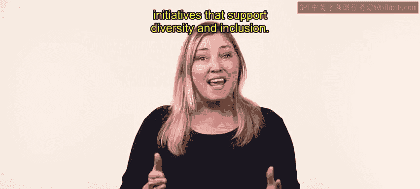
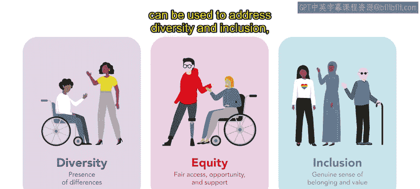
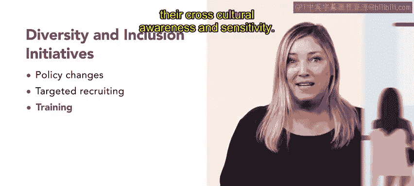
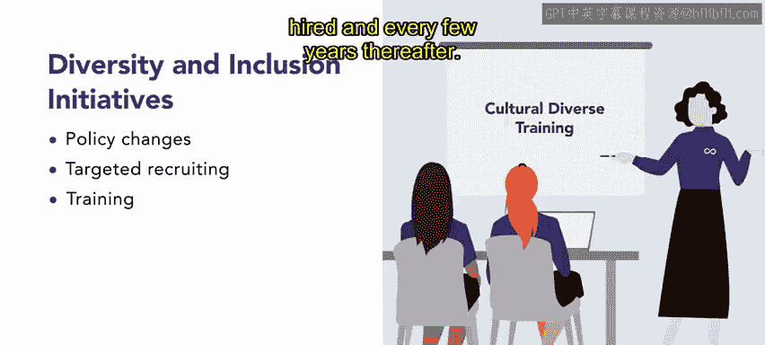
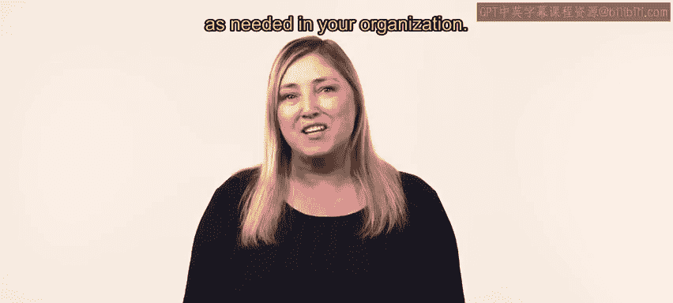

# HRCI《人力资源助理（员工关系、合规）》：第4-5课：多元化与包容倡议 🌍  




在本节课中，我们将学习如何在组织中推进多元化与包容。我们将了解如何设定多元化目标、衡量现状，并通过具体举措改进组织实践。同时，我们会系统梳理常见的多元化与包容倡议方法，帮助初学者建立清晰的操作框架。  


## 一、设定目标与评估现状 🎯  


在开始具体行动之前，组织必须明确方向。多元化与包容的改进始于设定具体的多元化目标。  


### 1. 设定具体目标  


组织首先应明确多元化目标，例如提升某类群体的代表性或改善员工满意度。核心逻辑可以表示为：  






```text
Diversity_Objectives = 明确、可衡量、可实现的目标
```  


### 2. 衡量当前状况  


在设定目标之后，组织必须使用人口统计数据和员工调查数据来评估当前状况，并与既定目标进行对比：  


```text
当前差距 = 目标值 - 当前实际值
```  


在本视频中，我们将探讨支持多元化与包容的多种倡议措施。当组织识别出问题领域后，人力资源部门应制定并实施相应计划，以改进组织的多元化与包容工作。接下来，我们将系统回顾多种可行方法。  


## 二、政策与流程改革 🏢  


上一节我们介绍了如何设定目标与评估现状。本节我们来看，组织如何通过调整政策和流程来实现多元化目标。  


以下是常见的政策改进方式：  


- **制定反歧视与反骚扰政策**：  
  为应对对少数群体员工的不宽容行为，组织可以制定反歧视与反骚扰政策。政策应明确行为准则，并规定违规处罚。  

- **优化招聘政策**：  
  若某些岗位缺乏多元代表性，组织可以从更多元的渠道招聘，或修改内部晋升政策。  

- **减少甄选偏见**：  
  如果问题源于招聘过程中的偏见，可以在简历和申请表中删除种族、性别、年龄等信息：  

```text
简历信息 = 移除(种族, 性别, 年龄)
```  


例如，在一次性骚扰投诉之后，人力资源团队重新审查并澄清了性骚扰培训政策。现在，每位员工在入职时必须完成培训，并在之后每隔几年再次完成培训。  


## 三、多元化招聘策略 👥  


在政策完善之后，组织还可以通过优化招聘方式来提升多元化水平。改变招聘方式是改善组织多元化最有效的方法之一。  


以下是常见的多元招聘策略：  


- 在多元社区中建立人脉网络  
- 与代表多元群体的专业组织合作  
- 与服务多元人群的学校和大学合作  
- 更关注候选人的技能和经验，而非单纯学历  
- 强调特定技能（如双语能力）以吸引更多元的申请者  


例如，Connective 的多个办公室位于教育资源不足的社区。其软件开发团队启动了面向当地14至18岁青少年的免费编程夏令营。该项目既服务社区，也支持定向招聘。  


## 四、多元化培训项目 📚  


在招聘策略之外，组织还应提升员工的认知与意识。多元化培训是重要起点。  


培训应包括：  


- 关于职场歧视与偏见的教育  
- 专门面向管理者和主管的项目  
- 帮助识别与克服偏见和刻板印象  
- 提升跨文化意识与敏感度  




例如，Connective 要求员工在入职时完成文化敏感度培训，并在之后每隔几年再次完成。  




## 五、员工资源小组（ERG） 🤝  


在培训之外，组织还可以通过建立员工资源小组来加强包容文化。  


### 1. 什么是 ERG  


员工资源小组（Employee Resource Group, ERG），也称为亲和小组，是由拥有相似特征或生活经历的员工组成的团体。  


```text
ERG = 组织支持 + 员工自主管理
```  


### 2. ERG 的作用  


以下是 ERG 的核心功能：  


- 提供相互支持  
- 建立人际网络  
- 促进职业发展  


ERG 可以由以下群体组成：  


- 具有共同族裔背景的员工  
- 残障员工  
- 退伍军人  
- LGBT 员工  


ERG 必须与组织战略保持一致，并具有业务目标，例如识别潜在新产品或提供市场营销洞察。  


例如，Connective 拥有十多个 ERG，包括：  


- 有色员工小组  
- 父母员工小组  
- 为聋人、听障人士及聋人子女设立的小组  


## 六、灵活工作安排 ⏰  


在前面介绍的措施基础上，组织还可以通过提供灵活安排来吸引多元人才。时间安排往往是招聘和留住多元员工的关键障碍。  


以下是灵活安排的常见形式：  


- 友好的育儿政策  
- 弹性工作时间  
- 远程办公选项  
- 浮动假期以适应宗教或文化节日  


例如，Connective 实施了 Fl Connect 项目。员工可以申请临时或永久性的工作时间调整，以满足宗教节日、育儿或疾病恢复等需求。  


## 七、社区参与 🌐  


最后，组织还可以通过积极参与社区活动来增强多元化。深入参与社区能够建立广泛而多元的关系网络。  


以下是常见的社区参与方式：  


- 与服务代表性不足群体的学校合作  
- 在社区媒体投放广告  
- 举办面向特定族群的招聘会  
- 赞助提升本地女孩 STEM 技能的项目  


这些活动可以：  


```text
组织品牌提升 → 好感度提升 → 建立长期关系 → 吸引本地人才
```  


此前提到的编程夏令营就是一个典型例子。它既支持定向招聘，也是有效的社区外展活动。  


## 结语 📝  




在本节课中，我们系统学习了多元化与包容倡议的实施路径，包括设定目标、政策改革、多元招聘、培训项目、员工资源小组、灵活工作安排以及社区参与。这些工具可以根据组织需要灵活运用，从而持续提升组织的多元化与包容水平。