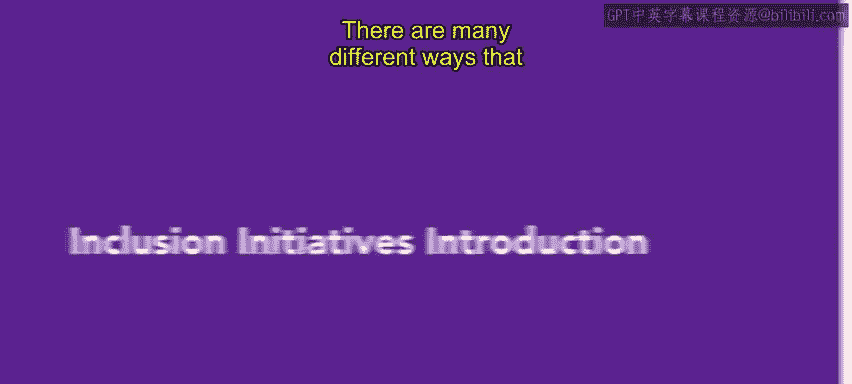

# HRCI《人力资源助理（员工关系、合规）》：第4课：包容倡议简介 🌍  


## 📌 课程概述  


在本节课中，我们将学习企业如何营造包容性文化。  



我们将介绍多种可实施的重要倡议方法，包括开放式沟通、员工参与、反馈机制、工作与生活平衡以及员工关系项目。  

这些内容将帮助你理解如何通过系统化措施打造更加包容的组织环境。  


---  


## 💬 一、建立开放式员工沟通文化  


在介绍具体方法之前，我们首先来看企业营造包容文化的重要基础——沟通。  

培养包容性的一种重要方式是创建开放的员工沟通文化。  

理解不同形式的沟通方式及其对组织文化的影响，有助于营造一个更加包容的环境。  


### 1️⃣ 核心概念  


沟通对组织文化的影响可以用下列关系表示：  


```text
沟通方式 → 员工体验 → 组织文化氛围
```  


当沟通方式更加开放透明时：  


```text
开放沟通 + 双向交流 = 更高的信任感 + 更强的归属感
```  


开放沟通包括但不限于以下方式：  


- 定期员工会议  
- 管理层开放问答  
- 内部沟通平台  
- 匿名意见渠道  


通过建立多样化的沟通渠道，组织能够确保不同背景的员工都有表达机会。  


---  


## 🤝 二、鼓励员工参与组织事务  


在建立沟通机制之后，下一步是提升员工参与度。  

员工参与是增强包容性的另一关键方式。  

人力资源助理可以使用多种工具和策略来鼓励员工参与。  


员工参与带来的影响可以用下式表示：  


```text
员工参与度 ↑ → 归属感 ↑ → 组织承诺 ↑
```  


当员工积极参与组织事务时，他们通常会感到更加受欢迎，并更愿意投入到组织及自身岗位中。  


以下是常见的员工参与工具和方法：  


- 跨部门项目小组  
- 员工委员会  
- 创新提案计划  
- 团队建设活动  


通过提升员工参与度，组织可以增强员工对企业的认同感和责任感。  


---  


## 🗣️ 三、建立员工反馈文化  


在讨论完沟通与参与之后，我们进一步关注反馈机制。  

除了开放沟通与员工参与之外，组织还需要建立欢迎员工反馈的文化。  

这种文化应涵盖公司生活的各个方面。  


有效反馈机制的核心逻辑如下：  


```text
员工建议 → 倾听 → 评估 → 可行时执行 → 包容性提升
```  


倾听员工意见，并在可能的情况下采取行动，是增强包容性的有力工具。  


常见反馈方式包括：  


- 员工满意度调查  
- 建议箱  
- 一对一沟通会议  
- 绩效评估反馈环节  


当员工看到自己的建议被认真对待时，会更强烈地感受到被尊重与重视。  


---  


## ⚖️ 四、强调工作与生活平衡  


在建立反馈机制后，我们继续探讨如何通过制度支持提升包容性。  

营造更具包容性的文化，还可以通过强调员工的工作与生活平衡来实现。  

当员工能够同时投入工作与个人生活，并且组织能够理解其个人情况时，他们会认为组织更加开放并尊重其特殊情况。  


工作与生活平衡的重要性可以表示为：  


```text
工作承诺 ≈ 生活承诺
组织理解个人情况 → 员工满意度 ↑
```  


这是改善职场环境、同时有利于员工与企业的重要议题之一。  


常见支持措施包括：  


- 弹性工作时间  
- 远程办公安排  
- 带薪休假政策  
- 家庭支持计划  


通过这些措施，组织可以在制度层面体现对员工多样化需求的尊重。  


---  


## 🌟 五、发展员工关系项目  


在前面介绍了沟通、参与、反馈与平衡机制之后，我们最后来看员工关系项目。  

组织可以通过建立员工关系项目，确保所有员工都感到受欢迎，并认为自己是被重视的组织成员。  


员工关系项目的目标可以表示为：  


```text
公平对待 + 尊重文化 + 归属支持 = 强化员工关系
```  


常见的员工关系项目包括：  


- 新员工融入计划  
- 多元与包容培训  
- 员工表彰项目  
- 冲突调解机制  


这些项目有助于巩固组织的包容文化，使员工在制度与情感层面都获得支持。  


---  


## 📘 课程总结  


在本节课中，我们一起学习了企业营造包容性文化的多种倡议方法。  


我们重点介绍了开放式员工沟通、员工参与、反馈文化、工作与生活平衡以及员工关系项目。  

通过系统地实施这些措施，组织能够构建更加包容、开放且高效的工作环境。