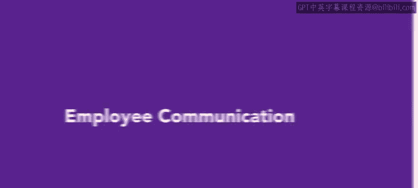
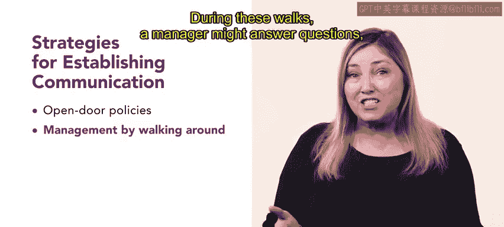
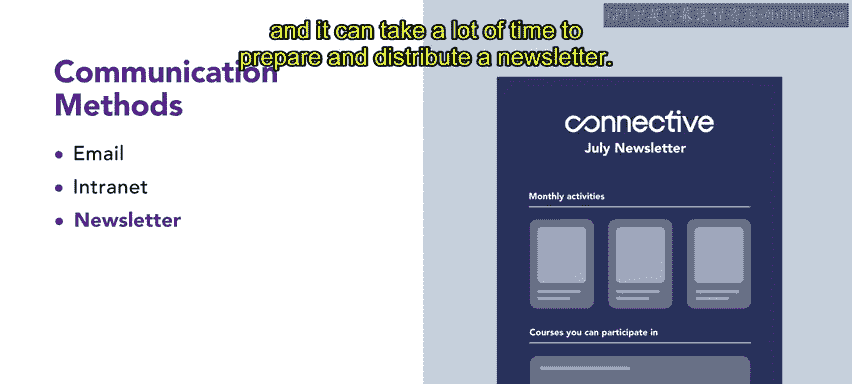

# HRCI人力资源助理课程：4-5：员工沟通 📢

在本节课中，我们将要学习如何在组织内建立有效的员工沟通策略。有效的沟通对于维持健康的工作氛围、确保组织高效运行至关重要。我们将探讨几种具体的沟通策略和常用的信息传递方法，并分析各自的优缺点。

## 建立有效沟通的策略

上一节我们介绍了沟通的重要性，本节中我们来看看几种可以帮助组织建立有效沟通的具体策略。这些策略旨在促进信息在管理层与员工之间的双向流动。

以下是几种关键的沟通策略：

*   **开放政策**：采用开放政策的组织鼓励员工在出现问题时，无需预约正式会议，即可随时与主管或经理会面。
*   **走动式管理**：这种沟通策略要求管理者通过在工作场所内走动来保持可接触性。在走动过程中，管理者可以回答问题、检查任务进度并处理问题。尽管这看似是显而易见的沟通步骤，但管理者很容易因其他事务而忘记执行。
*   **部门会议**：部门会议通常按固定周期举行，并包含部门内的所有员工。这些会议是讨论相关议题的机会。
*   **全员大会**：这是面向组织内所有员工的正式会议。在此类会议中，大部分信息由领导层传达给员工，但有时也会提供双向沟通的机会。
*   **午餐学习会**：这些非正式会议让员工和经理在轻松的环境中共同讨论各种问题和关切。

## 常用的沟通方法与优缺点

除了上述沟通策略，组织在日常运营中还会使用多种具体的方法或渠道来传递信息。每种方法都有其独特的优势和不足。

现在，我们来逐一探讨这些常见的沟通方法。

*   **电子邮件**
    *   **优点**：是向多人同时传递信息的高效方式，并能提供有记录的书面痕迹。
    *   **缺点**：员工可能被过多的邮件淹没，且机密信息存在被意外分享的风险。
*   **内部网络**
    *   **优点**：是组织内成员沟通和分享信息的有效途径。
    *   **缺点**：组织外部人员无法访问内部网络上的信息。
*   **新闻通讯**
    *   **优点**：允许组织向员工分发关于各类活动的信息。
    *   **缺点**：这种沟通主要是单向的，且准备和分发新闻通讯可能耗时较多。
*   **口头传达**
    *   **优点**：是快速传播特定信息的有效方式。
    *   **缺点**：信息可能在理解有误或以不同方式复述时发生改变。

## 总结

本节课中，我们一起学习了建立有效员工沟通的策略与方法。我们首先探讨了开放政策、走动式管理等五种促进双向沟通的策略。接着，我们分析了电子邮件、内部网络等四种常用沟通渠道各自的优势与不足。综合运用这些策略与方法，将有助于你在组织中发展出高效、顺畅的沟通体系。