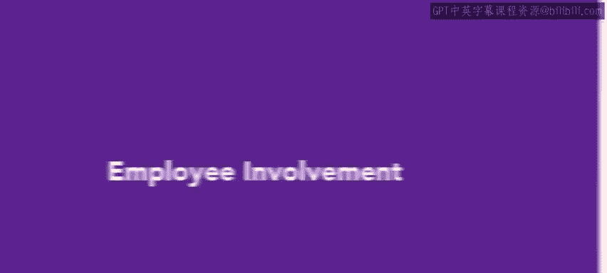
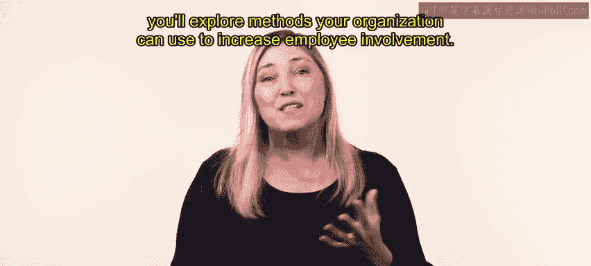
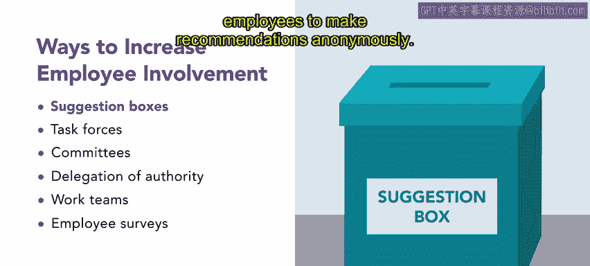
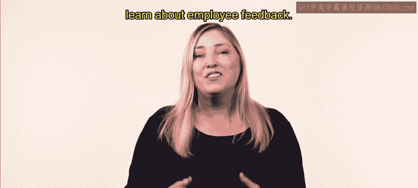

# 🎓 HRCI《人力资源助理》：第4-5课：员工参与（Employee Involvement）


在本节课中，我们将学习什么是员工参与，以及组织可以通过哪些具体方法来提升员工的参与感与投入度。员工参与是员工关系与组织文化中的关键内容，对提升员工满意度和组织绩效具有重要意义。




---

## 📌 什么是员工参与


上一节我们已经了解了员工与组织关系的重要性，本节中我们将进一步聚焦员工参与这一核心概念。


员工如果拥有更多参与组织事务的机会，通常会对组织表现出更高的参与感和投入度。


**员工参与（Employee Involvement）**，指的是员工有机会参与组织如何运作，并且能够感受到自己的贡献真正产生了影响。


这一概念可以用一个简单的逻辑公式来表示：


```text
员工参与度 = 参与机会 × 被倾听程度 × 贡献影响感
```




要实现真正的员工参与，组织的领导层必须愿意倾听员工的声音，并认真考虑员工提出的意见和建议。


---

## 🧩 提升员工参与感的方法概览


在明确了员工参与的定义之后，本节中我们将系统介绍几种常见且有效的员工参与方式。以下方法都围绕一个核心目标：让员工感受到“我参与了，我的意见有价值”。


---

## 📥 建议箱（Suggestion Boxes）


首先介绍的是一种非常基础但有效的方法。


**建议箱**是一种让员工匿名提出建议和改进意见的工具。


这种方式的核心优势在于：


- 员工可以在不暴露身份的情况下表达真实想法  
- 有助于收集平时不容易公开提出的意见  


其本质可以用如下方式理解：


```text
匿名机制 → 降低心理压力 → 提高真实反馈率
```


---

## 🛠️ 工作小组与委员会（Task Forces & Committees）


在建议箱之外，组织还可以通过更结构化的方式让员工参与决策。




### 工作小组（Task Forces）


工作小组是为了研究某个具体问题并提出解决方案而临时成立的团队。


其特点包括：


- 围绕某一特定问题成立  
- 问题解决后即解散  
- 目标清晰、周期有限  


可以简单理解为：


```text
问题存在 → 成立工作小组 → 提出解决方案 → 问题解决 → 小组解散
```


### 委员会（Committees）


与工作小组不同，**委员会**通常负责处理组织中的长期或持续性问题。


例如：


- 员工管理委员会  
- 跨部门协作委员会  


委员会往往由来自组织不同层级的员工组成，以确保多元视角被纳入决策过程。


---

## 🔑 授权（Delegation of Authority）


在介绍完团队形式的参与方式后，我们再来看一种更偏向管理行为的方式。


**授权**是指管理者将决策权和执行权下放给员工。


通过授权，管理者向员工传递一个明确信号：


```text
我信任你 → 你可以独立完成工作并做出决策
```


授权不仅能提升员工的责任感，还能增强他们对组织的信任与归属感。


---

## 👥 工作团队（Work Teams）


接下来介绍的是员工日常工作中最常见的一种参与形式。


**工作团队**是指那些每天一起完成工作任务的员工群体。


工作团队具有以下特点：


- 可以线下或线上开展协作  
- 可能由管理者分配任务  
- 也可能是自我管理型团队  


在自我管理团队中，成员通常会自行决定：


- 工作如何排期  
- 谁负责具体任务  
- 如何对结果负责  


其运作逻辑可以表示为：


```text
团队自决 = 自主安排 + 分工协作 + 共同问责
```


---

## 📊 员工调查（Employee Surveys）


最后一种员工参与方式是员工调查。


**员工调查**为员工提供了一种系统化的渠道，用于表达他们对组织氛围、管理方式和工作体验的看法。


通过调查，组织可以：


- 收集员工的想法与感受  
- 识别潜在问题  
- 为改进决策提供数据支持  


---

## 💬 员工参与的共同核心：沟通


在回顾了所有员工参与方式之后，我们可以发现一个共同主题。


**有效沟通**是提升员工参与度的基础。


领导者和管理者需要通过持续、开放的沟通，来建立积极且高效的工作文化。


在接下来的内容中，你将继续学习如何保持沟通渠道畅通，以及如何有效收集和运用员工反馈。


---

## ✅ 本节课总结


在本节课中，我们系统学习了员工参与的概念及其重要性，并了解了多种提升员工参与感的方法，包括：




- 建议箱  
- 工作小组  
- 委员会  
- 授权  
- 工作团队  
- 员工调查  


同时，我们也认识到，沟通是所有员工参与方式的共同基础。通过有效沟通，组织能够打造更加积极、投入和高效的工作环境。