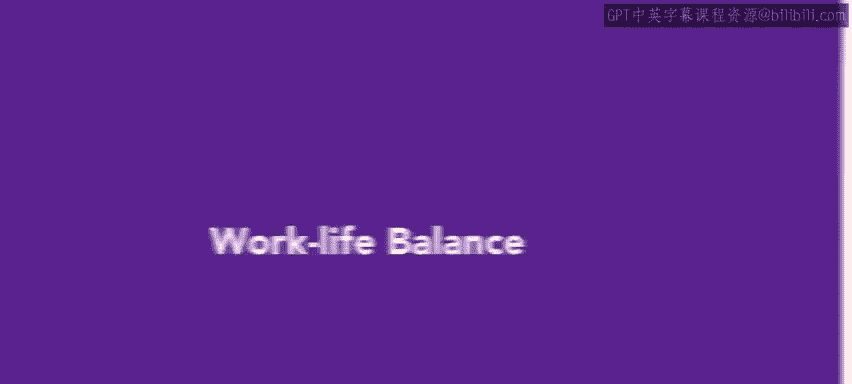
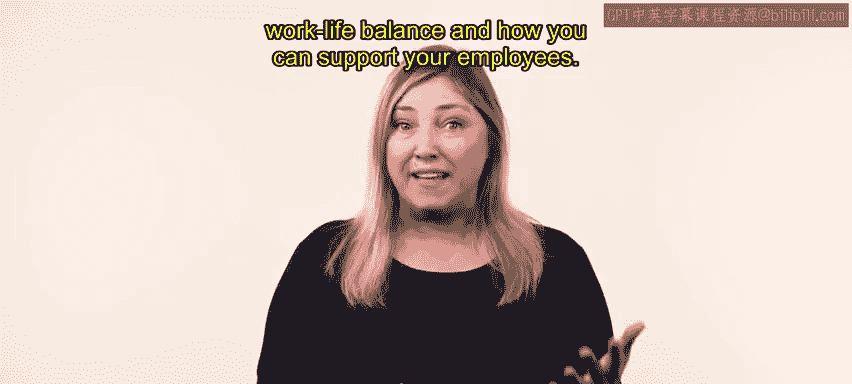
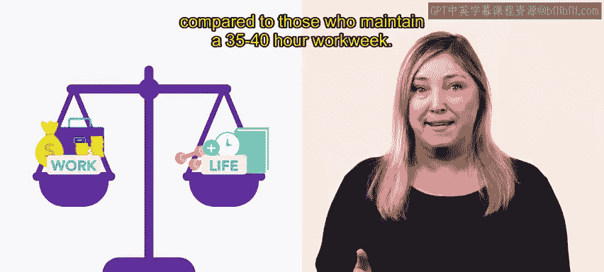
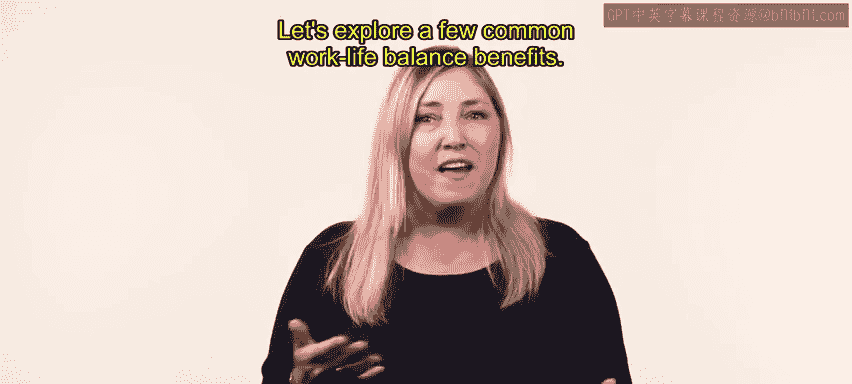
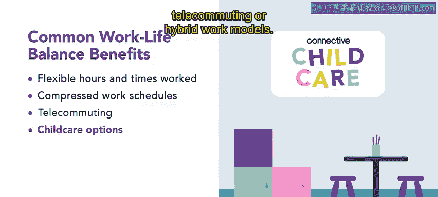
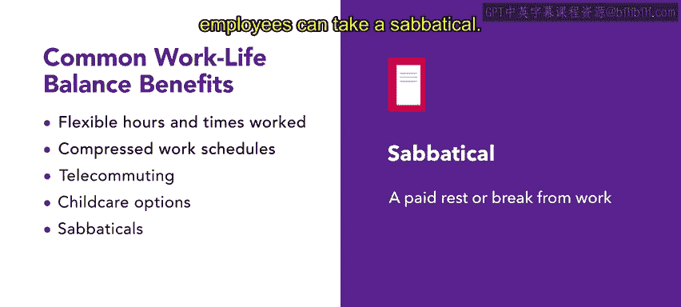
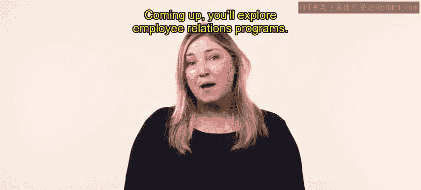

# HRCI《人力资源助理（员工关系、合规，4-5课／共5课）｜HRCI Human Resource Associate》 - P31：26_工作生活平衡.zh_en - GPT中英字幕课程资源 - BV1qE4m19788

Your life consists of various distinct， though， sometimes overlapping spheres。

 you have a social life， a family life， a work life。

 and perhaps our religious life or other commitments to beliefs or values。

 feeling personally fulfilled and happy requires balancing commitments。

 Go and desires in each of these areas， Many people struggle with this balance。

 especially when work is particularly demanding In this video。

 you'll explore work life balance and how you can support your employees。

 Each of us has a different vision for work life balance as we attempt to reconcile the tension between our professional obligations and the activities that fulfill us outside of work。

😊。

Experts agree that the absence of personal fulfillment activities in one's daily schedule reduces overall happiness and can negatively impact one's health。

 according to the CDC， employees who regularly overwork。

 meaning they clock more than 55 hours each week， or at an increased risk of stroke and heart disease compared to those who maintain a 35 to 40 hour work week。

Organizations recognize the value of a healthy， happy workforce。

 and many employers have introduced benefits that aim to make work life balance more achievable benefits and perks can also make a tremendous difference in recruitment and retention efforts。

Let's explore a few common work life balance benefits。

Some employers offer flexibility and the hours and times worked， for example。

 employees at Connective aren't expected to stay at their desk for a certain amount of time each day。

 instead they are expected to achieve specific goals and allow time to recharge。

Since this practice has been implemented， the HRTM at Connective has noticed that when employees feel they are in control of their time and work environment。

 they experience less burnout。Employees are happy to be able to meet personal needs and reduce commuting and childcare expenses like flexible scheduling。

 compressed work schedules allow for deviations from the standard Monday through Friday 9 to5 work week。

Employees working in a compressed work schedule typically perform a certain number of hours of work in fewer workdays each week popular alternative work schedules include the410 arrangement。

 which is working four 10 hour days with a three day weekend and the 980 arrangement。

 which is nine hour workdays with every other Friday off Telecommuting or working away from the office is another benefit to help achieve work life balance。

 advances in technology have made telecommuting the norm at many organizations。😊。

This flexible option generally leads to increased job satisfaction。At Connective。

 this was an easy benefit to offer and the company is proud of its success in this area。

Onite child carere is regarded as one of the best employed benefits for parents。

 not only is a childcare free or discounted， but parents are comforted knowing that their children are nearby。

Connive offers onsite child carere at its offices and childcare subsidies for employees who choose telecommuting or hybrid work models A sabbatical is a paid rest or break from work sabbaticals are usually awarded for one year after a period of years worked the purpose of a sabbatical is often to conduct research or in-depth study of a given topic or to travel。

 although sabbaticals are most commonly associated with academia。

 they can be incorporated into other sectors as well。😊。

After seven years of working at Connective， employees can take a sabbatical。

Work life balance benefits are a great tool to engage employees and attract talent for a more diverse workplace Com up you'll explore employee relations programs。

😊。

