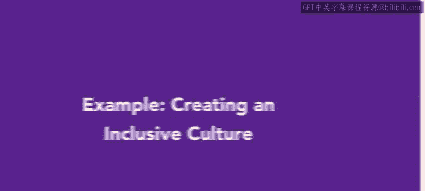
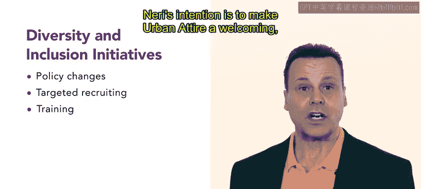

# HRCI《人力资源助理（员工关系、合规，4-5课／共5课）》：P33：28_示例：创建包容性文化

在本节课程中，我们将通过一个真实案例，学习一个组织如何尝试创建包容性文化。我们将跟随Urban Attire公司的人力资源专业人士Neri，了解其具体步骤与挑战。

## 🏢 案例背景：Urban Attire公司

Urban Attire是一家专注于现代都市休闲服饰的中型企业。公司提供一系列时尚且实用的服装。

其业务范围包括工厂、实体零售店和总部办公室。多样的地点和职位类型为人力资源部门带来了广泛的责任。

随着公司发展，Urban Attire一直以其对待和欢迎团队成员的方式为荣。然而，公司意识到在培养包容性组织文化方面仍有改进空间。

## 🔍 识别需求：为何需要包容性文化？

近年来，Urban Attire的员工数量从设计团队到制造和零售店员工都迅速增长。组织各个层级的人员都更多了。团队具有一定的多样性。

但Neri知道，一项正式的举措将使公司更具多样性和包容性。Neri理解，包容性意味着员工受到尊重和赏识，能够参与活动、项目和计划，获得公平的薪酬，并能充分发挥其技能。

## 📋 行动计划：三步走战略

Neri经过研究，制定了一个三步计划，以使Urban Attire更具包容性。

以下是该计划的核心步骤：

1.  **评估当前文化**：Neri将详细描述当前的文化状况。
2.  **制定改进计划**：基于评估结果，制定具体的行动计划。
3.  **建立开放沟通**：确保沟通渠道畅通，问题能被及时提出和解决。

### 第一步：评估当前文化

为了详细描述当前文化，Neri从Urban Attire的员工那里收集反馈。Neri举办研讨会、进行问卷调查并与团队成员会面，以了解更多关于歧视问题和可能需要做出的改变。

其中一些对话令人不适，但它们都很有价值。这些信息让Neri明确了解到Urban Attire存在明显的改进需求。

### 第二步：制定透明行动计划

Neri制定了一个透明的行动计划来解决具体问题。特别是，Neri了解到，来自某些代表性不足群体的员工没有得到应有的快速晋升。

这种不平衡可能会影响内部士气，并使Urban Attire面临法律风险。Neri创建了一个以行动为导向、目标可衡量的计划。

Neri打算每季度报告该计划的进展。该计划的第一个行动项是创建一个员工资源小组，该小组将连接来自代表性不足群体的员工，并讨论改善Urban Attire文化的方法。

## 🗣️ 第三步：实施开放沟通政策

为了确保涉及包容性的问题得到迅速解决，Neri还实施了开放沟通政策。

公司的每个人都应该能够就任何问题与经理交谈。如果员工觉得与另一个团队的领导交谈更自在，公司鼓励他们这样做。

## 🚀 未来展望与持续努力

Neri认为这是一个良好的开端。展望未来，他们计划引入更多多元化和包容性举措，例如政策变更、针对性招聘和培训。Neri的意图是使Urban Attire成为一个对所有员工都友好、高效且创新的公司。

## 💡 总结与启示

我们稍后会再次关注Neri的进展。确保一个组织具有包容性可能具有挑战性。一些对话会令人不适，管理层可能会惊讶地发现他们的公司并不像他们想象的那样友好。

尽管存在不适感，但这是一项至关重要的工作，有助于确保组织中的每个人都受到欢迎、被包容并感到满意。

在本节课中，我们一起学习了通过具体案例来创建包容性文化的三步流程：**评估现状 -> 制定计划 -> 开放沟通**。这是一个持续的过程，需要坦诚的对话和坚定的行动。接下来，你将学习关于员工敬业度的知识。

