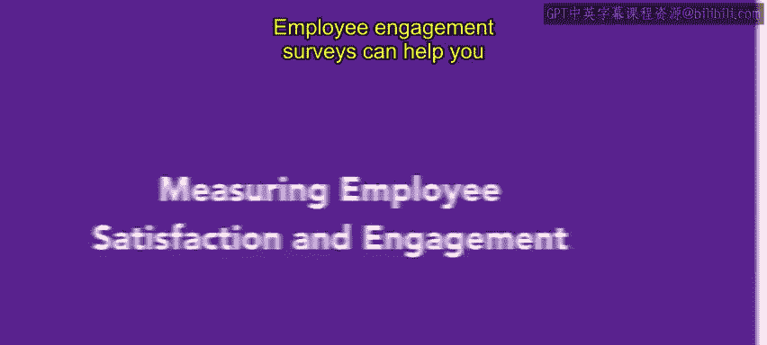
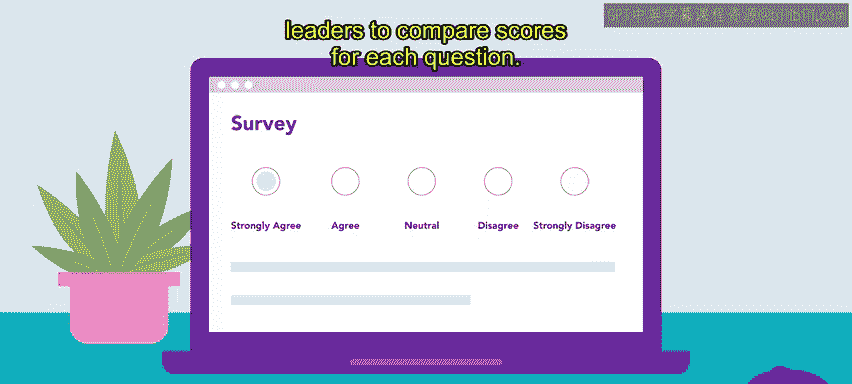
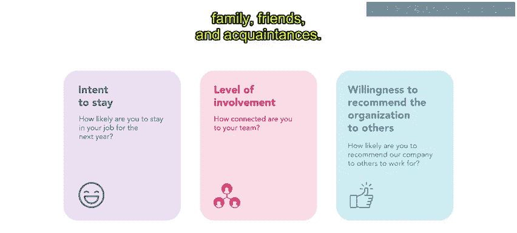
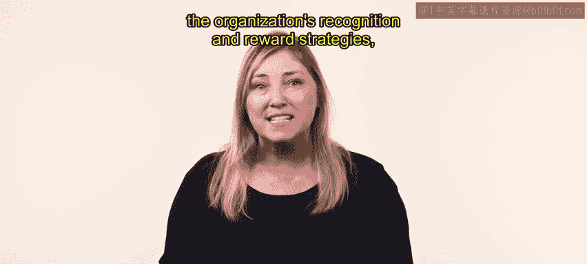

# HRCI《人力资源助理（员工关系、合规，4-5课／共5课）》 - P34：29_衡量员工满意度和敬业度

## 📊 课程概述
在本节课中，我们将要学习如何通过员工敬业度调查来衡量员工的满意度和敬业度。我们将探讨调查的目的、设计原则、核心问题构成以及结果应用，帮助你掌握这一关键的人力资源管理工具。

---

## 🎯 员工敬业度调查的目的
员工敬业度调查能帮助你了解员工是否在组织中感受到自身价值。其主要目的是揭示当前驱动和阻碍员工敬业度的因素，同时也用于评估组织敬业度提升举措的有效性。

---

## ✍️ 调查问卷的设计与发布
负责构建和发布敬业度调查的人员，必须准备能提供有效洞察的问题。

设计问卷时，保持问题简洁且聚焦至关重要。

将问题划分为多个部分有助于员工提供清晰的答案。

同时，必须注意调查的时机会影响其结果。

---

## 📈 常见的调查量表类型
最常见的调查采用**五点量表**。员工阅读一个陈述，然后从“非常同意”到“非常不同意”中选择一项。这种调查便于进行数据分析，因为领导者可以比较每个问题的得分。

---

## 🔍 衡量敬业度的核心问题
上一节我们介绍了调查的常见形式，本节中我们来看看具体应关注哪些方面。旨在衡量敬业度的问题应聚焦于发现员工的留任意向、参与程度以及是否愿意向家人、朋友和熟人积极推荐组织。

---

## 🏢 衡量工作环境与价值观
问题还应衡量组织的工作条件是否有助于培育其核心价值观。

以下是你可以询问员工的一些方面：
*   **自主权与赋权感**：员工如何看待自己的自主权和被赋权程度。
*   **领导力、沟通与协作**：员工对领导力、沟通、协作和组织文化的感受。
*   **职业发展与支持**：员工对其职业发展、管理支持、组织的认可与奖励策略以及所提供的培训与发展机会的感受。

---

## 💬 设置开放式问题
组织使用的调查应至少包含一个开放式问题，询问员工组织应如何改进。

这个问题可能不易分析，但它为员工提供了表达意见的机会，这些意见可能是其他问题未能涵盖的。

---

## 📢 分享结果与采取行动
进行员工敬业度调查固然关键，但几乎同等关键的一步是与公司分享调查结果及后续行动计划。

组织的发展高度依赖于员工，而关于员工如何与组织核心使命互动的准确信息，对于实现目标至关重要。

---

## ✅ 课程总结
本节课中，我们一起学习了员工敬业度调查的完整流程。我们明确了调查的核心目的是评估驱动因素与阻碍，并衡量管理举措的效果。我们掌握了设计有效问卷的原则，包括使用五点量表、聚焦于留任意向与推荐意愿等核心维度，并涵盖工作环境、价值观、职业发展等多方面。最后，我们强调了设置开放式问题以及分享结果并采取后续行动的重要性，这是将调查数据转化为组织改进动力的关键一步。