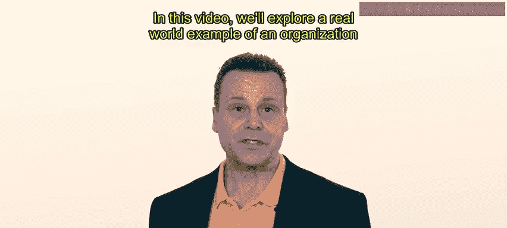
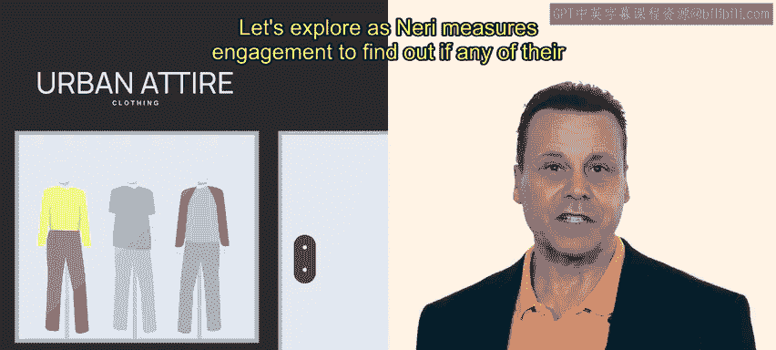
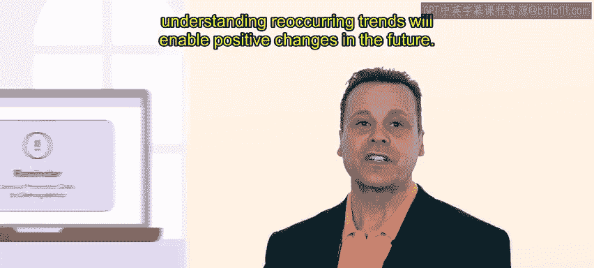
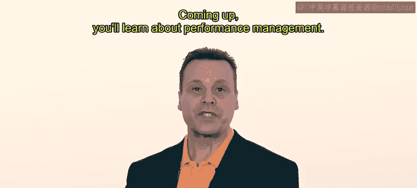

# HRCI《人力资源助理（员工关系、合规，4-5课／共5课）｜HRCI Human Resource Associate》 - P35：30_示例：评估敬业度.zh_en - GPT中英字幕课程资源 - BV1qE4m19788

In this video， we'll explore a real world example of an organization measures impact of inclusion efforts。

 For this example， we'll follow Neri an HR professional at Urban attire。

Earlier in this course， you reviewed how Neri researched the culture at Urban attire and created an action plan to address most issues they uncovered。

One of the most glaring issues was the possibility that employees from underrepresented groups were not being promoted as the expected rate。

Let's explore as Neary measure engagement to find out if any of their efforts had paid off。

First， Neri conducts the same survey they used before the new inclusion initiatives began。

The survey uses a five point scale to measure how strongly an employee agrees with a statement。

One of the most applicable questions is， do you think urban attire is an inclusive work。

This question shows a small， but encouraging bump。Previously， on average。

 respondents marked the statement at4 or agree。A few months after proactively working on inclusion。

 the average response rate had increased to 4。5。 That is between agreed and strongly agreed。

Nary is pleased with this increase and is happy to share this information at the next all company meeting。

Though harder to compare directly， Neri also organizes similar workshops to gauge how employees perceive the company。

 That is how they feel about the inclusion efforts and how they are likely to stay。Generally。

 these results are positive as well。 Ne he is pleased with urban attire's trajectory。

N reviews the HR data and also determines that promotions at urbanr attire have been more diverse than previously and are now aligned with the makeup up of the company's workforce。

Nary feels strongly that voicing concerns about the lack of diversity within promotions。

 even without a policy change， has supported this progress。

Nary will continue to monitor this issue and other aspects of urban attire in the coming months and years。

Maintaining benchmark data and understanding reoccurring trends will enable positive changes in the future。

We'll check in with Neri， again， later。Tracking employee satisfaction。

 engagement and sentiment towards new initiatives is important in every organization。

This feedback helps HR professionals ensure training and development is effective and useful。

Coming up， you'll learn about performance management。

