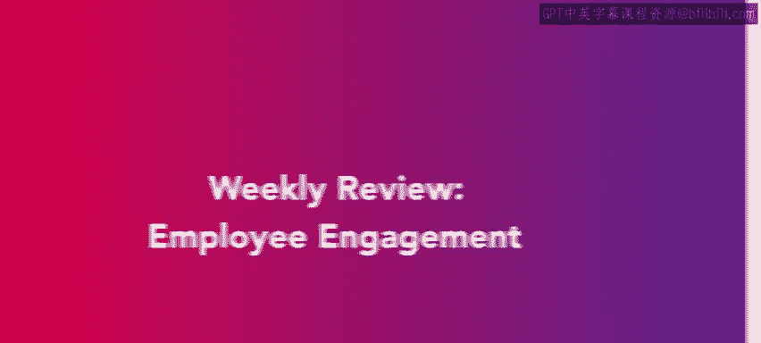
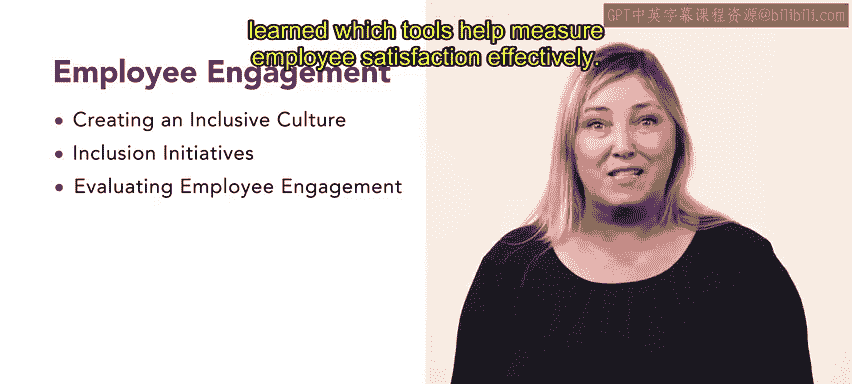

# HRCI《人力资源助理（员工关系、合规）》：第2周：每周回顾——员工敬业度 📊  


## 📌 课程概述  


在本节课中，我们将对第二周的学习内容进行系统回顾。本周的核心主题是**员工敬业度（Employee Engagement）**。通过本周的学习，你已经对员工敬业度的概念、构建方式以及衡量方法建立了全面理解。  


---  




## 🏢 构建包容且友好的职场文化  


上一部分课程围绕员工敬业度展开，本节首先回顾如何构建包容且友好的组织文化。  


首先，你学习了如何打造一个**包容性（Inclusion）**和**受欢迎（Welcoming）**的职场文化。理解这一点对于提升员工参与度至关重要。  


在这一过程中，你深入探讨了以下核心概念：  


- **多元化（Diversity）**  
- **公平性（Equity）**  


这些概念之所以重要，是因为它们构成组织健康发展的基础。  


其核心逻辑可以用公式表示为：  


```
包容性文化 = 多元化 + 公平性 + 尊重
```  


当组织真正重视并实践这些原则时，员工更容易产生归属感与认同感。  


随后，你还学习了创建包容性组织文化的实际方法，使理论能够落地到具体实践之中。  


---  


## 🤝 建立包容文化的实践方法  


在理解核心概念之后，本节进一步回顾组织如何在实践中推动包容文化。  


以下是帮助组织建立包容文化的关键方式：  


- **开放式沟通（Open Communication）**  
- **员工参与（Employee Involvement）**  
- **工作与生活平衡（Work-Life Balance）**  


其中，开放式沟通可以表示为：  


```
有效沟通 = 透明信息 + 双向反馈
```  


员工参与强调员工在决策和组织发展过程中的参与程度：  


```
员工参与度 ↑ → 员工敬业度 ↑
```  


同时，你还讨论了**工作与生活平衡**如何影响组织整体健康水平：  


```
良好的工作生活平衡 → 员工满意度提升 → 组织绩效提升
```  


这些因素共同作用，塑造了一个真正具有包容性的组织环境。  


---  


## 📈 员工参与与满意度衡量工具  


在掌握文化建设方法之后，本节最后回顾员工参与的关键术语与测量方式。  


你定义了与员工参与相关的重要概念，并学习了如何有效衡量员工满意度。  


常见的测量工具包括：  


- 员工满意度调查（Employee Satisfaction Survey）  
- 敬业度调查（Engagement Survey）  
- 反馈机制与数据分析工具  


其核心逻辑可以用公式概括：  


```
员工满意度 = 工作体验 + 组织支持 + 个人发展机会
```  


通过科学的测量工具，组织可以识别问题、制定改进计划，并持续提升员工敬业度。  


---  


## 🎯 本周总结  


本节课中，我们一起回顾了第二周关于员工敬业度的全部核心内容。  




我们学习了如何构建包容且友好的职场文化，理解了**多元化与公平性**的重要性，并掌握了建立包容文化的具体方法。随后，我们探讨了员工参与、工作生活平衡以及衡量员工满意度的工具与方法。  


通过这些内容，你已经建立了关于员工敬业度的系统认知，为接下来的第三周学习做好了准备。