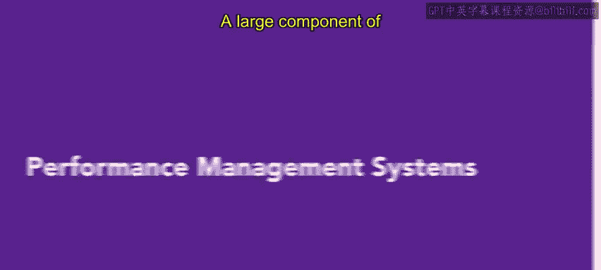
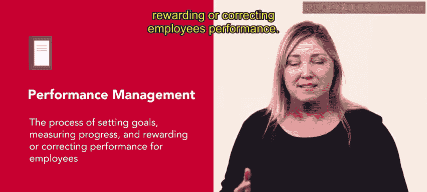
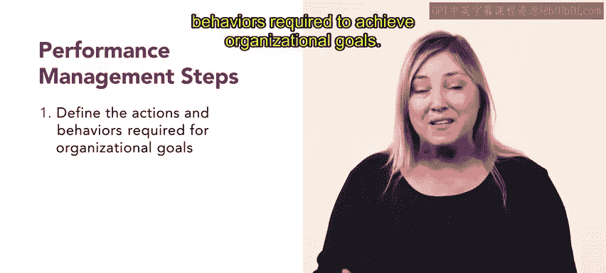
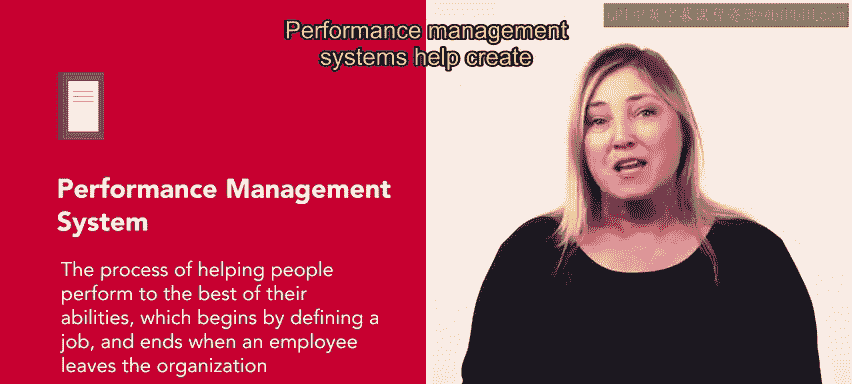
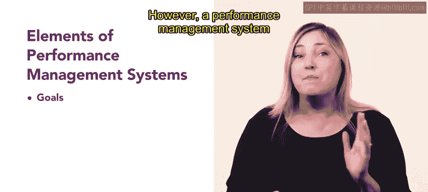
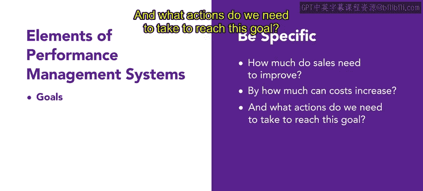
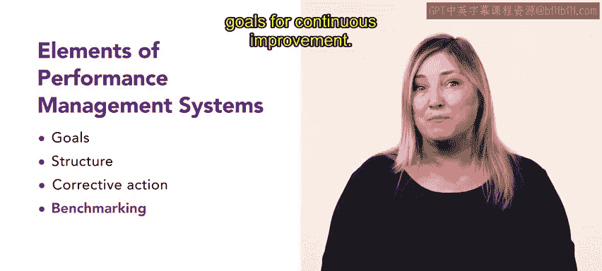
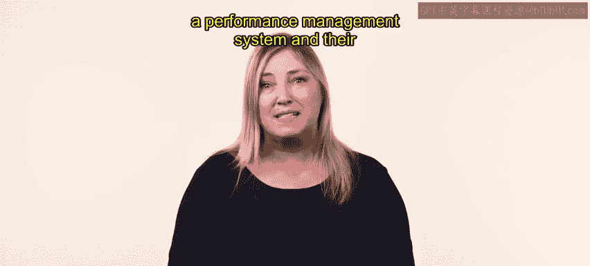

# HRCI人力资源助理课程：4-5：绩效管理系统

在本节课中，我们将要学习绩效管理系统的核心概念、基本步骤以及构成要素。绩效管理是管理者角色的重要组成部分，它通过设定目标、评估进展和采取相应措施，来确保员工发挥最佳能力并推动组织成功。

## 什么是绩效管理？📊

管理者角色的一个重要组成部分是监督任务。管理者必须密切监控员工绩效，提供建设性反馈并认可员工的努力。这些任务被称为绩效管理。

绩效管理是一个设定目标、衡量进展、并根据评估结果奖励或纠正员工绩效的过程。

## 绩效管理的三步流程🔄

上一节我们介绍了绩效管理的定义，本节中我们来看看这个过程的典型步骤。这个过程通常遵循三个步骤。

以下是绩效管理流程的三个核心步骤：
1.  **明确目标**：清晰地定义为实现组织目标所需的行为和行动。
2.  **定期评估**：定期评估员工是否达到这些期望。
3.  **采取措施**：根据评估结果，采取必要措施来调整或维持当前的绩效水平。

## 绩效管理系统的作用💡

许多组织通过使用绩效管理系统来简化上述流程。绩效管理系统帮助员工尽其所能地工作，它从定义岗位开始，到员工离开组织时结束。

绩效管理系统有助于创造一个所有员工都被平等对待的高效工作环境。

## 绩效管理系统的核心要素🔧

大多数绩效管理系统由一些共同的要素构成。接下来，我们将详细探讨其中的几个关键要素。

**目标设定**
目标是绩效管理系统的基本要素。然而，仅仅让管理者理解组织目标是不够的，绩效管理系统需要一个更具体和聚焦的方法。例如，如果一个组织目标是明年利润增长10%，管理者必须提出更具体的问题：销售额需要提高多少？成本可以增加多少？我们需要采取哪些行动来实现这个目标？

**评估结构**
下一个要素是评估结构。通常，员工会参与结构化的年度书面评估，将其工作与组织期望进行比较。为了对员工绩效进行更全面的评估，还会使用其他评估结构，包括评级量表、管理者意见、同事评审和自我评估。本周我们将更详细地讨论其中一些方法。

**纠正措施**
纠正措施或过程调整在绩效管理系统中起着至关重要的作用。这个要素帮助员工改进绩效，并允许组织识别和规划高绩效员工的发展。管理者也能够识别组织内部的必要变化，并相应地调整对员工的期望。

**基准分析**
基准分析是分析绩效和在组织内建立标准的宝贵方法。外部基准分析将员工绩效与其他组织的员工进行比较。内部基准分析则检查并比较组织过去与现在的绩效。基准分析技术使绩效管理系统能够为持续改进设定基线期望和目标。

## 总结与回顾🎯

本节课中，我们一起学习了绩效管理系统的各个方面。绩效管理系统的每一个要素都有助于确保管理任务在整个组织中得到有效执行。现在，你已经理解了构成绩效管理系统的不同组件及其在推动组织成功方面的重要性。