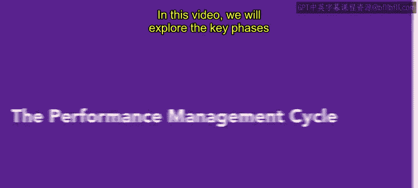
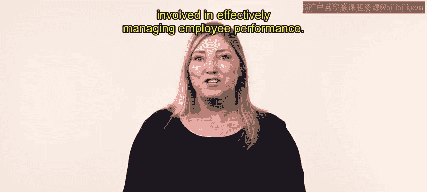
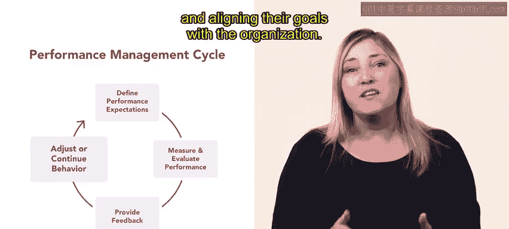
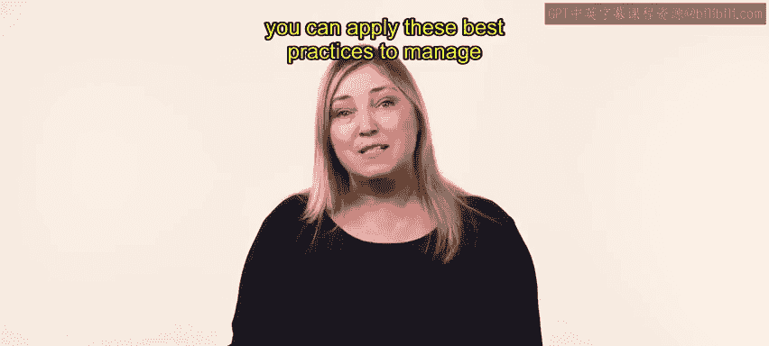

# HRCI《人力资源助理（员工关系、合规，4-5课／共5课）》：P39：绩效管理周期

## 📋 概述
在本节课中，我们将学习绩效管理周期的四个关键阶段。绩效管理是一个持续的过程，它通过系统地监控、评估和改进员工绩效，帮助组织实现其目标。

绩效管理是一个持续的四步循环，确保员工的绩效得到有效监控、评估和持续改进。

## 🔄 绩效管理周期的四个阶段
上一节我们介绍了绩效管理是一个持续循环的概念，本节中我们来看看这个循环具体包含哪四个阶段。

以下是绩效管理周期的四个核心阶段：

1.  **设定绩效期望**
    在绩效周期开始时，管理者与员工共同设定明确的绩效期望。这包括讨论具体项目、截止日期、质量标准及其他相关绩效标准。

2.  **评估绩效**
    在评估阶段，管理者密切监控员工的工作表现。他们使用多种评估方法，如定期检查、绩效评估和绩效指标，来衡量员工的进展、成就以及需要改进的领域。

3.  **提供反馈**
    基于评估结果，管理者向员工提供建设性的反馈。这包括指出员工的优势、待改进之处，并提供具体的改进建议。

4.  **制定新目标**
    在绩效回顾和反馈之后，员工根据反馈调整工作方法。随后，管理者与员工共同讨论并设定下一个绩效周期的新期望和目标。

## 🎯 阶段详解与示例
理解了四个阶段后，我们通过一个具体例子来深入看看每个阶段是如何运作的。

以市场经理和平面设计师为例：

*   **设定期望**：在绩效周期（通常为一年）开始时，市场经理与平面设计师讨论具体的设计项目、截止日期、质量标准等，为双方对目标的共同理解奠定基础。
*   **评估绩效**：期间，经理监控设计师的创造力、技术技能、对品牌指南的遵守情况以及达成项目目标的能力。
*   **提供反馈**：经理根据评估结果，向设计师提供反馈。例如，指出其关注细节的程度、响应客户请求的情况、团队协作能力，并表扬其创造力和时间管理技能，同时建议其如何更有效地与团队合作并跟上行业最新趋势。
*   **制定新目标**：反馈会后，设计师根据建议调整方法（如加强团队协作、关注行业动态）。在此基础上，经理与设计师讨论并设定下一周期的新期望，包括新项目、目标、技能发展机会，并确保其目标与组织目标保持一致。

需要指出的是，衡量、评估和提供反馈的具体时间安排可能因组织而异。

## 💎 总结
本节课中，我们一起学习了绩效管理周期的四个阶段：**设定期望 → 评估绩效 → 提供反馈 → 制定新目标**。记住，绩效管理是一个持续的循环过程，通过不断监控、评估和改进员工绩效来帮助组织达成目标。

现在你已理解绩效管理周期，可以将这些最佳实践应用于任何组织的员工绩效管理工作中。