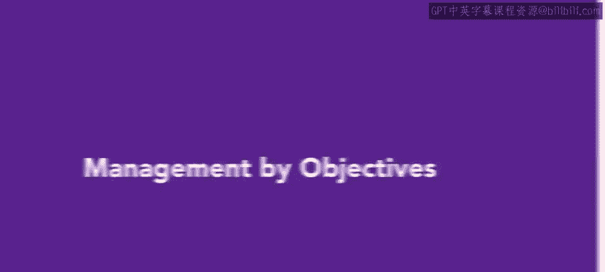
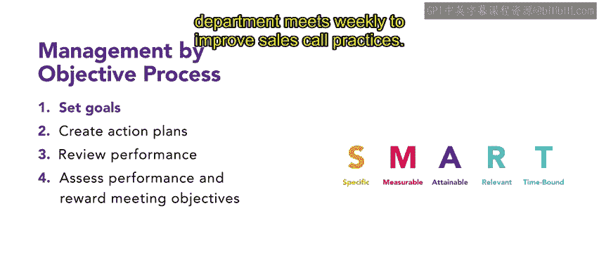
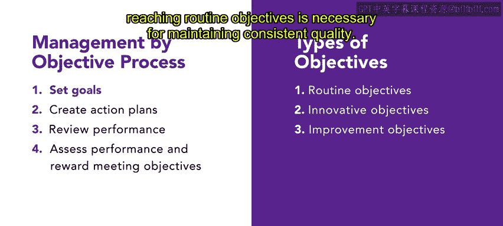
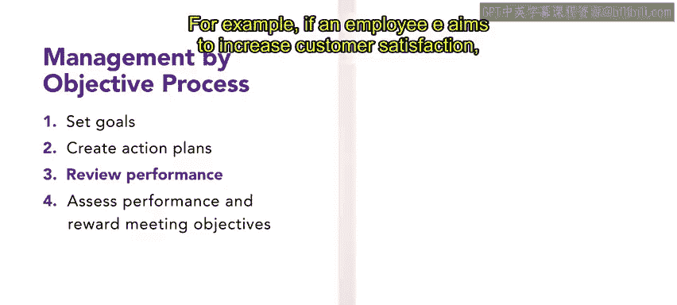
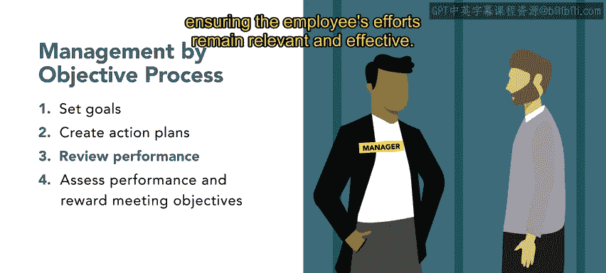
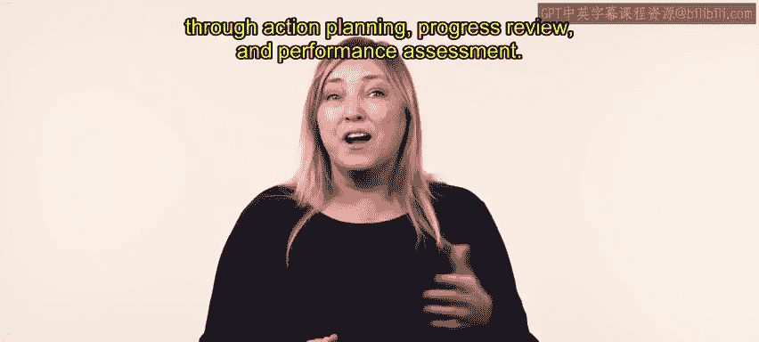

# HRCI《人力资源助理（员工关系、合规）》：第4-5课：目标管理法 🎯




## 📌 课程概述  


在本节课中，我们将系统学习**目标管理法（Management by Objectives，MBO）**。你将了解它的起源、核心思想，以及从目标制定到绩效评估与激励的完整流程，帮助你理解组织如何通过清晰的目标管理来提升整体绩效。


---

## 📖 什么是目标管理法（MBO）  


上一部分我们提到目标管理法的概念背景，本节中我们先来看看它的定义与价值。


1954年，**entity["people","Peter Drucker","management theorist"]** 提出了目标管理法（Management by Objectives，MBO）。


目标管理法是一种**协作式管理框架**，通过员工与管理者之间的有效沟通与目标对齐，帮助组织以系统、有纪律的方式设定并实现目标。


通过实施MBO，组织可以提升整体绩效并推动成功。


在本课程中，我们将从**组织目标的设定**开始，一直到**员工成果的奖励**，完整了解MBO的运作流程。


---

## 🔄 目标管理法的四个核心步骤 🧭  


在理解了MBO的整体作用之后，本节我们将进一步拆解它的流程。


目标管理法包含四个关键步骤，这些步骤用于连接员工与管理者，使双方能够设定清晰且可衡量的目标。


下面我们将依次详细介绍每一个步骤。


---

## 📝 第一步：协作制定目标（SMART目标）  


上一节我们提到MBO以目标为核心，本节我们重点来看目标应如何制定。


通过**协作式目标设定**，组织能够形成更现实、更具挑战性的目标，同时提升员工的参与度。


团队制定的每一个目标都必须符合 **SMART 原则**。


以下是SMART目标的具体标准：  


- **Specific（具体）**  
- **Measurable（可衡量）**  
- **Attainable（可实现）**  
- **Realistic（现实可行）**  
- **Time-bound（有时间限制）**  


可以用公式来表示：  




```text
SMART目标 = 具体 + 可衡量 + 可实现 + 现实可行 + 有截止时间
```


运用这些标准，管理者能够制定清晰明确的业务目标，并形成可执行的计划，从而显著提高目标达成的可能性。


为了更好理解，我们来看一个例子。


“提高销售电话质量”并不是一个SMART目标。


如果要让它符合SMART原则，可以改写为：  


```text
销售部门每周召开会议，持续改进销售电话实践
```


---



## 🧩 第二步：区分目标类型  


在明确了SMART目标之后，本节我们来看看MBO中目标的不同类型。


在目标管理法中，目标主要分为三类：  


- **常规目标（Routine Objectives）**  
  用于维持日常工作质量，确保工作稳定运行。  


- **改进目标（Improvement Objectives）**  
  引入新的挑战，推动绩效提升。  


- **创新目标（Innovative Objectives）**  
  通常更受关注，用于推动变革与突破。  


其中，完成常规目标是保持组织质量一致性的基础。


---

## 🗺️ 第三步：制定行动计划  


在完成目标分类之后，本节我们将进入目标落地的关键环节。


当管理者与员工共同设定好目标后，下一步是制定**行动计划**，明确实现目标所需的具体步骤。


行动计划可以根据目标范围不同，在以下层级制定：  


- **个人层级**  
- **部门层级**  
- **组织层级**  


下面是不同层级行动计划的示例说明。


- **个人行动计划**  
  包括市场调研、制定销售策略等具体任务。  


- **部门行动计划**  
  例如改进客户服务培训体系。  


- **组织层级行动计划**  
  用于协调跨部门的整体工作。  


行动计划为员工提供清晰的成功路径，使他们明确自己的目标以及实现目标所需采取的行动。


---

## 🔍 第四步：进度回顾与绩效评估  


在行动计划执行过程中，本节我们来看看如何进行跟进与调整。




管理者会与员工定期会面，回顾员工在目标达成方面的进展情况。


这些会议的作用包括：  


- 提供绩效反馈  
- 指出员工表现优秀的方面  
- 识别需要改进的领域  


在回顾过程中，目标也可以根据业务环境的变化进行更新或修订。


例如，如果员工的目标是提升客户满意度，管理者可能会建议员工改善与客户的沟通方式。




如果客户偏好或市场环境发生变化，目标就需要相应调整，以确保员工的努力始终保持相关性和有效性。


---

## 🏆 绩效评估与奖励机制  


在完成目标设定、行动计划和进度回顾之后，本节我们进入MBO的最后一步。


管理者将对员工的绩效进行评估，以判断员工在多大程度上实现了既定目标。


基于评估结果，管理者可能会给予员工以下奖励：  


- 奖金  
- 额外薪酬  
- 其他形式的认可  


这些奖励机制能够激励员工持续投入，并强化他们在MBO框架下实现目标的承诺。


---

## ✅ 课程总结 📚  


在本节课中，我们系统学习了**目标管理法（MBO）**如何提升组织绩效。


我们了解了MBO的起源与核心理念，并完整梳理了以下内容：  


- 协作制定SMART目标  
- 不同类型目标的划分  
- 行动计划的制定  
- 进度回顾、绩效评估与激励机制  




通过行动计划、持续回顾和绩效评估，MBO确保员工与管理者始终保持专注、负责并充满动力。