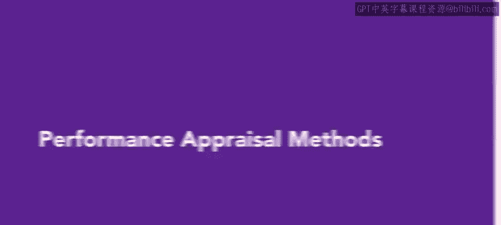
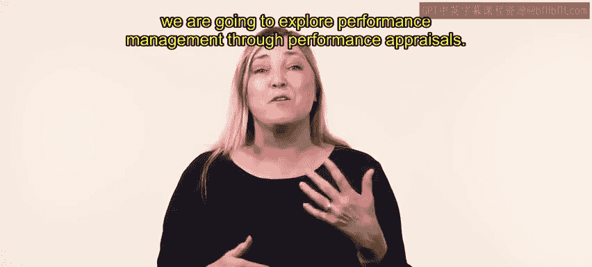
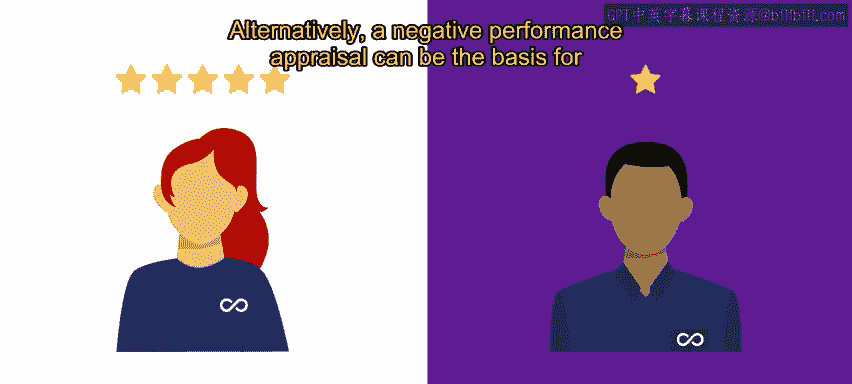
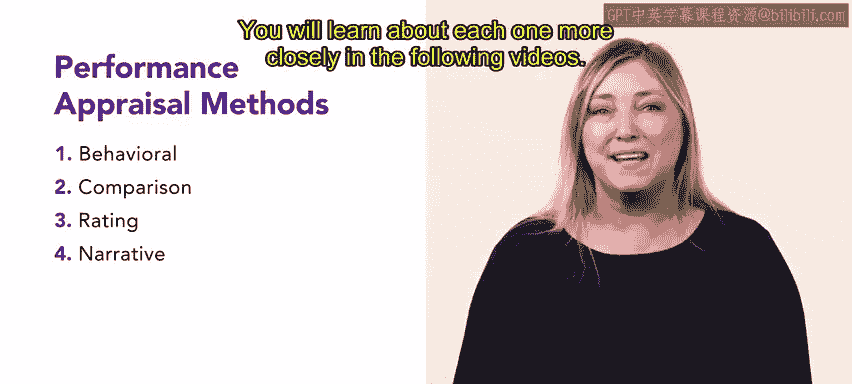

# HRCI《人力资源助理（员工关系、合规，4-5课／共5课）｜HRCI Human Resource Associate》 - P42：37_绩效评估方法.zh_en - GPT中英字幕课程资源 - BV1qE4m19788

In this video， we are going to explore performance management through performance appraisals。😊。

Organizations can help employees develop their careers and also increase productivity by implementing a performance management system In this system。

 employees meet periodically with their managers to agree on a set of performance goals that align with the job requirements and employee performance is then monitored during a set period At the end of the period the employee and manager meet for a performance appraisal During the performance appraisal or performance review the manager provides specific feedback about how well or poorly the employee performed in their job and provides clear documentation for future employment decisions。

😊。

If an employee earns a positive performance appraisal， it can be used for future promotion。

Alternatively， a negative performance appraisal can be the basis for disciplinary action or termination。

There are four methods for performance appraisal， behavioral， comparison， rating and narrative。

 you will learn about each one more closely in the following videos。😊。

To review managers provide a performance appraisal to employees at the end of a set period to determine how well or poorly the employee is doing the appraisal provides documentation for future employment decisions in upcoming videos you will learn more about the four types of performance appraisals。

