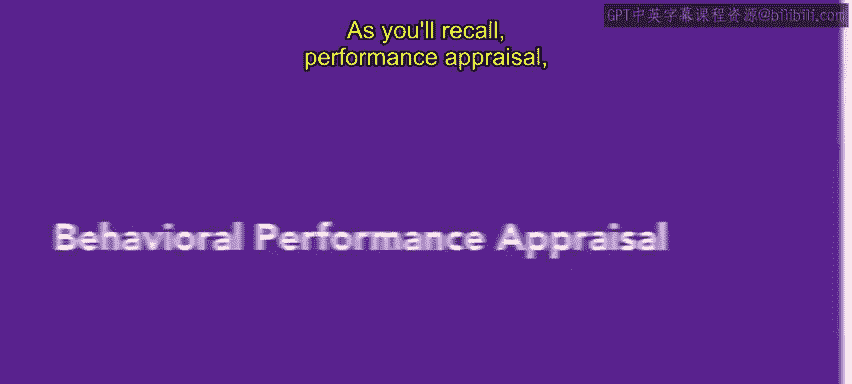
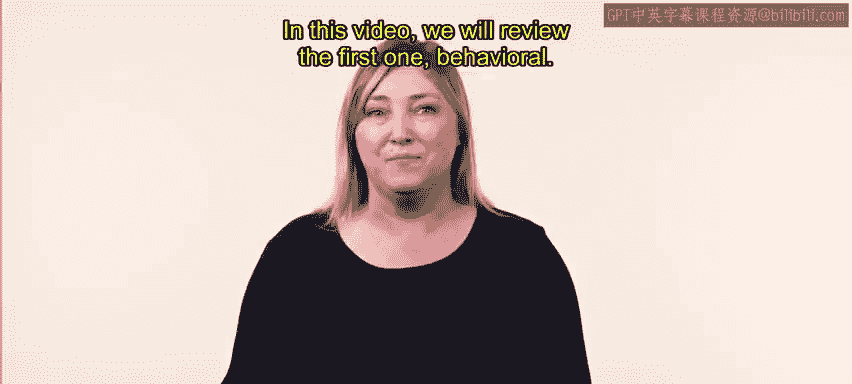
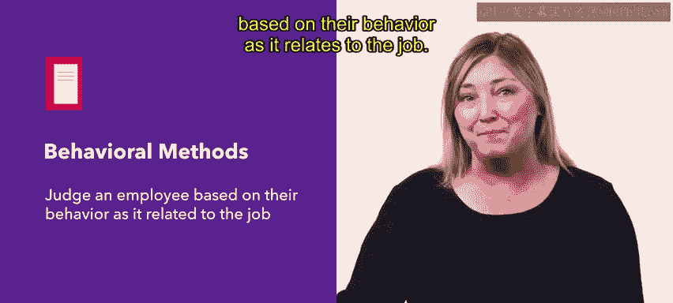
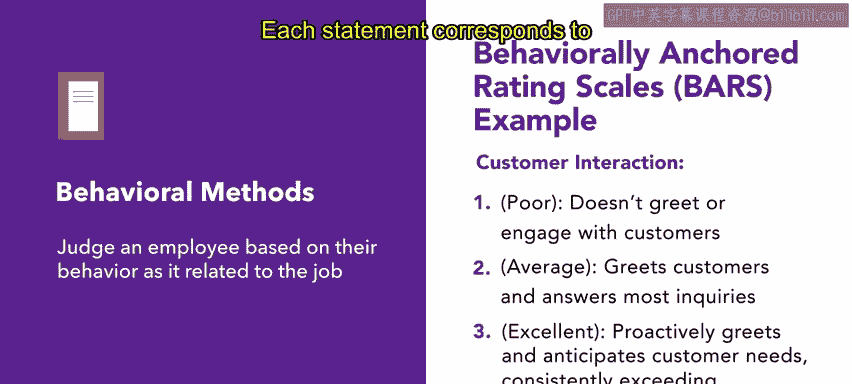
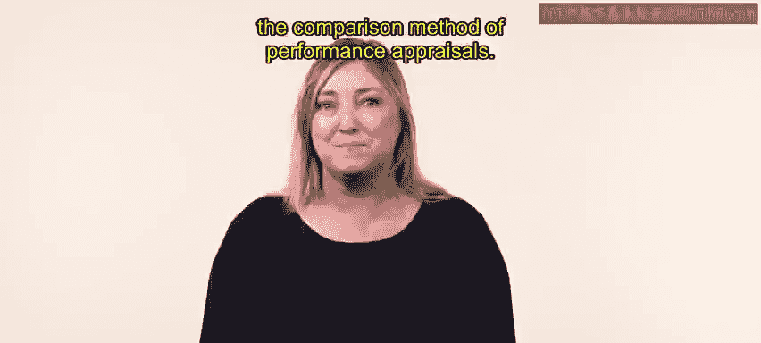

# HRCI《人力资源助理（员工关系、合规，4-5课／共5课）｜HRCI Human Resource Associate》 - P43：38_行为绩效评估.zh_en - GPT中英字幕课程资源 - BV1qE4m19788

As you'll recall， Perance appraisal， also known as Per Review。

 is a set time where a manager meets with an employee to review how well or poorly the employee performed during a period of time。

The appraisal data can be used as the basis for future employment decisions。

There are four methods for performance appraisal In this video we will review the first one behavioral behavioral methods judge an employee based on their behavior as it relates to the job The most common behavioral method is the bars method barsRS stands for behaviorally anchored rating scales a traditional rating scale contains a number rating from one to five。

 with the bars method an employee's job description is analyzed to identify the specific tasks related to that job。

 There are a series of statements that describe how the employee's behavior matches the task。

 and each statement corresponds to a numerical rating for the task。😊。

For example， Jay， a pizzaizz cook at sliceliceU， meets with her boss Sam to review Jay's behavioral performance appraisal as a pizzaizz Cook。

 J is rated on the following tasks， communication， reliability， accountability， professionalism。

 and job knowledge。Each category has specific behaviors that Sam looks for in Jay's work to illustrate。

 under the category of job knowledge， one of the criteria is displays a mastery of food safety guidelines。

In this case， the bar scale might work like this on one end， one or never， then two or almost never。

 then three or sometimes four， or usually， and five or always follows food safety guidelines。

During the meeting， Sam reviews their scores of Jay's work from the bar scale over the past three months of working for slicelice U。

 J continuously shows proficiency in food safety and cleanliness， because of this。

 Jay earns a five or always in the category of job knowledge。

To review bars is the most common way to measure an employee's behavior as it relates to their job。

 it uses a traditional rating skill to identify how an employee performs specific tasks related to their job。

 Next， you will learn about the comparison method of performance appraisals。😊。

