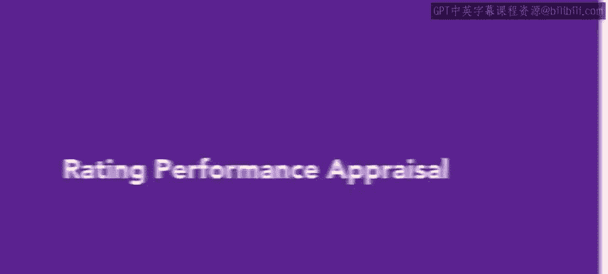
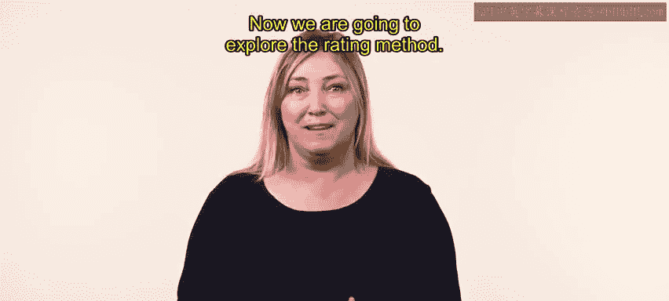
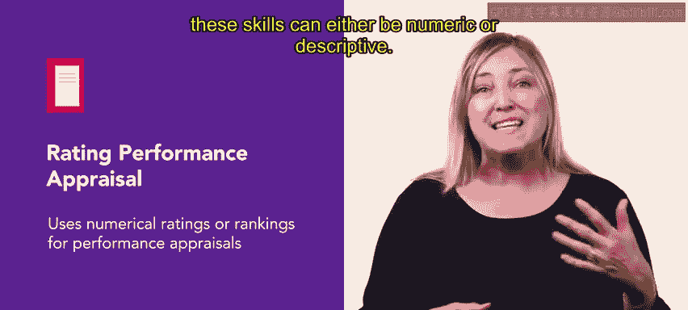
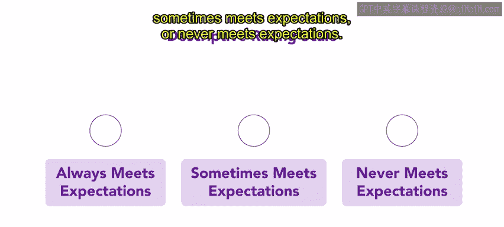
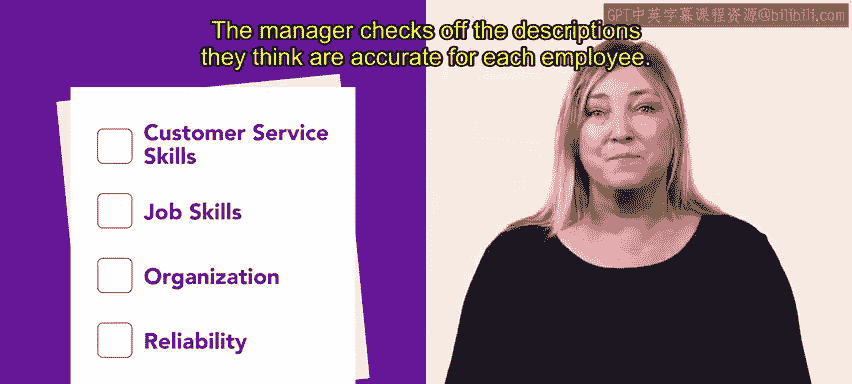
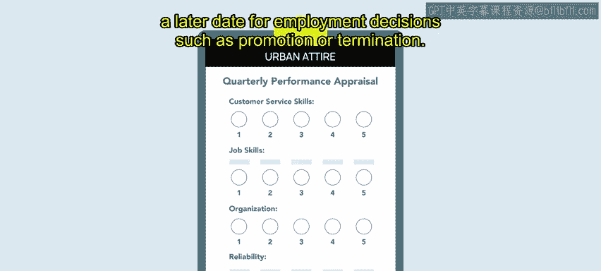
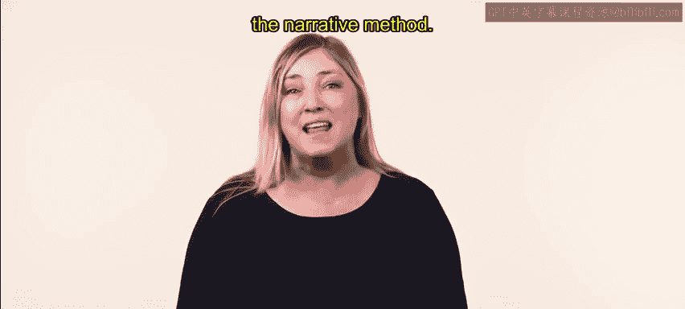

# HRCI《人力资源助理（员工关系、合规，4-5课／共5课）｜HRCI Human Resource Associate》 - P45：40_评分绩效评估.zh_en - GPT中英字幕课程资源 - BV1qE4m19788

So far， you have learned about the behavioral and comparison performance appraisal methods。 Now。

 we are going to explore the rating method。 The rating method uses numerical ratings or rankings for performance appraisals。

 ratinging scale attempt to differentiate levels of performance。

 These skills can either be numeric or descriptive。 A numeric rating scale is a skill with numbers。

 For example， a skill from one to5。😊。

A descriptive skill uses phrases such as always meets expectations， sometimes meets expectations。

 or never meets expectations managers can also use checklists which provide a list of statements used to describe aspects of employee performance。

😊。

The manager checks off the descriptions they think are accurate for each employee。

For example， Avery， a manager at Urban Attire， is responsible for conducting quarterly performance appraisals Avery has a checklist for each employee that offers a descriptive skill to rate each employee's performance The checklist is broken into categories that include customer service skills。

 job skills， organization and reliability。Each category issues brief statements about employee expectations along with a rating scale。

😊，Avery completes the skill for each employee and has a brief meeting with them to discuss their overall performance。

Avery then files the employee's documentation to be used at a later date for employment decisions such as promotion or termination。

To review， rating skills differentiate levels of performance and can be either numeric or descriptive managers can use these skills while conducting performance appraisals In the next video。

 you will explore the final performance appraisal method， the narrative method。😊。

