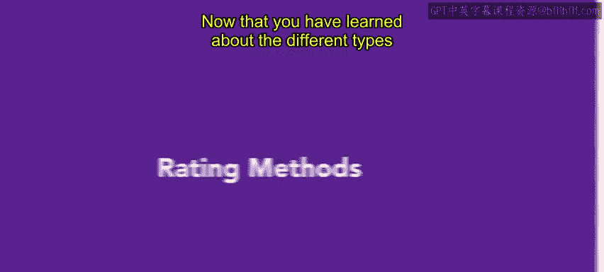
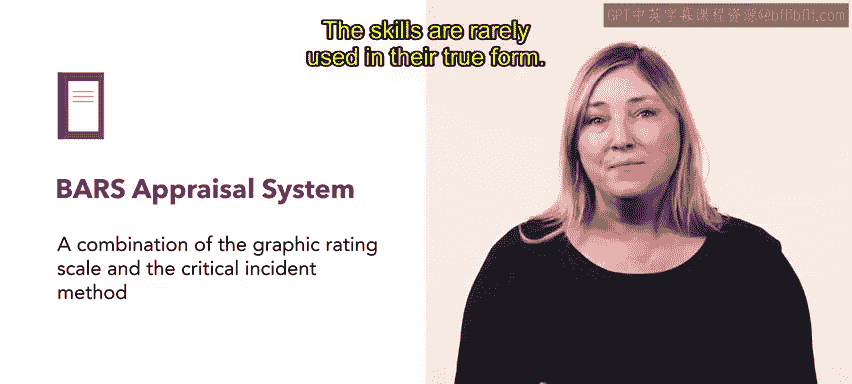
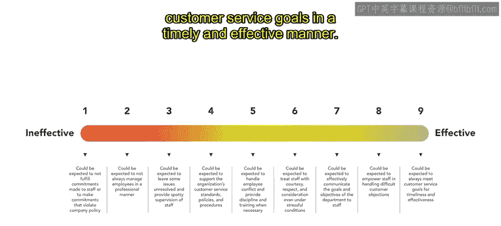
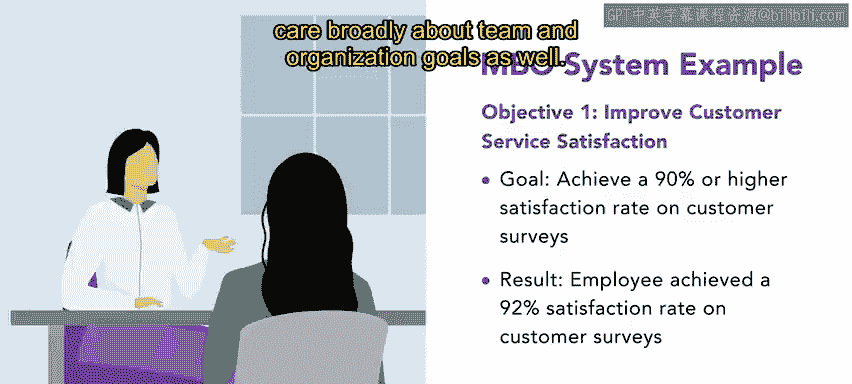
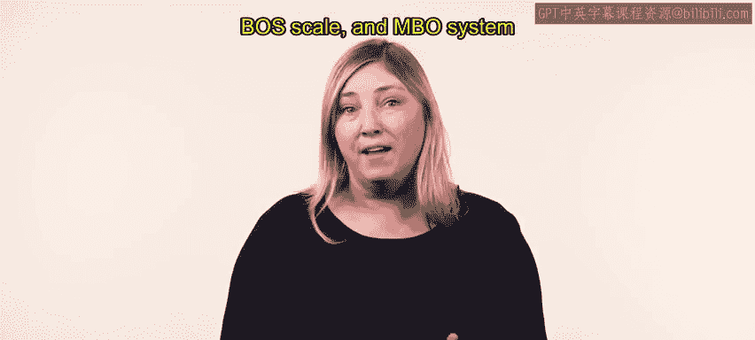

# HRCI人力资源助理课程：4-5：绩效评分方法

在本节课中，我们将要学习几种不同的绩效评分方法。这些方法是管理者用来系统化地评估员工工作表现的工具。

上一节我们介绍了不同类型的绩效评估，本节中我们来看看具体的评分方法。

## 📊 图形评分法

第一种评分方法称为**图形评分法**。该系统基于对员工工作表现组成部分的陈述或问题来对员工进行评分。

管理者可以使用评分技巧，按类别评估员工表现。每个类别都被赋予一个值。这些值可以是**定量**的，例如管理者可以从1到10的等级中赋值；也可以是**定性**的，例如使用“大多数时间”或“从不”等陈述来衡量员工表现。

以下是图形评分法的一个应用示例：

> 例如，Urban Attire公司列出的一项员工期望是：“客户服务：以合作、礼貌和乐于助人的方式处理难缠的客户及其他困难情况。”
>
> 管理者随后使用数字评分量表对每位员工的客户服务技能进行评分。该量表从1到5，1代表低分，5代表优秀。

这是一种简单的评分形式，可以包含多种绩效维度。然而，由于该量表在整个组织中使用，它无法个性化，必须衡量一般的特质、行为或态度。

## 📝 关键事件法

关键事件法是另一种评分方法。它依赖于员工表现良好或不佳的具体事例。

这种方法为员工提供了大量反馈，并且非常清晰，但在比较不同员工时效果不佳。

## 🎯 行为锚定等级评价法

行为锚定等级评价法，或称BARS，是图形评分法和关键事件法的结合。

该系统的优势之一是它提供了具体的行为示例，以反映良好和不良行为。然而，创建和实施BARS在时间和成本上较为昂贵，并且其技能很少以其真实形式被使用。但如果操作得当，它可以是一种极其有效的方法。

以下是BARS的一个应用示例：

> 例如，Connective公司为其员工使用BARS评估系统。它是一个垂直量表，底部为1（无效），顶部为9（有效）。
>
> 在1到9级之间，列出了行为陈述。例如，1级陈述为“员工不太可能履行对员工或客户的承诺”；9级陈述为“员工可靠地以及时有效的方式达到客户服务目标”。

## 🔍 行为观察量表

行为观察量表，或称BOS，是从关键事件发展而来的，但它使用了比BARS多得多的关键事件来定义有效绩效的必要衡量标准。

虽然这个量表可能比BARS系统更昂贵、更耗时，但它允许管理者具体评估员工在评分期间表现出异常好或差的行为的频率。

## 🎯 目标管理法

最后一种评分方法称为**目标管理法**，也称为基于目标的系统。该系统基于员工实现其个人绩效目标的程度。

MBO允许员工与其管理者之间进行更多的沟通和会议，以确保员工实现其目标。然而，有时员工可能只关注他们设定的目标，因此组织必须努力确保员工也广泛关注团队和组织目标。

---

在本节课中，我们一起学习了五种主要的绩效评分方法：**图形评分法**、**关键事件法**、**行为锚定等级评价法**、**行为观察量表**以及**目标管理法**。雇主可以使用这些多样的方法来评估其员工，每种方法都有其适用的场景和特点。